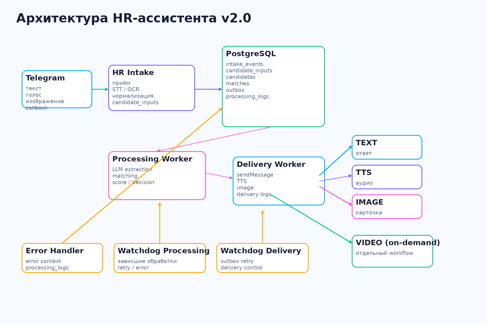
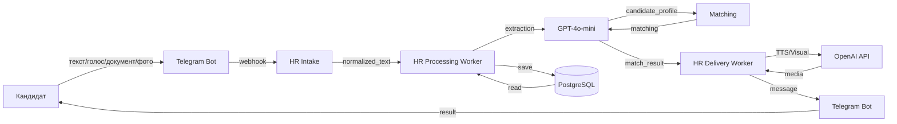

# HR Assistant

**Мультимодальный AI-ассистент для обработки резюме. Автоматическое извлечение данных, matching с вакансиями, мультимедийный ответ за секунды.**

---



*Архитектура системы: Telegram Bot → n8n Workflows → OpenAI API*

---

## Быстрая навигация

### Для заказчика

- **[Ценность для бизнеса](docs/BUSINESS_VALUE.md)** — какие проблемы решает, измеримый эффект
- **[Сквозные сценарии](docs/E2E_SCENARIOS.md)** — пошаговые примеры работы системы

### Для пользователя

- **[Руководство кандидата](docs/USER_GUIDE.md)** — как отправить резюме через Telegram
- **[Руководство HR-специалиста](docs/HR_GUIDE.md)** — работа с результатами matching

### Для инженера

- **[Архитектура](docs/ARCHITECTURE.md)** — компоненты, потоки данных, ER-диаграмма
- **[AI-компоненты](docs/AI_QUALIFICATION.md)** — промпты, модели, параметры, стоимость
- **[Prompt Evaluation](docs/prompt_evaluation/README.md)** — подсистема A/B-тестирования промптов
- **[Интеграции](docs/INTEGRATION_DIAGRAM.md)** — Telegram, OpenAI, PostgreSQL
- **[Развёртывание](docs/DEPLOYMENT_GUIDE.md)** — пошаговая инструкция деплоя
- **[Паспорт автоматизации](docs/AUTOMATION_PASSPORT.md)** — TCO, метрики, инциденты
- **[Инструкция поддержки](docs/SUPPORT_RUNBOOK.md)** — диагностика, известные проблемы

### Состояние проекта

- **[PROJECT_STATE](docs/PROJECT_STATE.md)** — текущий статус, известные проблемы, roadmap
- **[Журнал изменений](docs/CHANGE_LOG.md)** — история версий

---

## Ключевой бизнес-процесс

**Полный путь резюме:**



1. **Кандидат** отправляет резюме (текст/голос/документ/фото)
2. **HR Intake** принимает, классифицирует тип, нормализует данные
3. **GPT-4o-mini** извлекает структурированные данные (ФИО, город, навыки, зарплата)
4. **GPT-4o-mini** сравнивает профиль с вакансиями, формирует score (0-100)
5. **HR Delivery Worker** генерирует мультимедийный ответ (текст + TTS + визуал)
6. **Кандидат** получает результат matching за < 1 минуту

**Подробно:** [Сквозные сценарии](docs/E2E_SCENARIOS.md)

---

## Результат для бизнеса

| Проблема | Решение |
|----------|---------|
| **Медленная обработка** | < 1 минута вместо 10-15 минут |
| **Ограниченные форматы** | Мультимодальный ввод (текст/голос/документ/фото) |
| **Ручное извлечение данных** | AI-извлечение (GPT-4o-mini) |
| **Отсутствие matching** | Автоматическое сравнение с вакансиями |

**Подробно:** [Ценность для бизнеса](docs/BUSINESS_VALUE.md)

---

## Технологии

| Компонент | Технология | Назначение |
|-----------|-----------|-----------|
| **Workflow Automation** | n8n | Оркестрация процессов |
| **Database** | PostgreSQL | Хранение данных |
| **AI Models** | OpenAI GPT-4o-mini, GPT-4o-mini-tts, GPT-image-1, Sora-2 | Извлечение данных, matching, мультимедиа |
| **Bot** | Telegram Bot API | Входной канал |

**Подробно:** [Архитектура](docs/ARCHITECTURE.md)

---

## Быстрый старт

### Требования

- Docker Compose
- PostgreSQL 14+
- n8n 1.0+
- OpenAI API Key
- Telegram Bot Token

### Развёртывание

```bash
# 1. Настроить окружение (опционально)
cp .env.example .env
# Отредактируйте .env для production-развёртывания

# 2. Запустить PostgreSQL и n8n
docker-compose -f config/docker-compose.yml up -d

# 3. Импортировать схему БД (автоматически при первом запуске)
# Или вручную:
psql -U hr_user -d hr_assistant -f database/schema_hr_assistant.sql

# 4. Настроить credentials в n8n:
#    - PostgreSQL (host, database, user, password)
#    - OpenAI API (Authorization: Bearer YOUR_API_KEY)
#    - Telegram API (bot token)
# См. DEPLOYMENT_GUIDE.md для подробностей

# 5. Импортировать workflows в n8n
# 6. Настроить Telegram Webhook
```

**Подробно:** [Руководство по развёртыванию](docs/DEPLOYMENT_GUIDE.md)

**Важно:** Перед первым запуском замените `REPLACE_ME_WITH_YOUR_BOT_TOKEN` в `database/schema_hr_assistant.sql` на ваш реальный токен Telegram бота.

---

## Документация

Полный пакет документации: **17 обязательных документов**

Подробная навигация: см. раздел **[Быстрая навигация](#быстрая-навигация)**

---

## Состояние проекта

**Статус:** Production-ready (v2.0)
**Покрытие документации:** 100%
**Известные проблемы:** 1 (KP-001: metadata gap)

**Подробно:** [PROJECT_STATE](docs/PROJECT_STATE.md)

---

## Структура проекта

```
hr-assistant/
├── README.md                          # Точка входа
├── docs/                              # Документация
│   ├── BUSINESS_VALUE.md             # Ценность для бизнеса
│   ├── E2E_SCENARIOS.md              # Сквозные сценарии
│   ├── USER_GUIDE.md                # Руководство кандидата
│   ├── HR_GUIDE.md                  # Руководство HR-специалиста
│   ├── SUPPORT_RUNBOOK.md           # Инструкция поддержки
│   ├── ARCHITECTURE.md              # Архитектура
│   ├── DEPLOYMENT_GUIDE.md          # Развёртывание
│   ├── AI_QUALIFICATION.md           # AI-компоненты
│   ├── AUTOMATION_PASSPORT.md       # Паспорт автоматизации
│   ├── INTEGRATION_DIAGRAM.md       # Интеграции
│   ├── CHANGE_LOG.md                # Журнал изменений
│   └── screenshots/                 # Иллюстрации
├── workflows/                       # Workflow n8n
├── database/                         # Схемы БД
└── task_history/                    # История задач
```

---

## Контакты

**Проект:** HR Assistant
**Модуль:** PEm05
**Версия:** 2.0

---

**Статус:** Production-ready | **Документация:** 100% | **Код:** MIT License