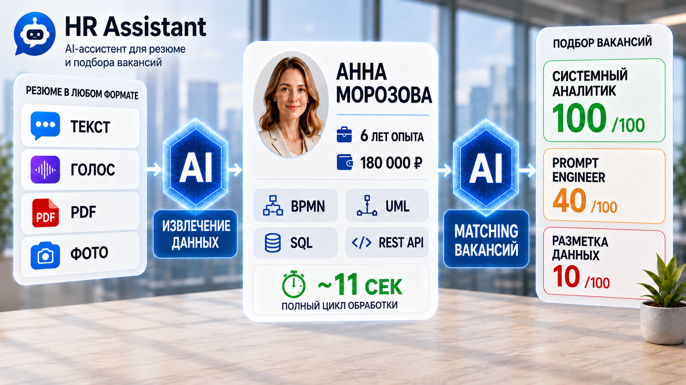
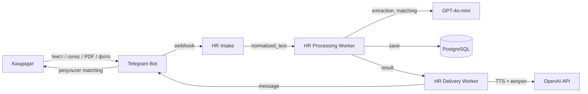

# 🏠 HR Assistant



🤖 **Мультимодальный AI-ассистент для обработки резюме. Автоматическое извлечение данных, matching с вакансиями, мультимедийный ответ за секунды.**

HR Assistant — автоматизация первичного отбора на n8n: кандидат отправляет резюме в Telegram-бот (текст, голос, PDF/DOCX или фото), GPT-4o-mini извлекает структурированный профиль, сравнивает его с вакансиями и возвращает кандидату результат matching — score 0–100 с разбивкой по критериям, вердикт match / no_match с обоснованием и мультимедийный ответ (текст + аудио + визуальная карточка).

- Кандидат получает разбор своего соответствия вакансиям менее чем за 90 секунд, в любом из четырёх форматов ввода.
- HR-специалист получает структурированные карточки кандидатов и обоснованные оценки в PostgreSQL — без ручного чтения резюме.
- Система не скрывает, как оценён кандидат: score, разбивка по критериям (роль, навыки, опыт, условия) и обоснование сохраняются с каждым matching.

[▶️ Проверить живое демо](#-live-demo) · [💼 Ценность для бизнеса](docs/BUSINESS_VALUE.md) · [🎬 Сквозные сценарии](docs/E2E_SCENARIOS.md)

---

## ▶️ Live Demo

🤖 **Telegram-бот:** [@PEm05_HR_assistant_bot](https://t.me/PEm05_HR_assistant_bot)

Отправьте резюме любым способом — текстом, голосовым сообщением, PDF/DOCX-файлом или фото — и получите результат matching по открытым вакансиям менее чем за 90 секунд.

> 🔓 **Demo-контракт:** бот открыт для всех, без регистрации и токенов. Отправляйте обезличенные данные — резюме обрабатываются живым AI-контуром. Канонический маршрут проверки демо (открыть → отправить → что наблюдать → ожидаемый результат) — [`docs/DEMO_ROUTE.md`](docs/DEMO_ROUTE.md).

---

## ❓ Зачем нужен HR Assistant

| Проблема | Решение |
|----------|---------|
| **Медленная обработка** | Менее 1 минуты вместо 10–15 минут ручного разбора |
| **Ограниченные форматы** | Мультимодальный ввод: текст / голос / документ / фото |
| **Ручное извлечение данных** | AI-извлечение структурированного профиля (GPT-4o-mini) |
| **Отсутствие matching** | Автоматическое сравнение с вакансиями, score 0–100 с обоснованием |

Подробно — в [`docs/BUSINESS_VALUE.md`](docs/BUSINESS_VALUE.md).

---

## 🎯 Для кого

- HR-команды и агентства, которым нужна мгновенная первичная обработка входящих резюме без ручного разбора.
- Рекрутеры, которым нужны структурированные карточки кандидатов и обоснованные оценки, а не «на глаз».
- Инженеры-интеграторы: кейс — рабочий референс мультимодального AI-конвейера на n8n (intake → extraction → matching → мультимедийная доставка).

---

## ✨ Возможности

- **Приём резюме 24/7 в четырёх форматах** — текст, голосовое сообщение (автоматическая транскрибация), PDF/DOCX, фото.
- **AI-извлечение данных** — ФИО, город, навыки, опыт, зарплатные ожидания в структурированный профиль.
- **AI-matching с вакансиями** — score 0–100 с разбивкой по критериям: роль 30 / навыки 35 / опыт 20 / условия 15, порог решения 60.
- **Мультимедийный ответ** — текст + TTS-озвучка + сгенерированная визуальная карточка результата.
- **Полная трассируемость** — журнал обработки, статусы шагов, сырые ответы LLM в PostgreSQL.

---

## 🏗️ Бизнес-процесс


```mermaid
flowchart LR
    A[Кандидат] -->|текст / голос / PDF / фото| B[Telegram Bot]
    B -->|webhook| C[HR Intake]
    C -->|normalized_text| D[HR Processing Worker]
    D -->|extraction, matching| E[GPT-4o-mini]
    D -->|save| J[(PostgreSQL)]
    D -->|result| G[HR Delivery Worker]
    G -->|TTS + визуал| H[OpenAI API]
    G -->|message| B
    B -->|результат matching| A
```

1. **Кандидат** отправляет резюме (текст / голос / PDF/DOCX / фото)
2. **HR Intake** принимает, определяет тип ввода, нормализует данные
3. **GPT-4o-mini** извлекает структурированный профиль кандидата
4. **GPT-4o-mini** сравнивает профиль с вакансиями: score 0–100, вердикт, обоснование
5. **HR Delivery Worker** формирует мультимедийный ответ (текст + TTS + визуал)
6. **Кандидат** получает результат matching менее чем за 90 секунд

Подробно: [🎬 Сквозные сценарии](docs/E2E_SCENARIOS.md) · [🏗️ Архитектура](docs/ARCHITECTURE.md)

---

## 🛠️ Технологии

| Компонент | Технология | Назначение |
|-----------|-----------|-----------|
| **Workflow Engine** | n8n (self-hosted), Docker Compose | Оркестрация процессов |
| **AI-провайдер** | OpenAI API (gpt-4o-mini, tts, gpt-image-1) | Извлечение, matching, мультимедиа |
| **База данных** | PostgreSQL 16 | Профили, вакансии, matching, журнал |
| **Бот** | Telegram Bot API | Входной канал |

---

## 🚀 Быстрый старт

```bash
# 1. Настроить окружение
cp .env.example .env    # заполнить переменные — см. DEPLOYMENT_GUIDE §5

# 2. Запустить PostgreSQL и n8n
docker compose -f config/docker-compose.yml up -d

# 3. Применить схему БД
psql -U hr_user -d hr_assistant -f database/schema_hr_assistant.sql

# 4. Настроить credentials в n8n (PostgreSQL, OpenAI, Telegram)
# 5. Импортировать workflows из workflows/ и настроить Telegram webhook
```

Полный процесс развёртывания — [🚀 `docs/DEPLOYMENT_GUIDE.md`](docs/DEPLOYMENT_GUIDE.md) (Source of Truth воспроизводимости).

**Требования:** Docker Compose, n8n, ключ OpenAI API, токен Telegram-бота.

---

## 📚 Документация

Три слоя читателей — по одному входу на слой:

### Customer Facing

| Документ | Назначение |
|----------|------------|
| [💼 `docs/BUSINESS_VALUE.md`](docs/BUSINESS_VALUE.md) | Ценность для бизнеса, эффекты до/после |
| [🎬 `docs/E2E_SCENARIOS.md`](docs/E2E_SCENARIOS.md) | Сквозные сценарии: текст / голос / PDF / фото |
| [🧭 `docs/DEMO_ROUTE.md`](docs/DEMO_ROUTE.md) | Канонический маршрут проверки демо |
| [📖 `docs/USER_GUIDE.md`](docs/USER_GUIDE.md) | Руководство кандидата |

### User-Operator

| Документ | Назначение |
|----------|------------|
| [🤝 `docs/HR_GUIDE.md`](docs/HR_GUIDE.md) | Руководство HR-специалиста: работа с результатами matching |
| [⚙️ `docs/SUPPORT_RUNBOOK.md`](docs/SUPPORT_RUNBOOK.md) | Эксплуатация: диагностика, инциденты, бэкапы |

### Engineering

| Документ | Назначение |
|----------|------------|
| [🏗️ `docs/ARCHITECTURE.md`](docs/ARCHITECTURE.md) | Архитектура: компоненты, потоки, БД |
| [🔌 `docs/INTEGRATION_DIAGRAM.md`](docs/INTEGRATION_DIAGRAM.md) | Интеграционные контракты: Telegram, OpenAI, PostgreSQL |
| [🔀 `docs/MULTI_PROVIDER_ARCHITECTURE.md`](docs/MULTI_PROVIDER_ARCHITECTURE.md) | Инженерный стенд тестирования LLM-провайдеров |
| [🧠 `docs/AI_QUALIFICATION.md`](docs/AI_QUALIFICATION.md) | Логика AI-извлечения и matching |
| [📝 `docs/PROMPT_ENGINEERING_GUIDE.md`](docs/PROMPT_ENGINEERING_GUIDE.md) | Система промптов и безопасное изменение |
| [🧪 `docs/prompt_evaluation/README.md`](docs/prompt_evaluation/README.md) | Подсистема A/B-оценки промптов |
| [🪪 `docs/AUTOMATION_PASSPORT.md`](docs/AUTOMATION_PASSPORT.md) | Паспорт автоматизации: TCO, метрики, инциденты |
| [📈 `docs/SUCCESS_METRICS.md`](docs/SUCCESS_METRICS.md) | Агрегатор метрик успеха |
| [✅ `docs/PROJECT_HANDOFF_CHECKLIST.md`](docs/PROJECT_HANDOFF_CHECKLIST.md) | Чеклист передачи проекта инженеру |
| [🛡️ `docs/SECURITY_NOTES.md`](docs/SECURITY_NOTES.md) | Модель безопасности: credentials, доступ, данные |
| [📂 `docs/PROJECT_STRUCTURE.md`](docs/PROJECT_STRUCTURE.md) | Карта репозитория |
| [🖼️ `docs/screenshots/MEDIA_INDEX.md`](docs/screenshots/MEDIA_INDEX.md) | Реестр изображений |
| [🚀 `docs/DEPLOYMENT_GUIDE.md`](docs/DEPLOYMENT_GUIDE.md) | Развёртывание (Source of Truth) |
| [📊 `docs/PROJECT_STATE.md`](docs/PROJECT_STATE.md) | Состояние проекта |
| [📜 `docs/known-issues.md`](docs/known-issues.md) | Известные проблемы |
| [📝 `docs/CHANGE_LOG.md`](docs/CHANGE_LOG.md) | Журнал изменений |

> **Примечание:** внутренние рабочие материалы инженерной среды AI Automation Portfolio Lab (история задач, протоколы) хранятся вне публичной поставки и не входят в состав документации.

---

## 🧪 Экспериментальный ML-контур

Параллельно с production-контуром (OpenAI GPT-4o-mini) развивается экспериментальный ML-контур качества matching: prompt evaluation → reference dataset → teacher dataset → fine-tuning LoRA → validation.

| Уровень | Статус | Документация |
|---------|--------|--------------|
| **Prompt Evaluation** | HRA-EXP-V1 завершён (Prompt B — REJECT) | [`docs/prompt_evaluation/`](docs/prompt_evaluation/README.md) |
| **Fine-tuning (LoRA)** | Experiments 001–004 завершены; LoRA — рабочий on-premise кандидат, **не** production-ready | [`finetuning/README.md`](finetuning/README.md) |
| **Runtime Validation** | Инженерный стенд Multi Provider Test | [`docs/MULTI_PROVIDER_ARCHITECTURE.md`](docs/MULTI_PROVIDER_ARCHITECTURE.md) |

Production-контур использует OpenAI GPT-4o-mini; LoRA не применяется в production (уступает GPT-4o-mini на real-world hard negatives — Telegram smoke 35 % vs 43 %).

---

## 📊 Статус проекта

**Production-контур:** работает (v2.3.0, 2026-09-01). Приём 4 форматов, extraction, matching, мультимедийная доставка — в live-эксплуатации.

**Экспериментальный ML-контур:** активен (prompt evaluation + LoRA-эксперименты). Подробно — [📊 `docs/PROJECT_STATE.md`](docs/PROJECT_STATE.md).

История изменений — [📝 `docs/CHANGE_LOG.md`](docs/CHANGE_LOG.md).

---

## 📁 Структура проекта

```
hr-assistant/
├── README.md          # Точка входа
├── docs/              # Документация
├── workflows/         # Workflow n8n
├── database/          # Схемы БД
├── config/            # Docker Compose, конфигурация окружения
├── finetuning/        # Модуль Fine-tuning (LoRA) — экспериментальный
└── api/               # Runtime API (экспериментальные LLM-бэкенды)
```

Полная карта каталогов и файлов — в [📂 `docs/PROJECT_STRUCTURE.md`](docs/PROJECT_STRUCTURE.md).