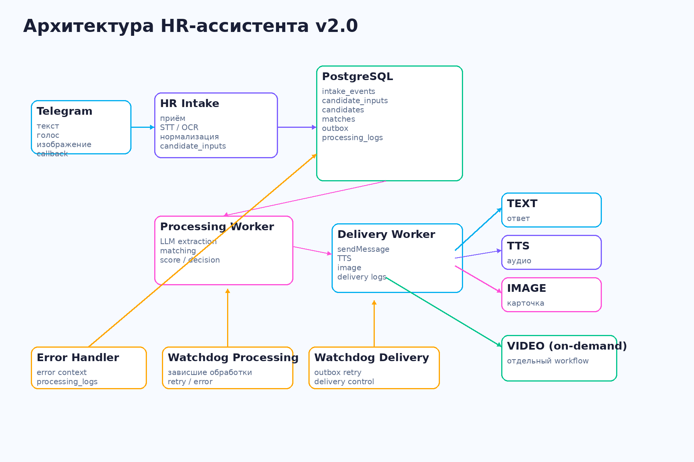
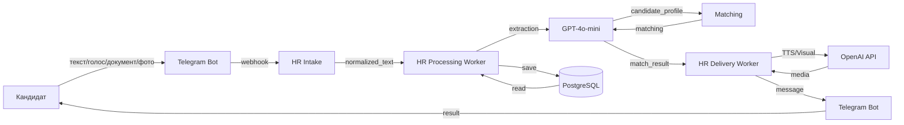
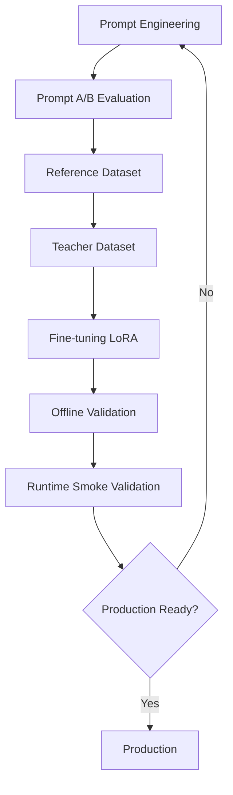

# HR Assistant

**Мультимодальный AI-ассистент для обработки резюме. Автоматическое извлечение данных, matching с вакансиями, мультимедийный ответ за секунды.**

---



*Архитектура системы: Telegram Bot → n8n Workflows → OpenAI API*

---

## Быстрая навигация

### Для заказчика

- **[Ценность для бизнеса](docs/BUSINESS_VALUE.md)** — какие проблемы решает, измеримый эффект
- **[Сквозные сценарии](docs/E2E_SCENARIOS.md)** — пошаговые примеры работы системы

### Для пользователя

- **[Руководство кандидата](docs/USER_GUIDE.md)** — как отправить резюме через Telegram
- **[Руководство HR-специалиста](docs/HR_GUIDE.md)** — работа с результатами matching

### Публичный кейс

- **[Storytelling Landing](landing/README.md)** — кинематографический лендинг экспериментов LoRA: `https://hra-lora.alex-n8n.site`

### Для инженера

- **[Архитектура](docs/ARCHITECTURE.md)** — компоненты, потоки данных, ER-диаграмма
- **[AI-компоненты](docs/AI_QUALIFICATION.md)** — промпты, модели, параметры, стоимость
- **[Prompt Engineering Guide](docs/PROMPT_ENGINEERING_GUIDE.md)** — система промптов и безопасное изменение
- **[Prompt Evaluation](docs/prompt_evaluation/README.md)** — подсистема A/B-тестирования промптов
- **[Интеграции](docs/INTEGRATION_DIAGRAM.md)** — Telegram, OpenAI, PostgreSQL
- **[Развёртывание](docs/DEPLOYMENT_GUIDE.md)** — пошаговая инструкция деплоя
- **[Паспорт автоматизации](docs/AUTOMATION_PASSPORT.md)** — TCO, метрики, инциденты
- **[Инструкция поддержки](docs/SUPPORT_RUNBOOK.md)** — диагностика, известные проблемы
- **[Success Metrics](docs/SUCCESS_METRICS.md)** — все метрики успеха проекта
- **[Handoff Checklist](docs/PROJECT_HANDOFF_CHECKLIST.md)** — чеклист передачи проекта новому инженеру

### Состояние проекта

- **[PROJECT_STATE](docs/PROJECT_STATE.md)** — текущий статус, известные проблемы, roadmap
- **[Журнал изменений](docs/CHANGE_LOG.md)** — история версий

---

## Ключевой бизнес-процесс

**Полный путь резюме:**


```mermaid
graph LR
    A[Кандидат] -->|текст/голос/документ/фото| B[Telegram Bot]
    B -->|webhook| C[HR Intake]
    C -->|normalized_text| D[HR Processing Worker]
    D -->|extraction| E[GPT-4o-mini]
    E -->|candidate_profile| F[Matching]
    F -->|matching| E
    E -->|match_result| G[HR Delivery Worker]
    G -->|TTS/Visual| H[OpenAI API]
    H -->|media| G
    G -->|message| I[Telegram Bot]
    I -->|result| A
    D -->|save| J[(PostgreSQL)]
    J -->|read| D
```

1. **Кандидат** отправляет резюме (текст/голос/документ/фото)
2. **HR Intake** принимает, классифицирует тип, нормализует данные
3. **GPT-4o-mini** извлекает структурированные данные (ФИО, город, навыки, зарплата)
4. **GPT-4o-mini** сравнивает профиль с вакансиями, формирует score (0-100)
5. **HR Delivery Worker** генерирует мультимедийный ответ (текст + TTS + визуал)
6. **Кандидат** получает результат matching за < 1 минуту

**Подробно:** [Сквозные сценарии](docs/E2E_SCENARIOS.md)

---

## Результат для бизнеса

| Проблема | Решение |
|----------|---------|
| **Медленная обработка** | < 1 минута вместо 10-15 минут |
| **Ограниченные форматы** | Мультимодальный ввод (текст/голос/документ/фото) |
| **Ручное извлечение данных** | AI-извлечение (GPT-4o-mini) |
| **Отсутствие matching** | Автоматическое сравнение с вакансиями |

**Подробно:** [Ценность для бизнеса](docs/BUSINESS_VALUE.md)

---

## Технологии

| Компонент | Технология | Назначение |
|-----------|-----------|-----------|
| **Workflow Automation** | n8n | Оркестрация процессов |
| **Database** | PostgreSQL | Хранение данных |
| **AI Models** | OpenAI GPT-4o-mini, GPT-4o-mini-tts, GPT-image-1, Sora-2 | Извлечение данных, matching, мультимедиа |
| **Bot** | Telegram Bot API | Входной канал |

**Подробно:** [Архитектура](docs/ARCHITECTURE.md)

---

## Экспериментальный ML-контур

HR Assistant развивает архитектуру ML-пайплайна для постоянного улучшения качества matching:


```mermaid
graph TD
    PE[Prompt Engineering] --> AB[Prompt A/B Evaluation]
    AB --> RD[Reference Dataset]
    RD --> TD[Teacher Dataset]
    TD --> FT[Fine-tuning LoRA]
    FT --> OV[Offline Validation]
    OV --> RS[Runtime Smoke Validation]
    RS --> PR{Production Ready?}
    PR -->|No| PE
    PR -->|Yes| PROD[Production]
```

### Уровни контура

| Уровень | Назначение | Документация |
|---------|-----------|--------------|
| **Prompt Evaluation** | A/B-тестирование промптов, формирование reference dataset | [docs/prompt_evaluation/](docs/prompt_evaluation/) |
| **Fine-tuning** | Обучение LoRA-адаптеров на teacher dataset | [finetuning/README.md](finetuning/README.md) |
| **Runtime Smoke Validation** | Тестирование LoRA-моделей в runtime | [docs/MULTI_PROVIDER_ARCHITECTURE.md](docs/MULTI_PROVIDER_ARCHITECTURE.md) |

### Текущий статус

- **Prompt Evaluation:** Активный, HRA-EXP-V1 завершён
- **Fine-tuning:** Экспериментальный, Experiments 001–004 завершены; Experiment 004 — последний цикл
- **Runtime Validation:** Инженерный стенд (Multi Provider Test workflow)
- **Production Ready:** **Нет** — LoRA не обгоняет GPT-4o-mini на real-world hard negatives (Telegram smoke 23 анкеты: LoRA 35 % vs GPT-4o-mini 43 %, см. [`finetuning/data/evidence/telegram_smoke_test_summary.json`](finetuning/data/evidence/telegram_smoke_test_summary.json))

**Подробно:** [Архитектура экспериментального контура](docs/ARCHITECTURE.md#экспериментальный-ml-контур)

---

## Fine-tuning (LoRA)

Модуль Fine-tuning позволяет обучать LoRA-адаптеры для улучшения качества matching:

### Назначение

- **Teacher Dataset:** Формируется из reference dataset (Judge оценки)
- **Обучение:** LoRA на Qwen/Qwen2.5-1.5B-Instruct
- **Валидация:** Offline evaluation + external validation
- **Тестирование:** Runtime smoke validation через Multi Provider Test workflow

### История экспериментов

| Эксперимент | Что проверяли | Ключевой результат |
|-------------|---------------|-------------------|
| **001** | Технический baseline | Обучение стабильно, JSON генерируется |
| **002** | Параметрическая оптимизация | `decision_accuracy=0.778`, но runtime negative test failed |
| **003** | Hard negatives в teacher dataset | Runtime negative smoke **7/7 pass**, offline accuracy снизилась до 0.667 |
| **004** | Positive/borderline примеры + GPT-4o-mini comparison | Internal 0.933 / external 0.931 decision accuracy; real-world Telegram smoke 35 % vs GPT-4o-mini 43 % |

**Вывод:** LoRA — рабочий on-premise / edge кандидат; production-контур по-прежнему использует GPT-4o-mini. Подтверждающие примеры — в [`finetuning/data/evidence/`](finetuning/data/evidence/).

#### Representative example: успешный кейс Telegram smoke

**Candidate:** AI Automation Specialist, 4 года опыта в prompt engineering, LLM, n8n, REST API, Python, зарплата 200 000 ₽.

**Vacancy:** Prompt Engineer / AI Automation Specialist; бюджет 150 000–250 000 ₽, Москва.

**Reference / expected:** `match`.

**Model prediction (LoRA Experiment 004, vLLM):** `match`, score 93.

**Почему этот пример важен:** Показывает, что LoRA умеет признавать явное соответствие — это baseline, который модель должна проходить стабильно, прежде чем претендовать на production.

**Evidence:** [`finetuning/data/evidence/telegram_smoke_test_summary.json`](finetuning/data/evidence/telegram_smoke_test_summary.json), строка #22 (POSITIVE).

---

#### Representative example: неуспешный кейс Telegram smoke

**Candidate:** Стажёр, 0 лет опыта, в резюме указан 1 навык SQL.

**Vacancy:** Системный аналитик; требуется SQL, BPMN, REST API, аналитика, постановка задач разработчикам.

**Reference / expected:** `no_match`.

**Model prediction (LoRA Experiment 004, vLLM):** `match`, score 80, с обоснованием, приписывающим кандидату SQL, BPMN, REST API и аналитику, которых в резюме нет.

**Почему этот пример важен:** Демонстрирует ключевой production-риск LoRA: галлюцинация hard-навыков у слабых профилей приводит к ложному положительному решению, поэтому LoRA уступает GPT-4o-mini на real-world hard negatives.

**Evidence:** [`finetuning/data/evidence/telegram_smoke_test_summary.json`](finetuning/data/evidence/telegram_smoke_test_summary.json), строка #11 (HN6) и блок `representative_failures`.

### Следующий цикл

**Приоритет:** Teacher-label audit и production smoke set для hard negatives / edge cases.

**Подробно:** [finetuning/README.md](finetuning/README.md)

---

## Быстрый старт

### Требования

- Docker Compose
- PostgreSQL 14+
- n8n 1.0+
- OpenAI API Key
- Telegram Bot Token

### Развёртывание

```bash
# 1. Настроить окружение (опционально)
cp .env.example .env
# Отредактируйте .env для production-развёртывания

# 2. Запустить PostgreSQL и n8n
docker-compose -f config/docker-compose.yml up -d

# 3. Импортировать схему БД (автоматически при первом запуске)
# Или вручную:
psql -U hr_user -d hr_assistant -f database/schema_hr_assistant.sql

# 4. Настроить credentials в n8n:
#    - PostgreSQL (host, database, user, password)
#    - OpenAI API (Authorization: Bearer YOUR_API_KEY)
#    - Telegram API (bot token)
# См. DEPLOYMENT_GUIDE.md для подробностей

# 5. Импортировать workflows в n8n
# 6. Настроить Telegram Webhook
```

**Подробно:** [Руководство по развёртыванию](docs/DEPLOYMENT_GUIDE.md)

**Важно:** Перед первым запуском замените `REPLACE_ME_WITH_YOUR_BOT_TOKEN` в `database/schema_hr_assistant.sql` на ваш реальный токен Telegram бота.

---

## Документация

Полный пакет документации: **17 обязательных документов**

Подробная навигация: см. раздел **[Быстрая навигация](#быстрая-навигация)**

---

## Состояние проекта

**Статус:** Production-ready (v2.1) + Experimental ML-контур
**Покрытие документации:** 100%
**Известные проблемы:** 1 (KP-001: metadata gap)

### Production-контур

| Компонент | Статус |
|-----------|--------|
| Workflow | ✅ Active |
| Database | ✅ Deployed |
| Integration | ✅ Live |
| Documentation | ✅ Complete |

### Экспериментальный ML-контур

| Компонент | Статус |
|-----------|--------|
| Prompt Evaluation | ✅ Active (HRA-EXP-V1) |
| Fine-tuning | ⚠️ Experimental (Experiments 001–004 completed; Experiment 004 latest) |
| Runtime Validation | ⚠️ Engineering test only |
| LoRA Production | ❌ Not ready (underperforms GPT-4o-mini on real-world hard negatives; см. [`finetuning/data/evidence/telegram_smoke_test_summary.json`](finetuning/data/evidence/telegram_smoke_test_summary.json)) |

**Подробно:** [PROJECT_STATE](docs/PROJECT_STATE.md)

---

## Структура проекта

```
hr-assistant/
├── README.md                          # Точка входа
├── docs/                              # Документация
│   ├── BUSINESS_VALUE.md             # Ценность для бизнеса
│   ├── E2E_SCENARIOS.md              # Сквозные сценарии
│   ├── USER_GUIDE.md                # Руководство кандидата
│   ├── HR_GUIDE.md                  # Руководство HR-специалиста
│   ├── SUPPORT_RUNBOOK.md           # Инструкция поддержки
│   ├── ARCHITECTURE.md              # Архитектура
│   ├── DEPLOYMENT_GUIDE.md          # Развёртывание
│   ├── AI_QUALIFICATION.md           # AI-компоненты
│   ├── AUTOMATION_PASSPORT.md       # Паспорт автоматизации
│   ├── INTEGRATION_DIAGRAM.md       # Интеграции
│   ├── CHANGE_LOG.md                # Журнал изменений
│   ├── prompt_evaluation/           # Документация Prompt Evaluation
│   └── screenshots/                 # Иллюстрации
├── workflows/                       # Workflow n8n
├── database/                         # Схемы БД
├── finetuning/                      # Модуль Fine-tuning (LoRA)
│   ├── README.md                    # Точка входа в подсистему
│   ├── TECHNICAL_FOUNDATION.md      # Технический фундамент
│   ├── Experiment_001_Report.md     # Отчёт Experiment 001
│   ├── Experiment_002_Report.md     # Отчёт Experiment 002
│   ├── Experiment_003_Report.md     # Отчёт Experiment 003
│   ├── Experiment_004_Report.md     # Отчёт Experiment 004
│   ├── configs/                     # Конфигурации экспериментов
│   ├── scripts/                     # Скрипты обучения
│   ├── data_sample/               # Обезличенный пример формата данных
│   └── reports/                     # Вспомогательные отчёты
├── api/                             # Runtime API (Qwen)
└── task_history/                    # История задач
```

---

## Контакты

**Проект:** HR Assistant
**Модуль:** PEm05
**Версия:** 2.0

---

**Статус:** Production-ready | **Документация:** 100% | **Код:** MIT License