# Архитектура системы HR Assistant

Документ описывает архитектуру, компоненты, потоки данных и технические решения HR Assistant.

---

## Обзор архитектуры

HR Assistant построен по принципу **event-driven architecture** с использованием n8n как оркестратора и PostgreSQL для хранения данных.

**Ключевые принципы:**
- Декомпозиция на независимые этапы обработки
- Слабая связность между компонентами
- Асинхронное взаимодействие через БД
- Идемпотентность операций
- Устойчивость к ошибкам

---

## Архитектурная диаграмма

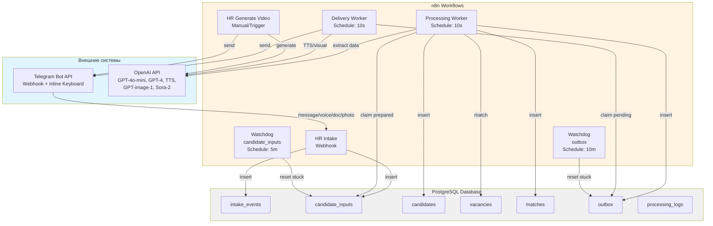

---

## Компоненты системы

### 1. HR Intake Workflow

**Назначение:** Приём и классификация входящих сообщений из Telegram.

**Триггер:** Telegram Webhook (message, callback_query)

**Функции:**
- Приём входящих сообщений
- Классификация типа: text, voice, document, image, callback
- Нормализация данных
- Запись в `intake_events` и `candidate_inputs`

**Узлы:** 43

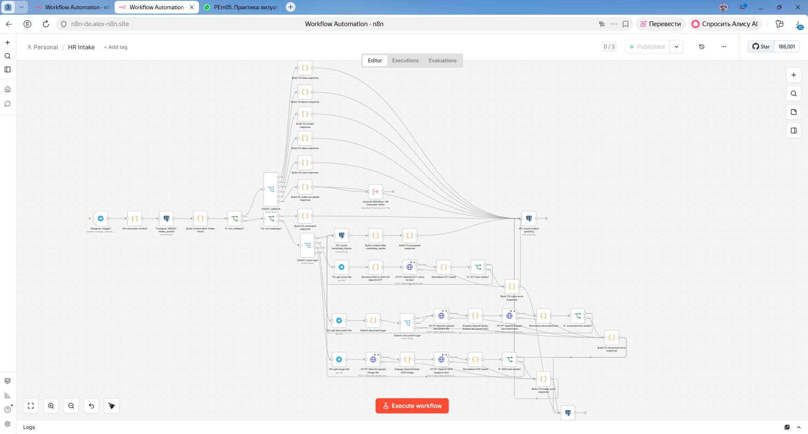

*Workflow приёма входных данных (HR Intake)*

**Поток данных:**
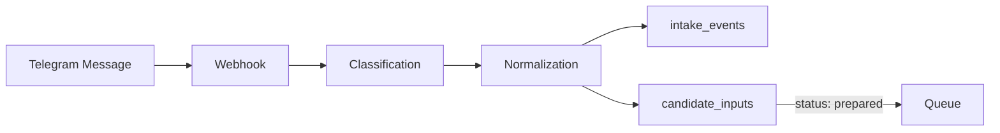

---

### 2. HR Processing Worker

**Назначение:** Извлечение данных кандидата и matching с вакансиями.

**Триггер:** Schedule (каждые 10 секунд)

**Функции:**
- Чтение записей из `candidate_inputs` (status='prepared')
- Извлечение данных с помощью GPT-4o-mini
- Валидация JSON-структуры
- Создание записи кандидата в `candidates`
- Matching с вакансиями (GPT-4o-mini)
- Подготовка ответа в `outbox`

**Узлы:** 47

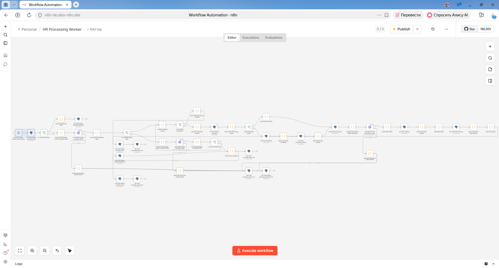

*Workflow обработки кандидата (Processing Worker)*

**Поток данных:**
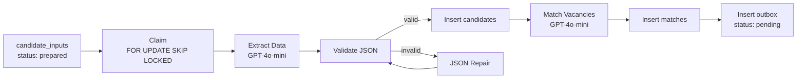

**Обработка ошибок:**
- Попытка ремонта JSON (repair)
- Fallback на невалидный JSON
- Fallback на processing error

---

### 3. HR Delivery Worker

**Назначение:** Доставка мультимедийного ответа кандидату.

**Триггер:** Schedule (каждые 10 секунд)

**Функции:**
- Чтение записей из `outbox` (status='pending')
- Генерация TTS (если metadata.tts_required)
- Генерация визуалов (если metadata.visual_required)
- Отправка сообщения в Telegram
- Обновление статуса `outbox`

**Узлы:** 21

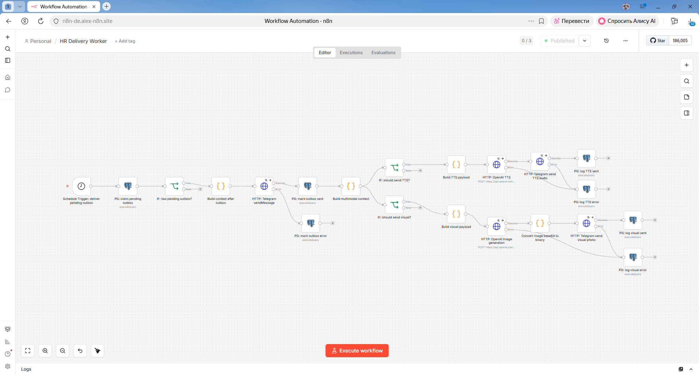

*Workflow доставки результата (Delivery Worker)*

**Поток данных:**
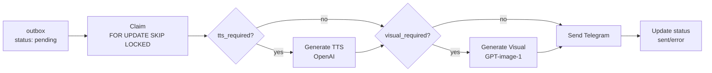

---

### 4. HR Generate Video

**Назначение:** Генерация видео по запросу пользователя.

**Триггер:** Manual / Execute Workflow Trigger

**Функции:**
- Генерация видео через OpenAI Sora-2
- Polling статуса генерации (до 20 попыток)
- Отправка результата в Telegram

**Узлы:** 15

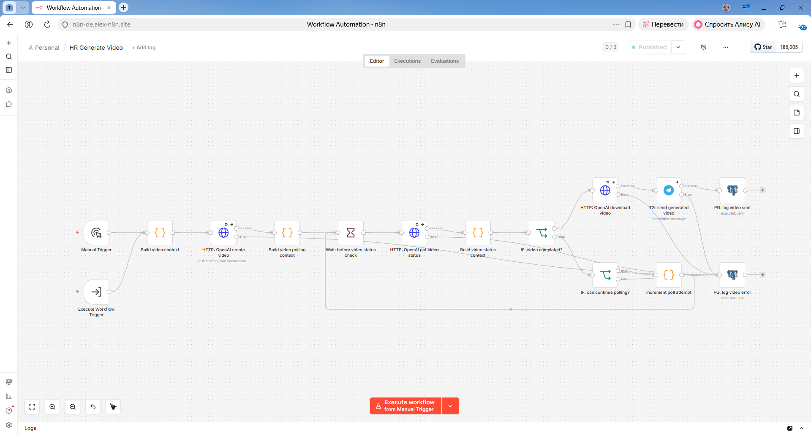

*Workflow генерации видео (on-demand)*

---

### 5. HR Queue Watchdog - candidate_inputs

**Назначение:** Сброс зависших обработок.

**Триггер:** Schedule (каждые 5 минут)

**Функции:**
- Поиск записей со статусом `processing_started` > 5 минут
- Сброс в `prepared` или `error`

**Узлы:** 2

---

### 6. HR Queue Watchdog - outbox

**Назначение:** Сброс зависших сообщений.

**Триггер:** Schedule (каждые 10 минут)

**Функции:**
- Поиск записей со статусом `sending` > 10 минут
- Сброс в `pending` или `error`

**Узлы:** 2

---

## База данных

### ER-диаграмма

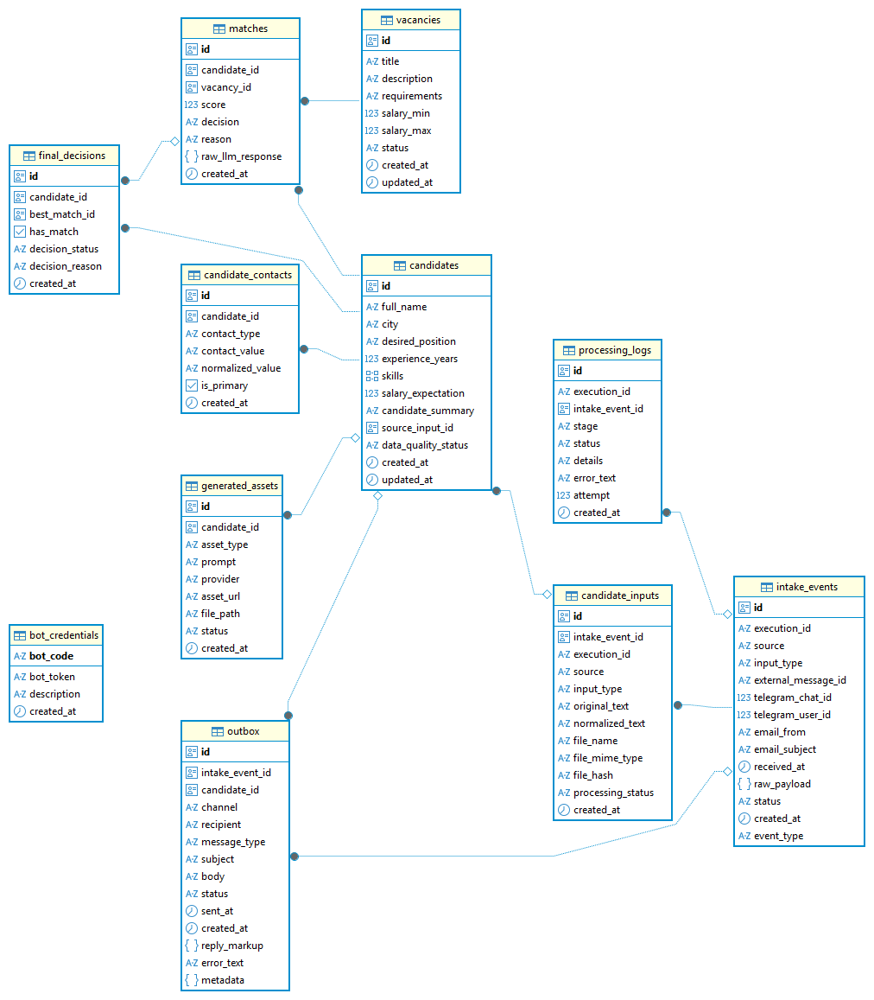

*ER-диаграмма базы данных HR Assistant*

---

### Основные таблицы (Production-контур)

| Таблица | Назначение | Ключевые поля |
|---------|-----------|---------------|
| `intake_events` | Входящие события | id, execution_id, input_type, telegram_chat_id |
| `candidate_inputs` | Входные данные | id, intake_event_id, normalized_text, processing_status |
| `candidates` | Профили кандидатов | id, full_name, city, skills, salary_expectation |
| `candidate_contacts` | Контакты | id, candidate_id, contact_type, contact_value |
| `vacancies` | Вакансии | id, title, description, salary_min, salary_max |
| `matches` | Результаты matching | id, candidate_id, vacancy_id, score, decision |
| `final_decisions` | Итоговые решения | id, candidate_id, best_match_id, has_match |
| `outbox` | Исходящие сообщения | id, channel, recipient, body, status, metadata |
| `processing_logs` | Журнал обработки | id, execution_id, stage, status, error_text |
| `generated_assets` | Сгенерированные материалы | id, candidate_id, asset_type, asset_url |
| `bot_credentials` | Учётные данные | bot_code, bot_token |

---

### Таблицы экспериментального ML-контура (Experimental)

**⚠️ Важно:** Эти таблицы изолированы от production и используются только для Prompt Evaluation и Fine-tuning.

| Таблица | Назначение | Ключевые поля |
|---------|-----------|---------------|
| `eval_prompt_datasets` | Версии датасетов для A/B-тестирования | id, dataset_code, name, status |
| `eval_prompt_cases` | Тестовые кейсы (кандидаты) | id, dataset_id, case_code, case_type |
| `eval_prompt_case_vacancies` | Вакансии внутри кейса с reference-разметкой | id, case_id, vacancy_json, reference_score |
| `eval_prompt_experiments` | Определения экспериментов | id, dataset_id, experiment_code, prompt_a_text, prompt_b_text |
| `eval_prompt_runs` | Запуски экспериментов (judge, A, B) | id, experiment_id, run_type, status |
| `eval_prompt_results` | Результаты выполнения | id, run_id, case_vacancy_id, score, decision |

**Связь с Fine-tuning:**
- Reference Dataset из Prompt Evaluation → Teacher Dataset для Fine-tuning
- Judge-оценки используются как эталон для обучения LoRA-адаптеров

**Документация:** [database/README.md](../database/README.md)

---

### Индексы

| Индекс | Таблица | Поля | Назначение |
|--------|---------|------|-----------|
| `idx_intake_events_execution_id` | intake_events | execution_id | Поиск по execution_id |
| `idx_intake_events_telegram` | intake_events | telegram_chat_id, telegram_user_id | Поиск по Telegram ID |
| `idx_candidate_inputs_execution_id` | candidate_inputs | execution_id | Поиск по execution_id |
| `idx_candidate_inputs_file_hash` | candidate_inputs | file_hash | Дедупликация файлов |
| `idx_candidate_contacts_normalized` | candidate_contacts | normalized_value | Поиск по нормализованным контактам |
| `idx_vacancies_status` | vacancies | status | Поиск активных вакансий |
| `idx_matches_candidate_score` | matches | candidate_id, score | Поиск лучших matching |
| `idx_processing_logs_execution_id` | processing_logs | execution_id | Поиск логов по execution |
| `idx_outbox_status` | outbox | status | Выборка pending сообщений |

---

## Потоки данных

### Общий pipeline обработки

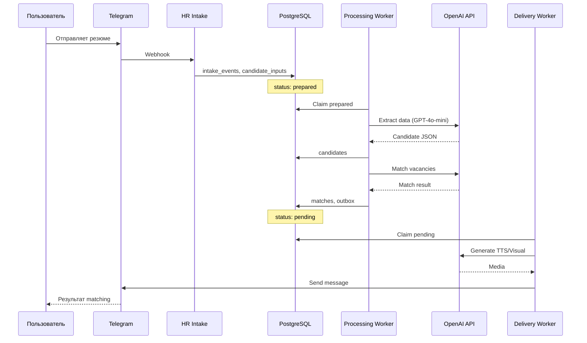

---

### Мультимодальный ввод

#### Текст

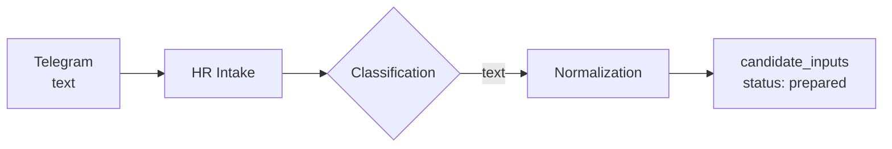

---

#### Голосовое сообщение

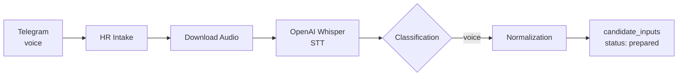

---

#### Документ (PDF/DOCX)

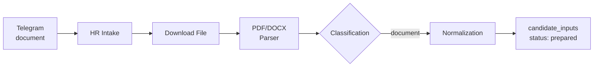

---

#### Изображение

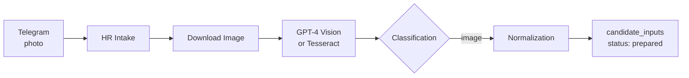

---

## Интеграции

### Telegram Bot API

**Тип:** Webhook

**Входящие сообщения:**
- `message` (text, voice, document, photo)
- `callback_query` (inline keyboard)

**Исходящие сообщения:**
- `sendMessage` (текст)
- `sendVoice` (голосовые сообщения)
- `sendPhoto` (изображения)
- `sendVideo` (видео)

**Webhook setup:**
```bash
curl -X POST "https://api.telegram.org/bot<token>/setWebhook" \
  -H "Content-Type: application/json" \
  -d '{"url": "https://your-n8n-instance.com/webhook/hr-assistant"}'
```

---

### OpenAI API

**Модели:**

| Модель | Назначение | Параметры |
|--------|-----------|-----------|
| **GPT-4o-mini** | Извлечение данных кандидата, Matching | Temperature: 0, Response format: JSON Schema |
| **GPT-4o-mini** | Ремонт невалидного JSON | Temperature: 0, Response format: JSON Schema |
| **TTS-1** | Генерация голосовых сообщений | Voice: alloy, Language: Russian |
| **GPT-image-1** | Генерация визуальных материалов | Size: 1024x1024 |
| **Sora-2** | Генерация видео | Size: 720x1280, Duration: 4 sec |

---

## Обработка ошибок

### Уровни обработки

| Уровень | Workflow | Типы ошибок | Обработка |
|---------|----------|-------------|-----------|
| **Intake** | HR Intake | Ошибки входных данных | Fallback-сообщение пользователю |
| **Processing** | HR Processing Worker | Ошибки LLM, JSON | Retry, JSON repair, fallback |
| **Delivery** | HR Delivery Worker | Ошибки отправки | Retry, error status |
| **Watchdog** | Watchdogs | Зависшие записи | Сброс статуса |

---

### Retry механизм

**Параметры:**
- Количество попыток: 3
- Интервал: 5 секунд

**Применяется:**
- OpenAI API calls
- Telegram API calls
- Database operations

---

### Fallback сценарии

**Processing Worker:**
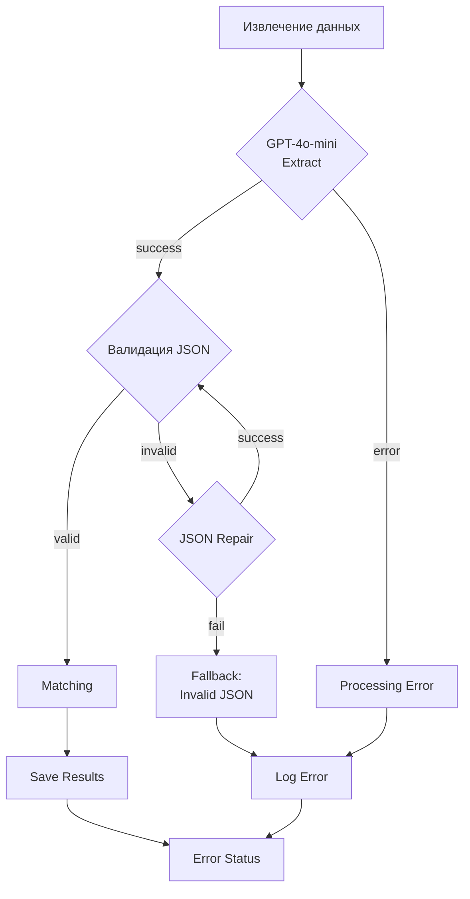

**Delivery Worker:**
1. Попытка отправить сообщение
2. При ошибке → retry (3 попытки)
3. При ошибке → error status в `outbox`

---

## Масштабируемость

### Горизонтальное масштабирование

**Возможно:**
- Запуск нескольких Processing Worker
- Запуск нескольких Delivery Worker
- Разделение по типам обработки

**Ограничения:**
- n8n не является high-load платформой
- PostgreSQL single instance

---

### Расширение системы

**Добавление новых каналов:**
- Email (входящие письма)
- Web-form (веб-форма на сайте)
- WhatsApp (через Twilio)

**Добавление новых типов обработки:**
- Новые модели LLM
- Новые форматы вывода
- Интеграция с ATS/CRM

---

## Экспериментальный ML-контур

HR Assistant развивает экспериментальный ML-контур для постоянного улучшения качества matching. Этот контур **не является production-системой** и работает изолированно.

### Архитектурная цепочка

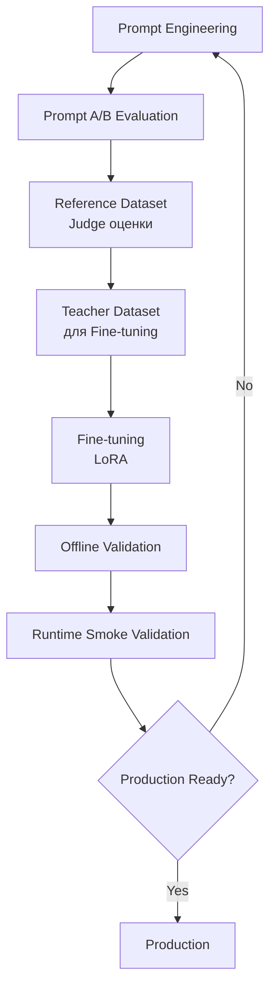

### Уровень 1: Prompt Evaluation

**Назначение:**
- A/B-тестирование промптов для matching
- Формирование reference dataset с Judge-оценками

**Компоненты:**
- База данных: `eval_prompt_*` таблицы (изолированы от production)
- Workflow: HRA Prompt Evaluation Experiment
- Judge-модель: GPT-4.1

**Результат HRA-EXP-V1:**
- Prompt A vs Prompt B сравнение
- Reference dataset из 90 кейсов с Judge-оценками
- MAE метрики, solution ready

**Документация:** [docs/prompt_evaluation/](prompt_evaluation/)

### Уровень 2: Fine-tuning (LoRA)

**Назначение:**
- Обучение LoRA-адаптеров на teacher dataset
- Улучшение качества matching

**Компоненты:**
- Базовая модель: Qwen/Qwen2.5-1.5B-Instruct
- Метод: LoRA (Low-Rank Adaptation)
- Платформа: RunPod GPU Pod

**Результаты experiment_002:**
- Offline validation: значительное улучшение качества
- Runtime smoke test: **failed negative test**
- Вывод: модель не production-ready

**Следующий шаг:** Расширение teacher dataset за счёт hard negative примеров

**Документация:** [finetuning/README.md](../finetuning/README.md)

### Уровень 3: Runtime Smoke Validation

**Назначение:**
- Инженерный стенд для тестирования LLM-провайдеров и LoRA-моделей
- **НЕ production workflow**

**Компоненты:**
- Workflow: `HR Processing Worker - Multi Provider Test.json`
- Провайдеры: OpenAI, RunPod
- Конфигурация: `workflows/llm-provider-config.js`

**Важно:**
- Workflow создан исключительно для smoke validation
- Не используется в production
- Подключён к RunPod без production-аутентификации
- Позволяет сравнивать поведение разных моделей

**Документация:** [MULTI_PROVIDER_ARCHITECTURE.md](MULTI_PROVIDER_ARCHITECTURE.md)

### Production vs Experimental

| Компонент | Production | Experimental |
|-----------|------------|--------------|
| Workflow | HR Processing Worker | HR Processing Worker - Multi Provider Test |
| База данных | production таблицы | eval_prompt_* таблицы |
| LLM | OpenAI GPT-4o-mini | OpenAI / RunPod (Qwen + LoRA) |
| Назначение | Обработка реальных запросов | Исследование и тестирование |

**Подчёркиваю:** Multi Provider Test workflow НЕ является production-контуром и не используется для обработки реальных запросов.

---

## Ограничения архитектуры

### Технические ограничения

1. **n8n не является high-load платформой**
   - Ограниченная производительность
   - Нет встроенного масштабирования

2. **PostgreSQL Single Instance**
   - Нет горизонтального масштабирования БД
   - Ограничения по объёму данных

3. **OpenAI API Rate Limits**
   - Зависимость от лимитов OpenAI
   - Стоимость токенов при масштабировании

---

### Функциональные ограничения

1. **Один язык**
   - Система работает только с русским языком
   - Нет мультиязычной поддержки

2. **Нет аутентификации**
   - Любой пользователь Telegram может использовать бота
   - Нет разграничения доступа

3. **Нет персистентности сессий**
   - Каждый запрос обрабатывается независимо
   - Нет контекста предыдущих сообщений

---

## Безопасность

### Текущее состояние

**Credentials:**

| Credential | Хранение | Использование |
|------------|----------|---------------|
| **PostgreSQL** | n8n credential store | Все workflows |
| **OpenAI API** | n8n credential store | Все AI-операции |
| **Telegram Bot Token** | Два источника: | |
| └─ HR Intake | n8n credential store | Telegram Trigger, get voice/doc/image |
| └─ HR Delivery Worker | `bot_credentials` таблица | HTTP Telegram requests |
| └─ HR Generate Video | n8n credential store | sendVideo |
| └─ Error Handler | n8n credential store | sendMessage |

**Архитектура хранения Telegram токена:**

HR Assistant использует гибридную архитектуру хранения Telegram Bot Token:

1. **n8n credential store** — для HR Intake, HR Generate Video, Error Handler
2. **bot_credentials таблица** — для HR Delivery Worker

**Обоснование:**
- Delivery Worker читает токен из БД, что позволяет менять его без перезапуска n8n
- Упрощает ротацию токенов
- Не требует обновления n8n credentials при смене токена

**⚠️ KP-002: Bot token в репозитории**

**Проблема:**
- Файл `schema_hr_assistant.sql` содержит реальный bot token в INSERT-запросе

**Решение:**
- Заменить реальный токен на placeholder для GitHub-публикации
- Документировать процесс обновления токена в DEPLOYMENT_GUIDE

**Рекомендации:**
- Хранить токен в n8n credential store (для HR Intake, HR Generate Video, Error Handler)
- Использовать bot_credentials для Delivery Worker
- Внедрить rotation policy для токенов

---

### Данные пользователей

**Персональные данные:**
- ФИО кандидатов
- Контакты (email, телефон)
- Информация о зарплате

**Рекомендации:**
- Анонимизация данных для аналитики
- Шифрование чувствительных полей
- GDPR/ФЗ-152 compliance

---

## Связанные документы

- [SPEC.md](SPEC.md) — спецификация системы
- [DEPLOYMENT_GUIDE.md](DEPLOYMENT_GUIDE.md) — руководство по развёртыванию
- [AI_QUALIFICATION.md](AI_QUALIFICATION.md) — промпты и модели
- [SUPPORT_RUNBOOK.md](SUPPORT_RUNBOOK.md) — инструкция для поддержки
- [known-issues.md](known-issues.md) — известные проблемы

---

**Статус документа:** Production-ready
**Последнее обновление:** 2026-06-24