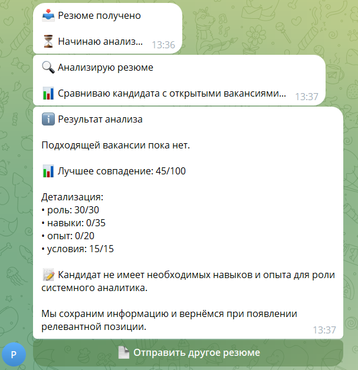

# Сквозные сценарии работы системы

Документ показывает, как резюме проходят через систему HR Assistant — от момента отправки до результата для кандидата и HR-специалиста.

Каждый сценарий демонстрирует конкретный путь резюме: что видит кандидат, что получает HR-специалист, как работает система.

---

## Сценарий 1: Текстовое резюме → Matching

**Номер:** HRA-001

Кандидат отправляет текстовое резюме через Telegram-бот. Система извлекает данные, сравнивает с вакансиями и возвращает результат.

---

### Исходная ситуация

Кандидат открывает Telegram-бота и отправляет текстовое описание опыта работы.


*Пример текстового резюме, отправленного кандидатом*

---

### Путь резюме

**1. Кандидат отправляет текст резюме**

Кандидат пишет в Telegram-бот:

> Привет! Меня зовут Иванов Иван.
> Опыт работы Frontend-разработчиком 5 лет.
> Навыки: React, TypeScript, Node.js.
> Город: Москва.
> Зарплатные ожидания: 180 000 руб.
> Email: ivanov@example.com
> Телефон: +79001234567

Система подтверждает приём.

---

**2. Нормализация текста**

HR Intake Workflow принимает сообщение, классифицирует тип (text), нормализует текст и создаёт запись в `candidate_inputs`.



*Нормализованные данные в формате JSON*

**Статус:** `prepared`

---

**3. Извлечение данных кандидата**

HR Processing Worker:
- Извлекает структурированные данные с помощью GPT-4o-mini
- Валидирует JSON-структуру
- Создаёт запись в таблице `candidates`

**Извлечённые данные:**
```json
{
  "full_name": "Иванов Иван",
  "city": "Москва",
  "desired_position": "Frontend-разработчик",
  "experience_years": 5,
  "skills": ["React", "TypeScript", "Node.js"],
  "salary_expectation": 180000,
  "email": "ivanov@example.com",
  "phone": "+79001234567"
}
```

---

**4. Matching с вакансиями**

Система сравнивает профиль кандидата с открытыми вакансиями:

| Вакансия | Score | Decision | Reason |
|----------|-------|----------|--------|
| Senior Frontend Developer | 85 | match | Опыт 5 лет, навыки соответствуют, город Москва |
| Middle React Developer | 70 | match | Опыт соответствует, навыки React |
| Backend Developer | 30 | no_match | Навыки не соответствуют |

**Лучший match:** Senior Frontend Developer (score 85)

---

**5. Формирование ответа**

Система готовит ответ:
- Текстовое сообщение с результатом matching
- Голосовое сообщение (TTS)
- Визуальные материалы (инфографика)

---

**6. Доставка ответа**

HR Delivery Worker отправляет мультимедийный ответ кандидату:

**Текст:**
> Иван, спасибо за резюме!
>
> Мы нашли для вас подходящую вакансию: **Senior Frontend Developer**
>
> **Score:** 85/100
> **Reason:** Ваш опыт (5 лет), навыки (React, TypeScript, Node.js) и город (Москва) соответствуют требованиям.
>
> HR-специалист свяжется с вами в ближайшее время.

**Голос (TTS):** Аудиоверсия сообщения

**Визуальные материалы:** Инфографика с профилем кандидата и matching

---

### Результат

**Кандидат получает:**
- Подтверждение приёма резюме
- Результат matching (подходящая вакансия)
- Score и обоснование
- Мультимедийный ответ (текст + голос + визуал)

**HR-специалист получает:**
- Структурированный профиль кандидата
- Результат matching с score
- Обоснование решения
- Контакты кандидата

---

## Сценарий 2: Голосовое резюме → Matching

**Номер:** HRA-002

Кандидат отправляет голосовое сообщение с описанием опыта. Система транскрибирует, извлекает данные и выполняет matching.

---

### Исходная ситуация

Кандидат отправляет голосовое сообщение в Telegram-бот.

---

### Путь резюме

**1. Кандидат отправляет голосовое сообщение**

Кандидат записывает голосовое сообщение:

> (Аудио) "Здравствуйте! Меня зовут Петрова Анна. Я UX-дизайнер с 3-летним опытом работы. Владею Figma, Sketch, Adobe XD. Живу в Санкт-Петербурге. Зарплатные ожидания 150 000 рублей. Контакты: anna@example.com, телефон +79021234567."

---

**2. STT-транскрибация**

HR Intake Workflow:
- Получает голосовое сообщение от Telegram
- Загружает аудиофайл
- Передаёт в OpenAI Whisper
- Получает текстовую расшифровку

**Нормализованный текст:**
> Здравствуйте! Меня зовут Петрова Анна. Я UX-дизайнер с 3-летним опытом работы. Владею Figma, Sketch, Adobe XD. Живу в Санкт-Петербурге. Зарплатные ожидания 150 000 рублей. Контакты: anna@example.com, телефон +79021234567.

---

**3. Извлечение данных**

HR Processing Worker извлекает структурированные данные:

```json
{
  "full_name": "Петрова Анна",
  "city": "Санкт-Петербург",
  "desired_position": "UX-дизайнер",
  "experience_years": 3,
  "skills": ["Figma", "Sketch", "Adobe XD"],
  "salary_expectation": 150000,
  "email": "anna@example.com",
  "phone": "+79021234567"
}
```

---

**4. Matching с вакансиями**

| Вакансия | Score | Decision | Reason |
|----------|-------|----------|--------|
| UX Designer | 80 | match | Опыт 3 года, навыки соответствуют |
| Product Designer | 65 | match | Частичное соответствие навыков |

**Лучший match:** UX Designer (score 80)

---

**5. Ответ кандидату**

**Текст:**
> Анна, спасибо за голосовое резюме!
>
> Мы нашли для вас вакансию: **UX Designer**
>
> **Score:** 80/100
> **Reason:** Ваш опыт (3 года) и навыки (Figma, Sketch, Adobe XD) соответствуют требованиям.
>
> Ожидайте звонка от HR-специалиста.

---

### Результат

**Кандидат получает:**
- Результат matching без необходимости писать текст
- Удобный формат ввода (голос)

**Система обрабатывает:**
- STT-транскрибацию
- Стандартизацию данных из голосового формата

---

## Сценарий 3: Документ (PDF/DOCX) → Matching

**Номер:** HRA-003

Кандидат отправляет документ с резюме (PDF или DOCX). Система извлекает текст и выполняет стандартную обработку.

---

### Исходная ситуация

Кандидат отправляет PDF-файл с резюме через Telegram-бот.

---

### Путь резюме

**1. Кандидат отправляет документ**

Кандидат прикрепляет файл `resume.pdf` к сообщению в Telegram.

---

**2. Извлечение текста из документа**

HR Intake Workflow:
- Получает документ от Telegram
- Определяет MIME-тип (application/pdf)
- Извлекает текст из PDF
- Нормализует текст

**Нормализованный текст:**
> Иванов Сергей
> Senior Java Developer
> Опыт: 7 лет
> Навыки: Java, Spring Boot, Microservices, PostgreSQL
> Город: Москва
> Зарплата: 250 000 руб.
> Email: sergey@example.com
> Телефон: +79031234567

---

**3. Извлечение данных**

```json
{
  "full_name": "Иванов Сергей",
  "city": "Москва",
  "desired_position": "Senior Java Developer",
  "experience_years": 7,
  "skills": ["Java", "Spring Boot", "Microservices", "PostgreSQL"],
  "salary_expectation": 250000,
  "email": "sergey@example.com",
  "phone": "+79031234567"
}
```

---

**4. Matching с вакансиями**

| Вакансия | Score | Decision | Reason |
|----------|-------|----------|--------|
| Senior Java Developer | 90 | match | Полное соответствие опыта и навыков |
| Tech Lead | 75 | match | Частичное соответствие |

**Лучший match:** Senior Java Developer (score 90)

---

**5. Ответ кандидату**

**Текст:**
> Сергей, спасибо за резюме!
>
> Мы нашли для вас вакансию: **Senior Java Developer**
>
> **Score:** 90/100
> **Reason:** Ваш опыт (7 лет) и навыки (Java, Spring Boot, Microservices, PostgreSQL) полностью соответствуют требованиям.
>
> HR-специалист свяжется с вами в ближайшее время.

---

### Результат

**Кандидат получает:**
- Возможность отправить резюме в привычном формате
- Автоматическую обработку без конвертации

**Система обрабатывает:**
- Извлечение текста из PDF/DOCX
- Стандартизацию данных

---

## Сценарий 4: Изображение резюме → Matching

**Номер:** HRA-004

Кандидат отправляет фото резюме. Система выполняет OCR, извлекает текст и данные.

---

### Исходная ситуация

Кандидат отправляет фотографию резюме через Telegram-бот.

---

### Путь резюме

**1. Кандидат отправляет изображение**

Кандидат прикрепляет фото резюме к сообщению.

---

**2. OCR-распознавание**

HR Intake Workflow:
- Получает изображение от Telegram
- Передаёт в OCR-сервис (или GPT-4 Vision)
- Извлекает текст
- Нормализует текст

**Нормализованный текст:**
> Смирнова Елена
> Marketing Manager
> Опыт: 4 года
> Навыки: Digital Marketing, SEO, Google Ads, Analytics
> Город: Москва
> Зарплата: 180 000 руб.
> Email: elena@example.com

---

**3. Извлечение данных**

```json
{
  "full_name": "Смирнова Елена",
  "city": "Москва",
  "desired_position": "Marketing Manager",
  "experience_years": 4,
  "skills": ["Digital Marketing", "SEO", "Google Ads", "Analytics"],
  "salary_expectation": 180000,
  "email": "elena@example.com"
}
```

---

**4. Matching с вакансиями**

| Вакансия | Score | Decision | Reason |
|----------|-------|----------|--------|
| Digital Marketing Manager | 85 | match | Опыт и навыки соответствуют |
| Marketing Lead | 70 | match | Частичное соответствие |

**Лучший match:** Digital Marketing Manager (score 85)

---

**5. Ответ кандидату**

**Текст:**
> Елена, спасибо за резюме!
>
> Мы нашли для вас вакансию: **Digital Marketing Manager**
>
> **Score:** 85/100
> **Reason:** Ваш опыт (4 года) и навыки (Digital Marketing, SEO, Google Ads) соответствуют требованиям.
>
> Ожидайте звонка от HR-специалиста.

---

### Результат

**Кандидат получает:**
- Возможность отправить фото резюме (скан, фото с телефона)
- Автоматическое распознавание без ручного ввода

**Система обрабатывает:**
- OCR-распознавание изображения
- Восстановление структуры текста
- Стандартизацию данных

---

## Сводная таблица сценариев

| Сценарий | Формат ввода | Время обработки | Формат ответа |
|----------|-------------|-----------------|--------------|
| Текстовое резюме | Текст | < 30 сек | Текст + TTS + Визуал |
| Голосовое резюме | Голос | < 60 сек | Текст + TTS + Визуал |
| Документ (PDF/DOCX) | Файл | < 60 сек | Текст + TTS + Визуал |
| Изображение | Фото | < 90 сек | Текст + TTS + Визуал |

---

## Что показывает документ

**Для бизнеса:**
- Как резюме проходят через систему
- Какие результаты получают кандидаты и HR-специалисты
- Как автоматизация экономит время

**Для оценки:**
- Конкретные примеры работы системы
- Различные форматы ввода
- Понятные бизнес-сценарии без технических деталей

---

## Связанные документы

- [BUSINESS_VALUE.md](BUSINESS_VALUE.md) — ценность для бизнеса
- [USER_GUIDE.md](USER_GUIDE.md) — руководство кандидата
- [HR_GUIDE.md](HR_GUIDE.md) — руководство HR-специалиста
- [ARCHITECTURE.md](ARCHITECTURE.md) — архитектура системы
- [SPEC.md](SPEC.md) — спецификация системы

---

**Статус документа:** Production-ready
**Последнее обновление:** 2026-06-23