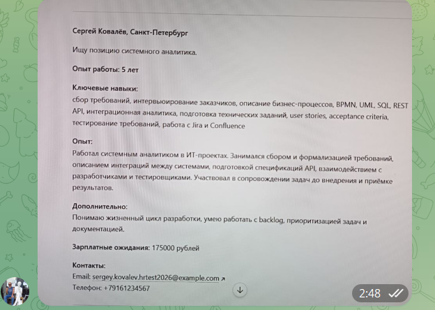
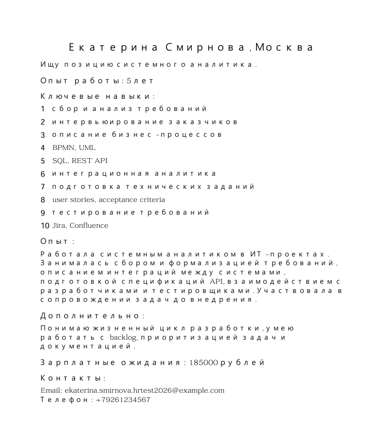
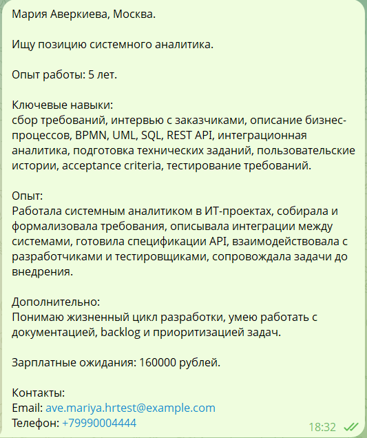

# Сквозные сценарии работы системы

Документ показывает, как резюме проходят через систему HR Assistant — от момента отправки до результата для кандидата.

Каждый сценарий демонстрирует конкретный путь резюме: что видит кандидат, что получает HR-специалист, как работает система.

---

## Сценарий 1: Фото резюме → Matching

**Номер:** HRA-001

Кандидат отправляет фото резюме через Telegram-бот. Система выполняет OCR, извлекает данные и выполняет matching.

---

### Исходная ситуация

Кандидат отправляет фото резюме через Telegram-бот.



*Пример фото резюме: Сергей Иванов, Москва*

---

### Путь резюме

**1. Кандидат отправляет фото**

Кандидат фотографирует резюме и отправляет в Telegram-бот.

---

**2. OCR-распознавание**

HR Intake Workflow:
- Получает изображение от Telegram
- Передаёт в OCR-сервис (GPT-4 Vision)
- Извлекает текст
- Нормализует текст

**Извлечённые данные:**
```json
{
  "full_name": "Сергей Иванов",
  "city": "Москва",
  "desired_position": "Системный аналитик",
  "experience_years": 6,
  "skills": [
    "сбор и анализ требований",
    "BPMN",
    "UML",
    "SQL",
    "REST API",
    "интеграция систем",
    "постановка задач разработчикам",
    "описание бизнес-процессов"
  ],
  "salary_expectation": 210000,
  "email": "sergey.ivanov.test@example.com",
  "phone": "+7 901 555-11-22"
}
```

---

**3. Matching с вакансиями**

Система сравнивает профиль кандидата с открытыми вакансиями:

| Вакансия | Score | Decision | Reason |
|----------|-------|----------|--------|
| Системный аналитик | 100 | match | Кандидат полностью соответствует роли системного аналитика, имеет все необходимые навыки и опыт, а также соответствует условиям по зарплате и городу |
| Prompt Engineer / AI Automation Specialist | 40 | no_match | Кандидат не соответствует роли и требованиям вакансии, навыки и опыт не связаны с prompt engineering и AI |

**Лучший match:** Системный аналитик (score: 100)

---

**4. Ответ кандидату**

**Текст:**
> Спасибо за резюме! Мы нашли для вас подходящую вакансию: **Системный аналитик**
>
> **Score:** 100/100
> **Reason:** Полное соответствие роли, все необходимые навыки, опыт и условия совпадают.
>
> HR-специалист свяжется с вами в ближайшее время.

**Голос (TTS):** Аудиоверсия сообщения

**Визуальные материалы:** Инфографика с профилем кандидата и результатами matching

---

### Результат

**Кандидат получает:**
- Возможность отправить фото резюме (скан, фото с телефона)
- Автоматическое распознавание без ручного ввода
- Результат matching за < 90 секунд

**HR-специалист получает:**
- Структурированный профиль кандидата
- Результат matching с детальным score
- Контакты кандидата

---

## Сценарий 2: Голосовое резюме → Matching

**Номер:** HRA-002

Кандидат отправляет голосовое сообщение с описанием опыта. Система транскрибирует, извлекает данные и выполняет matching.

---

### Исходная ситуация

Кандидат отправляет голосовое сообщение в Telegram-бот.


*Пример голосового резюме*

---

### Путь резюме

**1. Кандидат отправляет голосовое сообщение**

Кандидат записывает голосовое сообщение:

> (Голосовое сообщение) "Здравствуйте! Меня зовут Иванов Иван. Я системный аналитик с 5-летним опытом работы. Владею системным анализом, SQL, REST API, BPMN, UML. Живу в Москве. Зарплатные ожидания 180 000 рублей. Контакты: ivanov@example.com, телефон +79991234567."

---

**2. STT-транскрибация**

HR Intake Workflow:
- Получает голосовое сообщение от Telegram
- Загружает аудиофайл
- Передаёт в OpenAI Whisper
- Получает текстовую расшифровку

**Извлечённые данные:**
```json
{
  "full_name": "Иванов Иван",
  "city": "Москва",
  "desired_position": "Системный аналитик",
  "experience_years": 5,
  "skills": [
    "Системный анализ",
    "SQL",
    "REST API",
    "BPMN",
    "UML",
    "Swagger / OpenAPI",
    "Jira",
    "Confluence",
    "Работа с требованиями",
    "Интеграции систем"
  ],
  "salary_expectation": 180000,
  "email": "ivanov@example.com",
  "phone": "+79991234567"
}
```

---

**3. Matching с вакансиями**

| Вакансия | Score | Decision | Reason |
|----------|-------|----------|--------|
| Системный аналитик | 100 | match | Полное соответствие роли, все необходимые навыки, опыт и условия совпадают |
| Prompt Engineer / AI Automation Specialist | 40 | no_match | Навыки и опыт не связаны с prompt engineering и AI |

**Лучший match:** Системный аналитик (score: 100)

---

**4. Ответ кандидату**

**Текст:**
> Спасибо за голосовое резюме! Мы нашли для вас вакансию: **Системный аналитик**
>
> **Score:** 100/100
> **Reason:** Полное соответствие роли системного аналитика, все необходимые навыки и опыт.
>
> Ожидайте звонка от HR-специалиста.

---

### Результат

**Кандидат получает:**
- Результат matching без необходимости писать текст
- Удобный формат ввода (голос)

**Система обрабатывает:**
- STT-транскрибацию
- Стандартизацию данных из голосового формата

---

## Сценарий 3: Документ (PDF) → Matching

**Номер:** HRA-003

Кандидат отправляет документ с резюме (PDF). Система извлекает текст и выполняет стандартную обработку.

---

### Исходная ситуация

Кандидат отправляет PDF-файл с резюме через Telegram-бот.



*Пример PDF-резюме: извлечённый текст*


*Пример PDF-резюме: загруженный файл в Telegram*

---

### Путь резюме

**1. Кандидат отправляет документ**

Кандидат прикрепляет файл `resume.pdf` к сообщению в Telegram.

---

**2. Извлечение текста из документа**

HR Intake Workflow:
- Получает документ от Telegram
- Определяет MIME-тип (application/pdf)
- Извлекает текст из PDF
- Нормализует текст

**Извлечённые данные:**
```json
{
  "full_name": "Екатерина Смирнова",
  "city": "Москва",
  "desired_position": "Системный аналитик",
  "experience_years": 5,
  "skills": [
    "сбор и анализ требований",
    "интервьюирование заказчиков",
    "описание бизнес-процессов",
    "BPMN",
    "UML",
    "SQL",
    "REST API",
    "интеграционная аналитика",
    "подготовка технических заданий",
    "user stories",
    "acceptance criteria",
    "тестирование требований",
    "Jira",
    "Confluence"
  ],
  "salary_expectation": 185000,
  "email": "ekaterina.smirnova.hrtest2026@example.com",
  "phone": "+79261234567"
}
```

---

**3. Matching с вакансиями**

| Вакансия | Score | Decision | Reason |
|----------|-------|----------|--------|
| Системный аналитик | 100 | match | Кандидат полностью соответствует роли системного аналитика, имеет все необходимые навыки и опыт |
| Prompt Engineer / AI Automation Specialist | 45 | no_match | Навыки и опыт не связаны с prompt engineering и AI |
| Специалист по разметке данных | 10 | no_match | Навыки и опыт не связаны с разметкой данных |

**Лучший match:** Системный аналитик (score: 100)

---

**4. Ответ кандидату**

**Текст:**
> Екатерина, спасибо за резюме!
>
> Мы нашли для вас вакансию: **Системный аналитик**
>
> **Score:** 100/100
> **Reason:** Полное соответствие роли, все необходимые навыки, опыт и условия совпадают.
>
> HR-специалист свяжется с вами в ближайшее время.

---

### Результат

**Кандидат получает:**
- Возможность отправить резюме в привычном формате
- Автоматическую обработку без конвертации

**Система обрабатывает:**
- Извлечение текста из PDF/DOCX
- Стандартизацию данных

---

## Сценарий 4: Текстовое резюме → Matching

**Номер:** HRA-004

Кандидат отправляет текстовое резюме через Telegram-бот. Система извлекает данные и сравнивает с вакансиями.

---

### Исходная ситуация

Кандидат открывает Telegram-бота и отправляет текстовое описание опыта работы.



*Пример текстового резюме: Мария Аверкиева, Москва*

---

### Путь резюме

**1. Кандидат отправляет текст резюме**

Кандидат пишет в Telegram-бот:

> Привет! Меня зовут Мария Аверкиева.
> Опыт работы системным аналитиком 5 лет.
> Навыки: сбор требований, интервью с заказчиками, описание бизнес-процессов, BPMN, UML, SQL, REST API.
> Город: Москва.
> Зарплатные ожидания: 160 000 руб.
> Email: ave.mariya.hrtest@example.com
> Телефон: +79990004444

**Минимальные данные:**
- ФИО
- Желаемая должность или область
- Опыт работы

**Рекомендуемые данные:**
- Навыки
- Город
- Зарплатные ожидания
- Контакты (email и/или телефон)

---

**2. Извлечение данных**

**Извлечённые данные:**
```json
{
  "full_name": "Мария Аверкиева",
  "city": "Москва",
  "desired_position": "Системный аналитик",
  "experience_years": 5,
  "skills": [
    "сбор требований",
    "интервью с заказчиками",
    "описание бизнес-процессов",
    "BPMN",
    "UML",
    "SQL",
    "REST API",
    "интеграционная аналитика",
    "подготовка технических заданий",
    "пользовательские истории",
    "acceptance criteria",
    "тестирование требований"
  ],
  "salary_expectation": 160000,
  "email": "ave.mariya.hrtest@example.com",
  "phone": "+79990004444"
}
```

---

**3. Matching с вакансиями**

| Вакансия | Score | Decision | Reason |
|----------|-------|----------|--------|
| Системный аналитик | 100 | match | Полное соответствие роли системного аналитика, все необходимые навыки, опыт и условия совпадают |
| Prompt Engineer / AI Automation Specialist | 40 | no_match | Навыки и опыт не связаны с prompt engineering и AI |
| Специалист по разметке данных | 10 | no_match | Навыки и опыт не соответствуют требованиям вакансии |

**Лучший match:** Системный аналитик (score: 100)

---

**4. Ответ кандидату**

**Текст:**
> Мария, спасибо за резюме!
>
> Мы нашли для вас вакансию: **Системный аналитик**
>
> **Score:** 100/100
> **Reason:** Полное соответствие роли, все необходимые навыки, опыт и условия совпадают.
>
> HR-специалист свяжется с вами в ближайшее время.

---

### Результат

**Кандидат получает:**
- Результат matching за < 30 секунд
- Быстрый ответ без задержек

**HR-специалист получает:**
- Структурированный профиль кандидата
- Результат matching с детальным score
- Контакты кандидата

---

## Сводная таблица сценариев

| Сценарий | Формат ввода | Время обработки | Лучший match | Score |
|----------|-------------|-----------------|--------------|-------|
| Фото резюме | Изображение | < 90 сек | Системный аналитик | 100 |
| Голосовое резюме | Голос | < 60 сек | Системный аналитик | 100 |
| Документ (PDF) | Файл | < 60 сек | Системный аналитик | 100 |
| Текстовое резюме | Текст | < 30 сек | Системный аналитик | 100 |

---

## Что показывает документ

**Для бизнеса:**
- Как резюме проходят через систему
- Какие результаты получают кандидаты и HR-специалисты
- Как автоматизация экономит время

**Для оценки:**
- Конкретные примеры работы системы
- Различные форматы ввода
- Понятные бизнес-сценарии без технических деталей

---

## Связанные документы

- [BUSINESS_VALUE.md](BUSINESS_VALUE.md) — ценность для бизнеса
- [USER_GUIDE.md](USER_GUIDE.md) — руководство кандидата
- [HR_GUIDE.md](HR_GUIDE.md) — руководство HR-специалиста
- [ARCHITECTURE.md](ARCHITECTURE.md) — архитектура системы
- [SPEC.md](SPEC.md) — спецификация системы

---

**Статус документа:** Production-ready
**Последнее обновление:** 2026-06-24