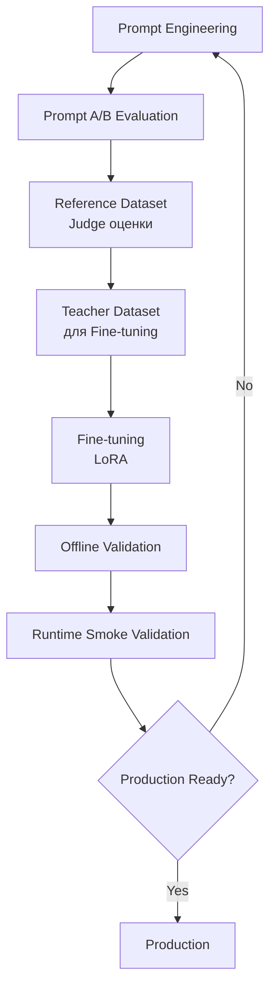

# Экспериментальный ML-контур HR Assistant

**Created:** 2026-06-28
**Status:** Experimental
**Author:** AI Automation Portfolio Lab

---

## Обзор

Этот документ описывает архитектурную цепочку экспериментального ML-контура HR Assistant.

**ВАЖНО:** Экспериментальный ML-контур **не является production-системой**. Он работает изолированно и предназначен для исследования и улучшения качества matching.

---

## Архитектурная цепочка



### Уровень 1: Prompt Engineering

**Назначение:**
- Разработка и оптимизация промптов для matching
- Формирование baseline качества

**Компоненты:**
- Production matching prompt (Prompt A)
- Experimental matching prompt (Prompt B)
- Judge prompt для эталонной оценки

**Выход:** Промпты для A/B-тестирования

---

### Уровень 2: Prompt A/B Evaluation

**Назначение:**
- Сравнение качества промптов (Prompt A vs Prompt B)
- Формирование reference dataset с Judge-оценками

**Методология:**
- Judge-модель: GPT-4.1 (эталон)
- Метрики: MAE (Mean Absolute Error), Accuracy, Latency
- Датасет: 90 кейсов (кандидат × вакансия)

**Результат HRA-EXP-V1:**
- Reference dataset: 90 кейсов с Judge-оценками
- MAE метрики для Prompt A и Prompt B
- Solution: REJECT PROMPT B (MAE увеличился на 52.86%)

**Документация:** [docs/prompt_evaluation/](prompt_evaluation/)

---

### Уровень 3: Reference Dataset

**Назначение:**
- Хранение эталонных оценок Judge
- Формирование teacher dataset для Fine-tuning

**Структура:**
- 90 кейсов (кандидат × вакансия)
- Стратификация: 30 obvious_match, 30 borderline, 30 obvious_no_match
- Judge-оценки: score (0-100), decision (match/no_match), reason

**Важно:**
- Teacher dataset формируется **только** из Judge-оценок
- НЕ из Prompt A или Prompt B результатов
- Это гарантирует качество обучения

**База данных:** `eval_prompt_*` таблицы (изолированы от production)

---

### Уровень 4: Teacher Dataset

**Назначение:**
- Подготовка данных для обучения LoRA
- Форматирование в формат messages для SFT

**Процесс:**
1. Извлечение кейсов из Reference Dataset
2. Форматирование в messages format (system + user + assistant)
3. Разбиение: 72 train / 9 validation / 9 test
4. Сохранение в JSONL формат

**Формат данных:**
```json
{
  "messages": [
    {"role": "system", "content": "Ты HR matching assistant..."},
    {"role": "user", "content": "КАНДИДАТ:\n[резюме]\n\nВАКАНСИЯ:\n[описание]"},
    {"role": "assistant", "content": "{\"role_score\": 8, \"skills_score\": 7, ...}"}
  ]
}
```

**Директория:** `finetuning/data/`

---

### Уровень 5: Fine-tuning (LoRA)

**Назначение:**
- Обучение LoRA-адаптера на базовой модели Qwen
- Улучшение качества matching

**Инфраструктура:**
- Базовая модель: Qwen/Qwen2.5-1.5B-Instruct
- Метод: LoRA (Low-Rank Adaptation)
- Платформа: RunPod GPU Pod (NVIDIA RTX A5000)

**Результаты:**

| Experiment | Offline Quality | Runtime Test |
|------------|-----------------|--------------|
| Experiment 001 | ✅ Baseline | ✅ Pass |
| Experiment 002 | ✅ **Improved** | ❌ **Failed negative** |

**Ключевой вывод:**
- LoRA улучшает offline качество
- Модель **не прошла runtime negative smoke test**
- Причина: недостаточно hard negative примеров в teacher dataset

**Директория:** `finetuning/runs/experiment_002/`

**Документация:** [finetuning/README.md](../finetuning/README.md)

---

### Уровень 6: Offline Validation

**Назначение:**
- Выбор лучшего чекпоинта по validation loss
- Оценка качества на отложенном тесте

**Метрики:**
- Validation Loss
- Token Accuracy
- JSON Validity Rate
- Score Correlation

**Результат Experiment 002:**
- Лучший чекпоинт: epoch 3
- Значительное улучшение качества vs baseline
- Offline validation: ✅ Pass

---

### Уровень 7: Runtime Smoke Validation

**Назначение:**
- Тестирование LoRA-модели в runtime-окружении
- Проверка на production-подобных данных

**Компоненты:**
- Workflow: `HR Processing Worker - Multi Provider Test.json`
- Runtime API: `api/hra_qwen_api_lora.py`
- Провайдер: RunPod (Qwen + LoRA adapter)

**Важно: Workflow `HR Processing Worker - Multi Provider Test.json` — это инженерный стенд.**

**Этот workflow НЕ является production-контуром.**

**Отличия от production:**

| Аспект | Production Workflow | Test Workflow |
|--------|---------------------|---------------|
| Файл | HR Processing Worker.json | HR Processing Worker - Multi Provider Test.json |
| LLM Provider | OpenAI | RunPod |
| Модель | gpt-4o-mini | hra-qwen (Qwen + LoRA) |
| Аутентификация | n8n credentials | None (RunPod proxy) |
| Назначение | Обработка реальных запросов | Тестирование моделей |
| Статус | ✅ Production | ⚠️ Experimental |

**Тесты:**
1. **Positive Smoke Test:** Корректные matching-запросы
2. **Negative Smoke Test:** Некорректные или edge-case запросы

**Результат Experiment 002:**
- Positive Smoke Test: ✅ Pass
- Negative Smoke Test: ❌ **Failed**

**Документация:** [MULTI_PROVIDER_ARCHITECTURE.md](MULTI_PROVIDER_ARCHITECTURE.md)

---

### Уровень 8: Production Readiness Decision

**Назначение:**
- Принятие решения о готовности модели к production
- Если модель не готова — возврат к улучшениям

**Критерии готовности:**
1. ✅ Offline validation: значительное улучшение качества
2. ✅ Runtime positive test: pass
3. ✅ Runtime negative test: pass
4. ✅ Production smoke test: pass

**Текущий статус:**
- Experiment 002: ❌ Не готова (failed negative test)
- Следующий шаг: Расширение teacher dataset

**Решение:** Модель **не является production-ready**. Требуется следующий цикл обучения с расширенным teacher dataset.

---

## Почему Prompt Evaluation — первый этап?

Раньше Prompt Evaluation рассматривался как самостоятельный эксперимент. Теперь это **первый этап ML-контура**:

1. **Сравнение промптов:** A/B-тестирование позволяет выбрать лучший промпт
2. **Reference Dataset:** Judge-оценки формируют эталонный датасет
3. **Teacher Dataset:** Reference Dataset становится основой для обучения LoRA
4. **Качество:** Использование Judge-оценок гарантирует качество обучения

**Без Prompt Evaluation нет Teacher Dataset.**

**Без Teacher Dataset нет Fine-tuning.**

---

## Почему отдельный workflow для Runtime Smoke Validation?

**HR Processing Worker - Multi Provider Test НЕ является production workflow.**

Причины создания отдельного workflow:

1. **Изоляция:** Тестирование новых моделей не должно влиять на production
2. **Гибкость:** Возможность переключать провайдеры (OpenAI / RunPod)
3. **Безопасность:** RunPod подключён без production-аутентификации
4. **Нагрузка:** Smoke test не создаёт нагрузку на production-очереди

**Архитектура:**
- Production workflow: HR Processing Worker (только OpenAI)
- Test workflow: HR Processing Worker - Multi Provider Test (OpenAI / RunPod)

**Документация:** [WORKFLOW_MODIFICATION_GUIDE.md](WORKFLOW_MODIFICATION_GUIDE.md)

---

## Почему модель не готова к production?

**Experiment 002 показал:**

| Тест | Результат |
|------|-----------|
| Offline validation | ✅ Улучшение качества |
| Runtime positive test | ✅ Pass |
| Runtime negative test | ❌ **Failed** |

**Причина:**
Teacher dataset не содержит достаточное количество hard negative примеров. Модель научилась корректно обрабатывать позитивные matching-запросы, но не научилась отклонять некорректные.

**Следующий цикл:**
1. Расширить teacher dataset (добавить hard negative примеры)
2. Провести experiment_003
3. Пройти runtime smoke validation
4. Повторить до production-readiness

---

## Документация

| Документ | Назначение |
|----------|------------|
| [ARCHITECTURE.md](ARCHITECTURE.md) | Общая архитектура системы |
| [MULTI_PROVIDER_ARCHITECTURE.md](MULTI_PROVIDER_ARCHITECTURE.md) | Мультипровайдерная архитектура |
| [WORKFLOW_MODIFICATION_GUIDE.md](WORKFLOW_MODIFICATION_GUIDE.md) | Инструкция по модификации workflow |
| [finetuning/README.md](../finetuning/README.md) | Модуль Fine-tuning |
| [prompt_evaluation/README.md](prompt_evaluation/README.md) | Подсистема Prompt Evaluation |

---

**Статус документа:** Experimental
**Последнее обновление:** 2026-06-28