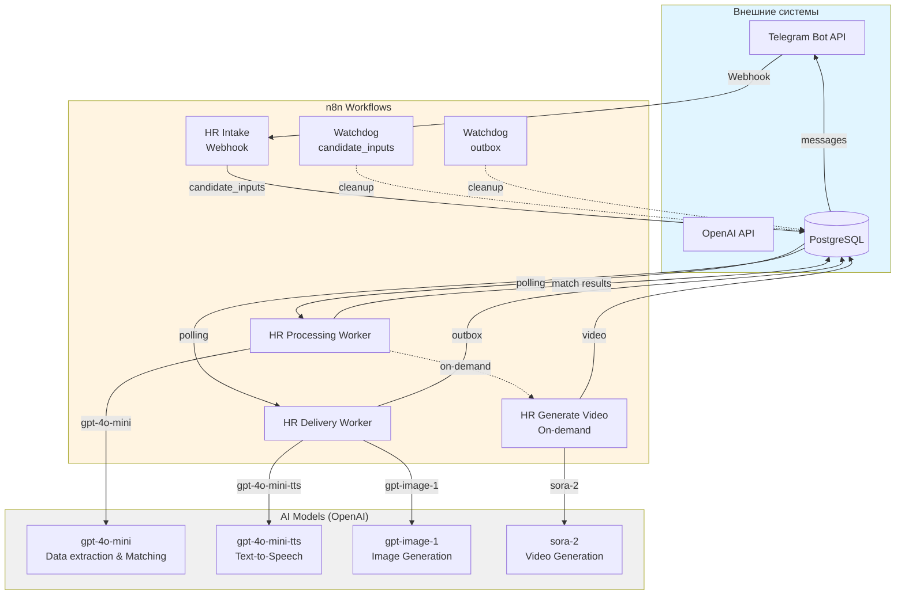
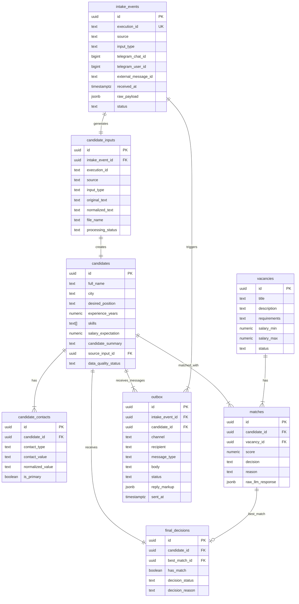

# Диаграмма интеграций: HR Assistant

Документ описывает интеграции HR Assistant с внешними системами и внутренними компонентами.

---

## Обзор интеграций

HR Assistant интегрируется с:
- **Telegram Bot API** — входной канал и доставка ответов
- **OpenAI API** — AI-модели для извлечения данных и matching
- **PostgreSQL** — база данных

---

## Архитектурная диаграмма интеграций



---

## Интеграция с Telegram Bot API

### Обзор

**Назначение:** Входной канал для резюме от кандидатов и доставка ответов.

**Тип интеграции:** Webhook

**Документация:** https://core.telegram.org/bots/api

---

### Настройка

#### Создание бота

```bash
# Создание бота через BotFather
/newbot
# Введите имя: HR Assistant
# Введите username: hr_assistant_bot
# Получите токен: 1234567890:ABCdefGHIjklMNOpqrsTUVwxyz
```

---

#### Установка Webhook

```bash
curl -X POST "https://api.telegram.org/bot${TELEGRAM_BOT_TOKEN}/setWebhook" \
  -H "Content-Type: application/json" \
  -d "{\"url\": \"https://your-domain.com/webhook/hr-assistant\"}"
```

---

### Входящие сообщения

#### Типы сообщений

| Тип | Описание | Обработка |
|-----|-----------|-----------|
| **text** | Текстовое сообщение | STT не требуется |
| **voice** | Голосовое сообщение | STT (Whisper) |
| **document** | Документ (PDF/DOCX) | Извлечение текста |
| **photo** | Изображение | OCR |
| **callback_query** | Inline keyboard | Обработка кнопок |

---

#### Пример входящего сообщения

```json
{
  "update_id": 987654321,
  "message": {
    "message_id": 142,
    "from": {
      "id": 123456789,
      "first_name": "Кирилл",
      "last_name": "Смирнов",
      "username": "ksmirnov"
    },
    "chat": {
      "id": 123456789,
      "type": "private"
    },
    "date": 1719187200,
    "text": "Здравствуйте! Меня зовут Смирнов Кирилл Андреевич. Ищу работу специалиста по внедрению AI-решений. Опыт 4 года: n8n, PostgreSQL, Python, OpenAI API. Город: Санкт-Петербург. Зарплата: от 220000 руб. Контакты: +7 (921) 555-78-43, k.smirnov.pro@mail.ru"
  }
}
```

---

### Исходящие сообщения

#### Типы сообщений

| Метод | Описание | Параметры |
|-------|-----------|-----------|
| **sendMessage** | Текстовое сообщение | chat_id, text, parse_mode |
| **sendVoice** | Голосовое сообщение | chat_id, voice |
| **sendPhoto** | Изображение | chat_id, photo, caption |
| **sendVideo** | Видео | chat_id, video, caption |

---

#### Пример исходящего сообщения

```json
{
  "method": "sendMessage",
  "chat_id": 123456789,
  "text": "Кирилл, спасибо за резюме!\n\nМы нашли для вас вакансию: **Prompt Engineer / AI Automation Specialist**\n\nScore: 90/100\nDecision: match\n\nОбоснование: Кандидат соответствует должности и требованиям, имеет необходимые навыки и опыт, а также подходит по зарплатным ожиданиям.\n\nДетали оценки:\n• Должность: 30/30\n• Навыки: 30/35\n• Опыт: 15/20\n• Условия: 15/15",
  "parse_mode": "Markdown"
}
```

---

### Обработка ошибок

| Код ошибки | Описание | Действие |
|------------|----------|----------|
| **403** | Bot was blocked by user | Удалить chat_id из БД |
| **400** | Bad Request | Проверить формат сообщения |
| **429** | Too Many Requests | Retry с задержкой |
| **500** | Internal Server Error | Retry с экспоненциальной задержкой |

---

## Интеграция с OpenAI API

### Обзор

**Назначение:** AI-модели для извлечения данных, matching, TTS, генерации.

**Тип интеграции:** REST API

**Документация:** https://platform.openai.com/docs

---

### Используемые модели

| Модель | Назначение | Workflow | Использование |
|--------|-----------|----------|---------------|
| **gpt-4o-mini** | Извлечение данных кандидата | HR Processing Worker | JSON Schema extraction |
| **gpt-4o-mini** | Matching кандидат-вакансия | HR Processing Worker | JSON Schema scoring |
| **gpt-4o-mini-tts** | Генерация голоса | HR Delivery Worker | TTS for match results |
| **gpt-image-1** | Генерация изображений | HR Delivery Worker | Visual candidate cards |
| **sora-2** | Генерация видео | HR Generate Video | On-demand video (4s, 720x1280) |

**Примечание:** Все модели используются через OpenAI API с temperature=0 для детерминированных результатов.

---

### Запрос к GPT-4o-mini (извлечение данных)

```javascript
const response = await openai.chat.completions.create({
  model: "gpt-4o-mini",
  temperature: 0,
  messages: [
    {
      role: "system",
      content: "Ты — HR-ассистент для извлечения структурированных данных из резюме. Извлекай только явно присутствующие данные. Не выдумывай отсутствующие сведения."
    },
    {
      role: "user",
      content: "Извлеки данные кандидата из текста резюме:\n\n" + normalizedText
    }
  ],
  response_format: {
    type: "json_schema",
    json_schema: {
      name: "candidate_profile",
      strict: true,
      schema: {
        type: "object",
        properties: {
          full_name: { type: ["string", "null"] },
          city: { type: ["string", "null"] },
          desired_position: { type: ["string", "null"] },
          experience_years: { type: ["number", "null"] },
          skills: { type: "array", items: { type: "string" } },
          salary_expectation: { type: ["number", "null"] },
          email: { type: ["string", "null"] },
          phone: { type: ["string", "null"] },
          summary: { type: ["string", "null"] }
        },
        required: ["full_name", "city", "desired_position", "experience_years", "skills", "salary_expectation", "email", "phone", "summary"]
      }
    }
  }
});
```

---

### Запрос к GPT-4o-mini (matching)

```javascript
const response = await openai.chat.completions.create({
  model: "gpt-4o-mini",
  temperature: 0,
  messages: [
    {
      role: "system",
      content: `Ты HR matching assistant.

Сравни кандидата и вакансию по критериям:
1. Должность / роль — 30 баллов
2. Навыки — 35 баллов
3. Опыт — 20 баллов
4. Город / формат / зарплатные ожидания — 15 баллов

Итоговый score должен быть от 0 до 100.
Правила:
- score >= 60 → decision = "match"
- score < 60 → decision = "no_match"
- не выдумывай навыки и опыт
- если данных недостаточно, снижай score`
    },
    {
      role: "user",
      content: "Кандидат:\n" + JSON.stringify(candidate, null, 2) + "\n\nВакансия:\n" + JSON.stringify(vacancy, null, 2)
    }
  ],
  response_format: {
    type: "json_schema",
    json_schema: {
      name: "vacancy_match_result",
      strict: true,
      schema: {
        type: "object",
        properties: {
          vacancy_id: { type: ["string", "null"] },
          title: { type: ["string", "null"] },
          role_score: { type: "number" },
          skills_score: { type: "number" },
          experience_score: { type: "number" },
          conditions_score: { type: "number" },
          score: { type: "number" },
          decision: { type: "string", enum: ["match", "no_match"] },
          reason: { type: "string" }
        },
        required: ["vacancy_id", "title", "role_score", "skills_score", "experience_score", "conditions_score", "score", "decision", "reason"]
      }
    }
  }
});
```

---

### Запрос к TTS (gpt-4o-mini-tts)

```javascript
const response = await openai.audio.speech.create({
  model: "gpt-4o-mini-tts",
  voice: "alloy",
  input: "Смирнов Кирилл, спасибо за резюме! Мы нашли для вас вакансию: Prompt Engineer / AI Automation Specialist. Score: 90 из 100.",
  response_format: "mp3"
});

const buffer = Buffer.from(await response.arrayBuffer());
```

---

### Запрос к gpt-image-1

```javascript
const response = await openai.images.generate({
  model: "gpt-image-1",
  prompt: "Create a professional infographic for a job candidate matching result...",
  size: "1024x1024",
  output_format: "png"
});

const imageUrl = response.data[0].url;
```

---

### Обработка ошибок

| Код ошибки | Описание | Действие |
|------------|----------|----------|
| **401** | Invalid API key | Проверить OPENAI_API_KEY |
| **429** | Rate limit exceeded | Retry с экспоненциальной задержкой |
| **500** | Internal Server Error | Retry |
| **503** | Service Unavailable | Retry с задержкой |

---

### Retry механизм

```javascript
async function callWithRetry(fn, maxRetries = 3, delay = 5000) {
  for (let attempt = 0; attempt < maxRetries; attempt++) {
    try {
      return await fn();
    } catch (error) {
      if (error.status === 429 || error.status >= 500) {
        if (attempt < maxRetries - 1) {
          await sleep(delay * Math.pow(2, attempt));
          continue;
        }
      }
      throw error;
    }
  }
}
```

---

## Интеграция с PostgreSQL

### Обзор

**Назначение:** Хранение данных о кандидатах, вакансиях, результатах matching.

**Тип интеграции:** Прямое подключение

**Документация:** https://www.postgresql.org/docs/

---

### Схема БД

#### Основные таблицы

| Таблица | Назначение | Ключевые поля |
|---------|-----------|---------------|
| `intake_events` | Входящие события | id, execution_id, input_type |
| `candidate_inputs` | Входные данные | id, intake_event_id, normalized_text |
| `candidates` | Профили кандидатов | id, full_name, skills |
| `candidate_contacts` | Контакты | id, candidate_id, contact_value |
| `vacancies` | Вакансии | id, title, requirements |
| `matches` | Результаты matching | id, candidate_id, vacancy_id, score |
| `final_decisions` | Итоговые решения | id, candidate_id, best_match_id |
| `outbox` | Исходящие сообщения | id, status, body |

---

### Операции

#### Чтение кандидатов для обработки

```sql
SELECT * FROM candidate_inputs
WHERE processing_status = 'prepared'
ORDER BY created_at ASC
LIMIT 10;
```

---

#### Запись кандидата

```sql
INSERT INTO candidates (
  full_name, city, desired_position,
  experience_years, skills, salary_expectation,
  candidate_summary, source_input_id, data_quality_status
)
VALUES (
  'Смирнов Кирилл Андреевич',
  'Санкт-Петербург',
  'Специалист по внедрению AI-решений / AI Automation Engineer',
  4,
  ARRAY['AI Automation', 'n8n', 'PostgreSQL', 'Python'],
  220000,
  'Имею опыт проектирования и внедрения AI-решений для HR, продаж и клиентского сервиса...',
  '9d8c873c-46b8-48b7-bca3-6ab2f61c9bdd',
  'validated'
)
RETURNING id;
```

---

#### Запись контактов кандидата

```sql
INSERT INTO candidate_contacts (candidate_id, contact_type, contact_value, normalized_value, is_primary)
VALUES
  ('{{candidate_id}}', 'phone', '+7 (921) 555-78-43', '+79215557843', true),
  ('{{candidate_id}}', 'email', 'k.smirnov.pro@mail.ru', 'k.smirnov.pro@mail.ru', true);
```

---

#### Запись matching

```sql
INSERT INTO matches (
  candidate_id, vacancy_id, score, decision, reason, raw_llm_response
)
VALUES (
  '9d8c873c-46b8-48b7-bca3-6ab2f61c9bdd',
  '3cc72567-e82a-4b5f-803a-497878f223b9',
  90,
  'match',
  'Кандидат соответствует должности и требованиям, имеет необходимые навыки и опыт, а также подходит по зарплатным ожиданиям.',
  '{"score": 90, "title": "Prompt Engineer / AI Automation Specialist", "role_score": 30, "skills_score": 30, "experience_score": 15, "conditions_score": 15, "decision": "match"}'::jsonb
);
```

---

#### Чтение сообщений для доставки

```sql
SELECT * FROM outbox
WHERE status = 'pending'
ORDER BY created_at ASC
LIMIT 10;
```

---

### Обработка ошибок

| Ошибка | Описание | Действие |
|--------|-----------|----------|
| **Connection refused** | PostgreSQL недоступен | Retry с задержкой |
| **Duplicate key** | Нарушение уникальности | Игнорировать или обновить |
| **Foreign key violation** | Нарушение FK | Проверить связанные данные |
| **Deadlock** | Взаимная блокировка | Retry |

---

## Внутренние интеграции

### Workflow-схемы

**Общий поток обработки:**


**Workflow HR Intake (приём входящих сообщений):**


*Workflow HR Intake — приём и классификация входящих сообщений (43 узла)*

**Workflow HR Processing Worker (обработка данных кандидата):**


*Workflow HR Processing Worker — извлечение данных и matching (47 узлов)*

**Workflow HR Delivery Worker (доставка результатов):**


*Workflow HR Delivery Worker — генерация медиа и доставка сообщений*

**Workflow HR Generate Video (on-demand видео):**


*Workflow HR Generate Video — генерация видео по запросу (sora-2)*

---

### HR Intake → HR Processing Worker

**Механизм:** База данных (таблица `candidate_inputs`)

**Протокол:**
1. HR Intake создаёт запись в `candidate_inputs` (status='prepared')
2. HR Processing Worker опрашивает таблицу каждые 10 секунд
3. Processing Worker обрабатывает и обновляет статус

**Статусы:**
- `prepared` — готов к обработке
- `processing_started` — в обработке
- `processed` — обработан
- `error` — ошибка

---

### HR Processing Worker → HR Delivery Worker

**Механизм:** База данных (таблица `outbox`)

**Протокол:**
1. Processing Worker создаёт запись в `outbox` (status='pending')
2. Delivery Worker опрашивает таблицу каждые 10 секунд
3. Delivery Worker отправляет и обновляет статус

**Статусы:**
- `pending` — готов к отправке
- `sending` — отправляется
- `sent` — отправлен
- `error` — ошибка

---

### Watchdogs → База данных

**Механизм:** SQL-запросы

**HR Queue Watchdog - candidate_inputs:**
```sql
UPDATE candidate_inputs
SET processing_status = 'prepared'
WHERE processing_status = 'processing_started'
  AND created_at < NOW() - INTERVAL '5 minutes';
```

**HR Queue Watchdog - outbox:**
```sql
UPDATE outbox
SET status = 'pending'
WHERE status = 'sending'
  AND created_at < NOW() - INTERVAL '10 minutes';
```

---

## Схема данных

### ER-диаграмма



---

## Мониторинг интеграций

### Telegram Bot API

**Метрики:**
- Количество входящих сообщений в час
- Количество исходящих сообщений в час
- Ошибки webhook
- Latency

**SQL-запрос:**
```sql
SELECT
  COUNT(*) as messages_count,
  DATE_TRUNC('hour', received_at) as hour
FROM intake_events
WHERE received_at > NOW() - INTERVAL '24 hours'
GROUP BY hour
ORDER BY hour DESC;
```

---

### OpenAI API

**Метрики:**
- Количество запросов в час
- Количество токенов
- Ошибки API
- Latency

**SQL-запрос:**
```sql
SELECT
  COUNT(*) as requests_count,
  SUM((pl.details::jsonb->>'tokens')::int) as total_tokens
FROM processing_logs pl
WHERE pl.stage = 'llm_call'
  AND pl.created_at > NOW() - INTERVAL '24 hours';
```

---

### PostgreSQL

**Метрики:**
- Количество соединений
- Latency запросов
- Размер БД
- Количество записей

**SQL-запрос:**
```sql
SELECT
  (SELECT COUNT(*) FROM candidates) as candidates_count,
  (SELECT COUNT(*) FROM matches) as matches_count,
  (SELECT COUNT(*) FROM outbox WHERE status = 'pending') as pending_messages;
```

---

## Связанные документы

- [ARCHITECTURE.md](ARCHITECTURE.md) — архитектура системы
- [SPEC.md](SPEC.md) — спецификация системы
- [DEPLOYMENT_GUIDE.md](DEPLOYMENT_GUIDE.md) — руководство по развёртыванию
- [SUPPORT_RUNBOOK.md](SUPPORT_RUNBOOK.md) — инструкция для поддержки

---

**Статус документа:** Production-ready
**Последнее обновление:** 2026-06-24