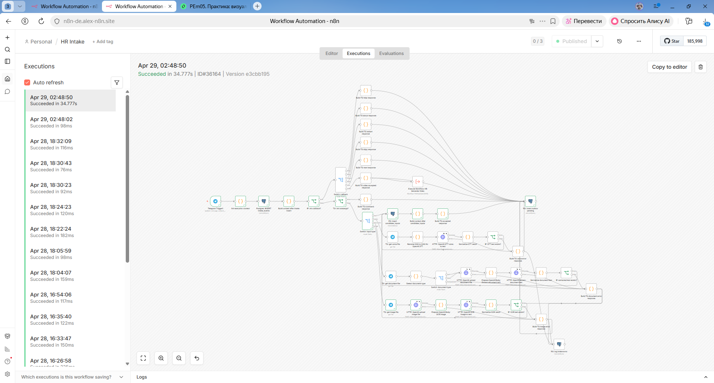

# Support Runbook: HR Assistant

Инструкция для команды сопровождения HR Assistant.

---

## Обзор системы

HR Assistant — мультимодальный AI-ассистент для обработки резюме через Telegram-бот.

**Ключевые характеристики:**
- Мультимодальный ввод: текст, голос, документ, изображение
- AI-извлечение данных: GPT-4o-mini
- Matching с вакансиями: GPT-4
- Мультимедийный вывод: текст, TTS, визуальные материалы
- Платформа: n8n + PostgreSQL + OpenAI API

---

## Компоненты системы

### Workflow

| Workflow | Назначение | Триггер | Расписание |
|----------|-----------|---------|------------|
| **HR Intake** | Приём входящих сообщений | Telegram Webhook | — |
| **HR Processing Worker** | Извлечение данных и matching | Schedule | Каждые 10 сек |
| **HR Delivery Worker** | Доставка ответов | Schedule | Каждые 10 сек |
| **HR Generate Video** | Генерация видео | Manual/Callback | — |
| **HR Queue Watchdog - candidate_inputs** | Сброс зависших обработок | Schedule | Каждые 5 мин |
| **HR Queue Watchdog - outbox** | Сброс зависших сообщений | Schedule | Каждые 10 мин |

---

### База данных

**Основные таблицы:**

| Таблица | Назначение | Критичность |
|---------|-----------|-------------|
| `intake_events` | Входящие события из Telegram | Высокая |
| `candidate_inputs` | Нормализованные входные данные | Высокая |
| `candidates` | Профили кандидатов | Высокая |
| `candidate_contacts` | Контакты кандидатов | Средняя |
| `vacancies` | Вакансии | Средняя |
| `matches` | Результаты matching | Высокая |
| `final_decisions` | Итоговые решения | Высокая |
| `outbox` | Исходящие сообщения | Высокая |
| `processing_logs` | Журнал обработки | Низкая |
| `generated_assets` | Сгенерированные материалы | Низкая |
| `bot_credentials` | Учётные данные ботов | Высокая |

---

### Внешние сервисы

| Сервис | Назначение | Критичность |
|--------|-----------|-------------|
| **Telegram Bot API** | Входной канал, доставка ответов | Высокая |
| **OpenAI API** | Извлечение данных, matching, TTS, генерация | Высокая |

---

## Точки контроля

### 1. Telegram Bot

**Мониторинг:**
- Webhook установлен корректно
- Bot token валиден
- Inline keyboard работает

**Проверка:**
```sql
-- Проверка bot token
SELECT * FROM bot_credentials WHERE bot_code = 'hr_assistant';

-- Проверка входящих сообщений
SELECT COUNT(*), status
FROM intake_events
WHERE received_at > NOW() - INTERVAL '1 hour'
GROUP BY status;
```

---

### 2. Processing Worker

**Мониторинг:**
- Worker запущен
- Записи обрабатываются
- Нет зависших записей

**Проверка:**
```sql
-- Записи в обработке
SELECT COUNT(*)
FROM candidate_inputs
WHERE processing_status = 'processing_started';

-- Зависшие записи (> 5 минут в обработке)
SELECT COUNT(*)
FROM candidate_inputs
WHERE processing_status = 'processing_started'
  AND created_at < NOW() - INTERVAL '5 minutes';

-- Последние обработанные
SELECT id, processing_status, created_at
FROM candidate_inputs
ORDER BY created_at DESC
LIMIT 10;
```

---

### 3. Delivery Worker

**Мониторинг:**
- Worker запущен
- Сообщения отправляются
- Нет зависших сообщений

**Проверка:**
```sql
-- Сообщения в очереди
SELECT COUNT(*), status
FROM outbox
WHERE status IN ('pending', 'sending')
GROUP BY status;

-- Зависшие сообщения (> 10 минут в отправке)
SELECT COUNT(*)
FROM outbox
WHERE status = 'sending'
  AND created_at < NOW() - INTERVAL '10 minutes';

-- Последние отправленные
SELECT id, status, sent_at
FROM outbox
ORDER BY created_at DESC
LIMIT 10;
```

---

### 4. OpenAI API

**Мониторинг:**
- API доступен
- Rate limits не превышены
- Стоимость в рамках бюджета

**Проверка:**
- Логи n8n (узлы OpenAI)
- Processing logs (ошибки API)

---

## Диагностика

### Проблема: Кандидат не получает ответ

**Возможные причины:**

1. **Intake не работает**
   - Webhook не настроен
   - Bot token невалиден

2. **Processing Worker не работает**
   - Worker не запущен
   - OpenAI API недоступен
   - Зависшие записи в `candidate_inputs`

3. **Delivery Worker не работает**
   - Worker не запущен
   - Telegram API недоступен
   - Зависшие сообщения в `outbox`

4. **Ошибка в обработке**
   - Невалидный JSON от LLM
   - Ошибка генерации TTS/визуалов

**Диагностика:**

```sql
-- Шаг 1: Проверка intake_events
SELECT id, input_type, status, received_at
FROM intake_events
WHERE received_at > NOW() - INTERVAL '1 hour'
ORDER BY received_at DESC
LIMIT 10;

-- Шаг 2: Проверка candidate_inputs
SELECT id, processing_status, created_at
FROM candidate_inputs
WHERE created_at > NOW() - INTERVAL '1 hour'
ORDER BY created_at DESC
LIMIT 10;

-- Шаг 3: Проверка outbox
SELECT id, status, error_text, created_at
FROM outbox
WHERE created_at > NOW() - INTERVAL '1 hour'
ORDER BY created_at DESC
LIMIT 10;

-- Шаг 4: Проверка processing_logs
SELECT stage, status, error_text, created_at
FROM processing_logs
WHERE created_at > NOW() - INTERVAL '1 hour'
ORDER BY created_at DESC
LIMIT 10;
```

---

### Проблема: Ошибка извлечения данных

**Возможные причины:**
- Невалидный JSON от LLM
- Превышение лимита токенов
- Ошибка валидации JSON Schema

**Диагностика:**

```sql
-- Поиск ошибок обработки
SELECT
    ie.id,
    ie.input_type,
    ci.processing_status,
    pl.stage,
    pl.status,
    pl.error_text,
    pl.created_at
FROM intake_events ie
LEFT JOIN candidate_inputs ci ON ci.intake_event_id = ie.id
LEFT JOIN processing_logs pl ON pl.intake_event_id = ie.id
WHERE pl.status = 'error'
  AND pl.created_at > NOW() - INTERVAL '1 hour'
ORDER BY pl.created_at DESC;
```

**Решение:**
1. Проверить логи n8n (узел JSON Repair)
2. Проверить промпт GPT-4o-mini
3. Добавить fallback на processing error

---

### Проблема: Ошибка отправки сообщения

**Возможные причины:**
- Telegram API недоступен
- Неверный chat_id
- Превышение лимитов Telegram

**Диагностика:**

```sql
-- Поиск ошибок отправки
SELECT
    id,
    channel,
    recipient,
    status,
    error_text,
    created_at
FROM outbox
WHERE status = 'error'
  AND created_at > NOW() - INTERVAL '1 hour'
ORDER BY created_at DESC;
```

**Решение:**
1. Проверить connectivity с Telegram API
2. Проверить chat_id
3. Проверить формат сообщения

---

### Проблема: Зависшие записи

**Симптомы:**
- Записи в статусе `processing_started` > 5 минут
- Сообщения в статусе `sending` > 10 минут

**Диагностика:**

```sql
-- Зависшие обработки
SELECT COUNT(*)
FROM candidate_inputs
WHERE processing_status = 'processing_started'
  AND created_at < NOW() - INTERVAL '5 minutes';

-- Зависшие сообщения
SELECT COUNT(*)
FROM outbox
WHERE status = 'sending'
  AND created_at < NOW() - INTERVAL '10 minutes';
```

**Решение:**
1. Проверить Watchdog workflow
2. Сбросить вручную:

```sql
-- Сброс зависших обработок
UPDATE candidate_inputs
SET processing_status = 'prepared'
WHERE processing_status = 'processing_started'
  AND created_at < NOW() - INTERVAL '5 minutes';

-- Сброс зависших сообщений
UPDATE outbox
SET status = 'pending'
WHERE status = 'sending'
  AND created_at < NOW() - INTERVAL '10 minutes';
```

---

## Известные проблемы

### KP-001: НЕСОВМЕСТИМОСТЬ metadata

**Приоритет:** 🔴 Critical

**Описание:** Поле `metadata` в таблице `outbox` не заполняется в Processing Worker, но используется в Delivery Worker.

**Влияние:**
- TTS не работает корректно (fallback на текст из `body`)
- Visual generation не работает корректно (fallback на default prompt)

**Временное решение:**
- Delivery Worker использует fallback-значения
- Metadata игнорируется

**Постоянное решение:**
- Добавить заполнение metadata в Processing Worker
- Протестировать TTS и visual generation

**Ссылка:** [known-issues.md](known-issues.md#kp-001-несовместимость-metadata)

---

### KP-002: ЗАХАРДКОЖЕННЫЕ CREDENTIALS

**Приоритет:** ⚠️ Medium

**Описание:** Bot token захардкожен в SQL-файле.

**Влияние:**
- Риск утечки credentials при публикации
- Сложность ротации токена

**Решение:**
- Перенести в environment variables
- Удалить из SQL-файла

**Ссылка:** [known-issues.md](known-issues.md#kp-002-захардкоженные-credentials)

---

### KP-003: ОТСУТСТВИЕ ВЕРСИОНИРОВАНИЯ WORKFLOW

**Приоритет:** ⚠️ Medium

**Описание:** Отсутствует версионирование workflow n8n.

**Влияние:**
- Сложность отката изменений
- Отсутствие истории

**Решение:**
- Внедрить Git-based версионирование
- Создать CHANGELOG.md

---

## Порядок действий при сбоях

### Инцидент 1: Telegram Bot недоступен

1. **Проверить connectivity:**
   - Webhook установлен?
   - Bot token валиден?

2. **Проверить логи:**
   - n8n → HR Intake → Errors

3. **Восстановить:**
   - Переустановить webhook
   - Проверить bot token

4. **Уведомить:**
   - Сообщить команде о восстановлении

---

### Инцидент 2: OpenAI API недоступен

1. **Проверить статус:**
   - https://status.openai.com

2. **Проверить логи:**
   - n8n → Processing Worker → OpenAI nodes → Errors

3. **Временное решение:**
   - Ждать восстановления API
   - Сообщить пользователям о задержке

4. **Постоянное решение:**
   - Настроить retry механизм (уже есть)
   - Рассмотреть fallback модели

---

### Инцидент 3: База данных недоступна

1. **Проверить connectivity:**
   - PostgreSQL запущен?
   - Connection string корректен?

2. **Проверить логи:**
   - n8n → Database nodes → Errors

3. **Восстановить:**
   - Перезапустить PostgreSQL
   - Проверить connection string

---

### Инцидент 4: Зависание обработки

1. **Диагностировать:**
   - Проверить Watchdog workflow
   - Проверить зависшие записи

2. **Восстановить:**
   - Сбросить зависшие записи вручную (SQL выше)
   - Перезапустить Watchdog workflow

3. **Уведомить:**
   - Сообщить команде о восстановлении

---

## Мониторинг

### Рекомендуемые метрики

**Бизнес-метрики:**
- Количество обработанных резюме в час/день
- Среднее время обработки
- Конверсия по форматам ввода (текст/голос/документ/фото)
- Score distribution (распределение кандидатов по score)

**Технические метрики:**
- Время ответа Telegram API
- Время ответа OpenAI API
- Количество ошибок в обработке
- Количество зависших записей

**Инфраструктурные метрики:**
- CPU usage n8n
- Memory usage n8n
- PostgreSQL connections
- Disk usage

### Структура логирования



*Структура логирования обработки*


*Пример логов обработки*

---

### SQL-запросы для мониторинга

```sql
-- Количество обработанных за час
SELECT COUNT(*)
FROM final_decisions
WHERE created_at > NOW() - INTERVAL '1 hour';

-- Среднее время обработки
SELECT AVG(EXTRACT(EPOCH FROM (fd.created_at - ci.created_at))) as avg_seconds
FROM final_decisions fd
JOIN candidates c ON c.id = fd.candidate_id
JOIN candidate_inputs ci ON ci.id = c.source_input_id
WHERE fd.created_at > NOW() - INTERVAL '1 hour';

-- Ошибки за час
SELECT COUNT(*)
FROM processing_logs
WHERE status = 'error'
  AND created_at > NOW() - INTERVAL '1 hour';

-- Зависшие записи
SELECT
    (SELECT COUNT(*) FROM candidate_inputs WHERE processing_status = 'processing_started') as stuck_processing,
    (SELECT COUNT(*) FROM outbox WHERE status = 'sending') as stuck_sending;
```

---

## Бэкапы и восстановление

### Бэкап PostgreSQL

**Рекомендуемая частота:** ежедневно

**Команда:**
```bash
pg_dump -h localhost -U postgres -d hr_assistant > backup_$(date +%Y%m%d).sql
```

**Восстановление:**
```bash
psql -h localhost -U postgres -d hr_assistant < backup_20260623.sql
```

---

### Бэкап n8n Workflows

**Рекомендуемая частота:** при каждом изменении

**Экспорт:**
```bash
n8n export:workflow --all --output=workflows/
```

**Импорт:**
```bash
n8n import:workflow --input=workflows/
```

---

## Контакты

| Роль | Контакты |
|------|----------|
| **Администратор n8n** | [email] |
| **Администратор БД** | [email] |
| **Разработчик** | [email] |

---

## Ссылки

### Документация

- [SPEC.md](SPEC.md) — спецификация системы
- [ARCHITECTURE.md](ARCHITECTURE.md) — архитектура
- [known-issues.md](known-issues.md) — известные проблемы
- [PROJECT_STATE.md](PROJECT_STATE.md) — состояние проекта

### Внешние ресурсы

- [n8n Documentation](https://docs.n8n.io)
- [OpenAI API Documentation](https://platform.openai.com/docs)
- [Telegram Bot API Documentation](https://core.telegram.org/bots/api)
- [PostgreSQL Documentation](https://www.postgresql.org/docs/)

---

**Статус документа:** Production-ready
**Последнее обновление:** 2026-06-23