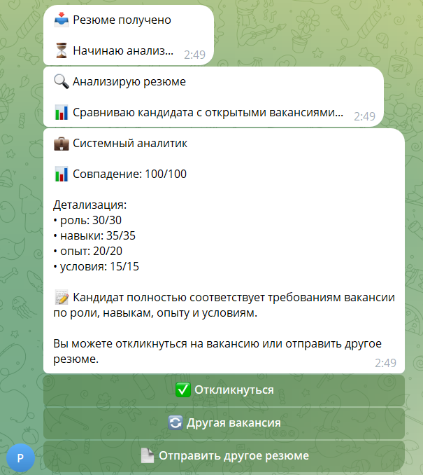
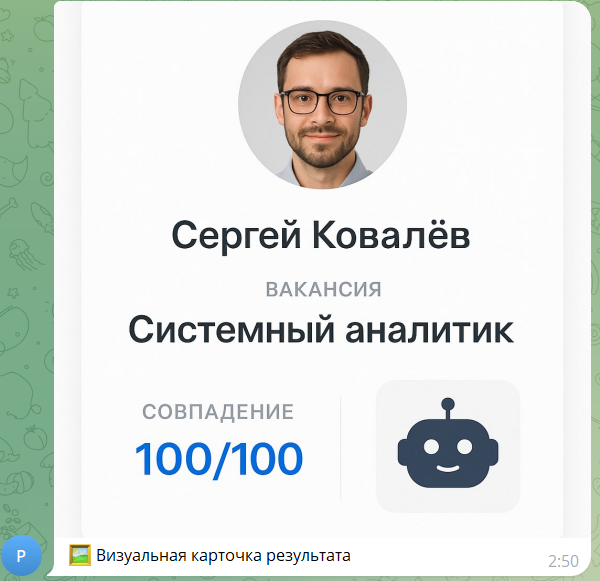
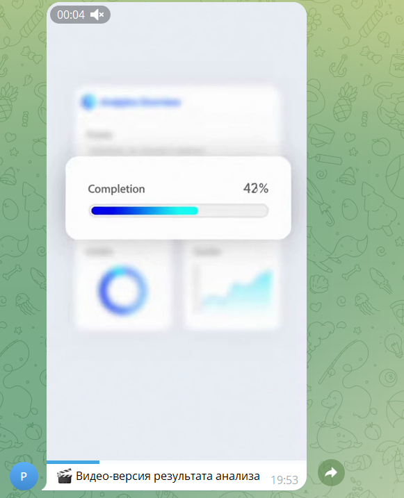

# Руководство кандидата

Это руководство для кандидатов, которые хотят отправить резюме через HR Assistant.

---

## Что такое HR Assistant

HR Assistant — AI-ассистент для обработки резюме. Вы отправляете резюме в удобном формате через Telegram, система анализирует его и сообщает о подходящих вакансиях.

---

## Как отправить резюме

### Способ 1: Текстовое сообщение

**Шаг 1. Откройте Telegram-бота**

Найдите бота HR Assistant в Telegram и нажмите **Start**.

---

**Шаг 2. Напишите резюме в свободной форме**

*Пример текстового резюме в Telegram*

**Минимальные данные:**
- ФИО
- Желаемая должность или область
- Опыт работы

**Рекомендуемые данные:**
- Навыки
- Город
- Зарплатные ожидания
- Контакты (email и/или телефон)

---

**Шаг 3. Получите ответ**

Система автоматически:
- Извлечёт данные из резюме
- Сравнит с открытыми вакансиями
- Отправит результат matching

*Пример успешного сопоставления (match)*

---

### Способ 2: Голосовое сообщение

**Шаг 1. Нажмите на значок микрофона**

В Telegram-боте нажмите и удерживайте значок микрофона для записи голосового сообщения.

*Пример голосового резюме в Telegram*

---

**Шаг 2. Запишите резюме**

Продиктуйте информацию о себе:

> (Голосовое сообщение) "Здравствуйте! Меня зовут Петрова Анна. Я UX-дизайнер с 3-летним опытом работы. Владею Figma, Sketch, Adobe XD. Живу в Санкт-Петербурге. Зарплатные ожидания 150 000 рублей. Контакты: anna@example.com, телефон +79021234567."

---

**Шаг 3. Отправьте сообщение**

Отпустите кнопку микрофона для отправки.

---

**Шаг 4. Получите ответ**

Система автоматически:
- Транскрибирует голос в текст
- Извлечёт данные
- Выполнит matching

Вы получите текстовый ответ с результатом.

---

### Способ 3: Документ (PDF/DOCX)

**Шаг 1. Нажмите на значок скрепки**

В Telegram-боте нажмите на значок скрепки для прикрепления файла.

---

**Шаг 2. Выберите файл резюме**

*Пример PDF-резюме: извлечённый текст*

*Пример PDF-резюме: загруженный файл в Telegram*

Выберите файл резюме в формате PDF или DOCX на вашем устройстве.

---

**Шаг 3. Отправьте файл**

Нажмите "Send" для отправки файла.

---

**Шаг 4. Получите ответ**

Система автоматически:
- Извлечёт текст из документа
- Проанализирует резюме
- Отправит результат matching

---

### Способ 4: Фото резюме

**Шаг 1. Сделайте фото резюме**

Сфотографируйте резюме или загрузите готовое фото.

*Пример фото резюме в Telegram*

---

**Шаг 2. Отправьте фото в бот**

В Telegram-боте:
- Нажмите на значок скрепки
- Выберите "Photo"
- Выберите фото резюме
- Отправьте

---

**Шаг 3. Получите ответ**

Система автоматически:
- Распознает текст на изображении (OCR)
- Извлечёт данные
- Выполнит matching

---

## Форматы ответа

Система отправляет мультимедийный ответ:

**Текстовое сообщение:**
- Информация о подходящей вакансии
- Score (оценка соответствия 0-100)
- Обоснование решения

*Пример результата при неуспешном сопоставлении (no_match)*

**Голосовое сообщение (TTS):**

*Пример голосового сообщения (TTS)*

**Визуальные материалы:**

*Визуальная карточка с профилем кандидата и результатами matching*

**Видео-результат:**

*Пример видео-версии результата (опционально)*

---

## Команды Telegram-бота

| Команда | Описание |
|---------|----------|
| `/start` | Начать работу с ботом |
| `/help` | Справка по работе бота |
| `/about` | Информация о системе |

---

## Типовые ошибки

### Ошибка: "Не удалось извлечь данные"

**Причина:** Резюме не содержит достаточно информации.

**Решение:** Добавьте в резюме:
- ФИО
- Желаемую должность
- Опыт работы
- Контакты (email или телефон)

---

### Ошибка: "Не удалось распознать голос"

**Причина:** Плохое качество аудио или неразборчивая речь.

**Решение:**
- Запишите сообщение в тихом помещении
- Говорите чётко
- Убедитесь, что микрофон не заглушён

---

### Ошибка: "Не удалось извлечь текст из документа"

**Причина:** Документ повреждён или в неподдерживаемом формате.

**Решение:**
- Убедитесь, что файл в формате PDF или DOCX
- Попробуйте отправить текстовым сообщением
- Или отправьте фото резюме

---

### Ошибка: "Не удалось распознать текст на изображении"

**Причина:** Плохое качество фото или неразборчивый текст.

**Решение:**
- Сделайте фото при хорошем освещении
- Убедитесь, что текст чёткий
- Попробуйте отправить документом или текстом

---

## FAQ кандидата

### Через сколько отвечают?

Обычно < 1 минута. Время зависит от формата резюме:
- Текст: < 30 сек
- Голос: < 60 сек
- Документ: < 60 сек
- Фото: < 90 сек

---

### Какие форматы резюме принимаются?

- Текстовое сообщение
- Голосовое сообщение
- Документ (PDF, DOCX)
- Изображение (фото резюме)

---

### Какой формат лучше?

**Текстовое сообщение** — самый быстрый способ (обработка < 30 сек).

**Голосовое сообщение** — удобно, если нет времени писать.

**Документ** — подходит для готовых резюме в PDF/DOCX.

**Фото** — удобно для бумажных резюме или сканов.

---

### Как понять результат?

**Score (0-100):**
- 80-100: Высокое соответствие
- 60-80: Среднее соответствие
- 40-60: Частичное соответствие
- < 40: Низкое соответствие

**Decision:**
- match: Подходит для вакансии
- no_match: Не подходит

---

### Что делать, если не нашли подходящую вакансию?

Если score низкий или вакансия не найдена:
1. Проверьте полноту резюме
2. Уточните желаемую должность
3. Добавьте больше навыков
4. Отправьте резюме повторно

---

### Как связаться с HR-специалистом?

HR-специалист свяжется с вами по указанным контактам (email или телефон).

---

### Можно ли отправить резюме повторно?

Да. Если вы хотите обновить резюме, отправьте его повторно. Система обработает новую версию.

---

### Как удалить мои данные?

Для удаления данных обратитесь к HR-специалисту или администратору системы.

---

## Рекомендации по составлению резюме

### Обязательные данные

- ✅ ФИО
- ✅ Желаемая должность или область работы
- ✅ Опыт работы (в годах)
- ✅ Контакты (email или телефон)

### Рекомендуемые данные

- ✅ Навыки (ключевые технологии, инструменты)
- ✅ Город проживания
- ✅ Зарплатные ожидания
- ✅ Краткое описание опыта

### Пример хорошего резюме

> Иванов Иван Иванович
> Frontend-разработчик
>
> Опыт работы: 5 лет
> Навыки: React, TypeScript, Node.js, Redux, Webpack
> Город: Москва
> Зарплата: 180 000 руб.
>
> Email: ivanov@example.com
> Телефон: +79001234567
>
> Опыт работы:
> - Senior Frontend Developer, Company A (2022-настоящее время)
> - Middle Frontend Developer, Company B (2019-2022)
> - Junior Frontend Developer, Company C (2017-2019)

---

## Связанные документы

- [BUSINESS_VALUE.md](BUSINESS_VALUE.md) — ценность для бизнеса
- [E2E_SCENARIOS.md](E2E_SCENARIOS.md) — сквозные сценарии
- [HR_GUIDE.md](HR_GUIDE.md) — руководство HR-специалиста

---

**Статус документа:** Production-ready
**Последнее обновление:** 2026-06-24