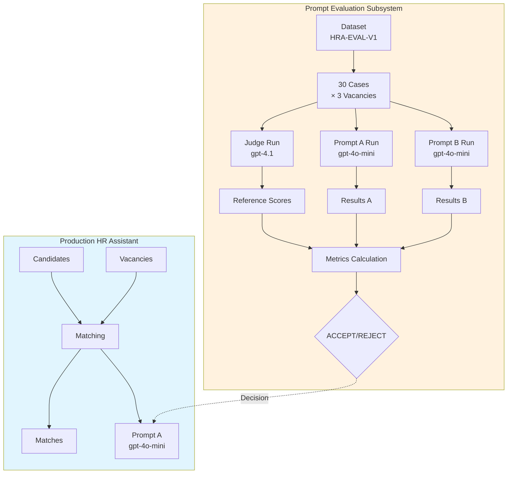
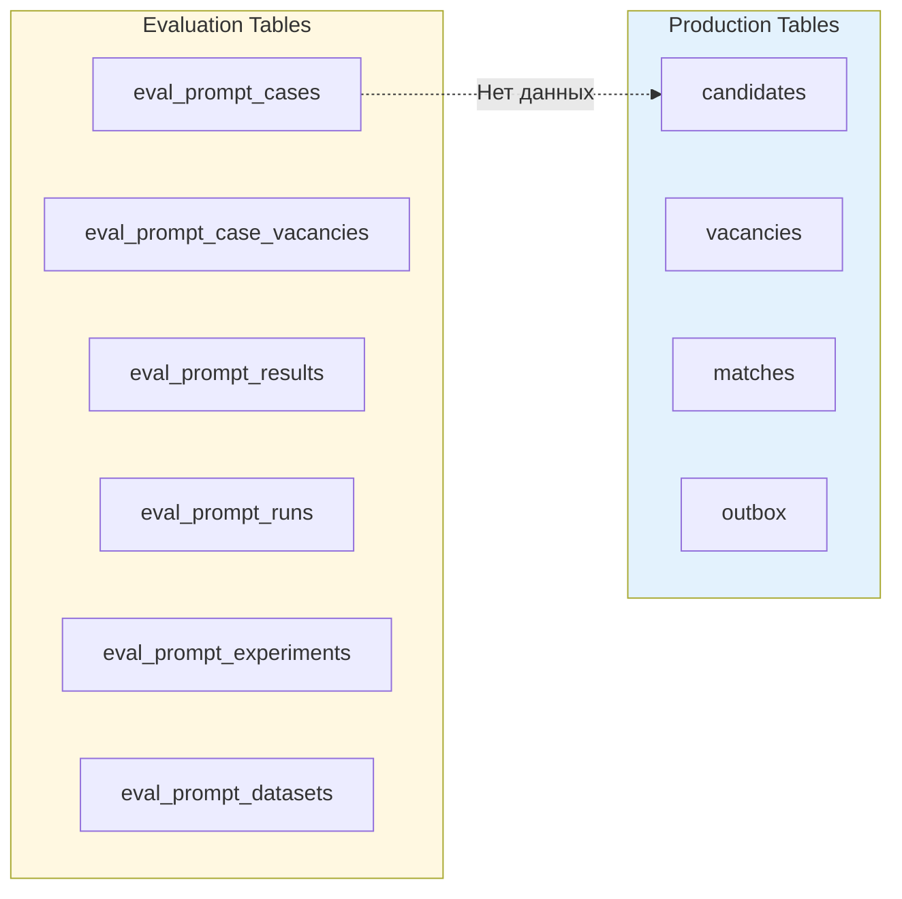

# Подсистема Prompt Evaluation

**Архитектура и назначение**

---

## Назначение

Prompt Evaluation — это **изолированная подсистема** HR Assistant для исследования качества промптов и принятия инженерных решений о замене production-промптов.

### Ключевые возможности

- A/B-тестирование промптов
- Сравнение с эталонной оценкой (Judge)
- Метрики качества (MAE, Accuracy, Latency)
- Воспроизводимость экспериментов
- Документирование решений

### Важно

**Подсистема полностью изолирована от production-контура HR Assistant.**

Результаты экспериментов:
- Не влияют на production matching
- Не пишутся в боевые таблицы
- Хранятся в отдельном схеме БД (`eval_prompt_*`)

---

## Место в архитектуре проекта



---

## Состав компонентов

### База данных

| Таблица | Назначение |
|---------|------------|
| `eval_prompt_datasets` | Версии датасетов для тестирования |
| `eval_prompt_experiments` | Определения экспериментов |
| `eval_prompt_cases` | Кандидаты для оценки |
| `eval_prompt_case_vacancies` | Пары кандидат-вакансия с reference-оценками |
| `eval_prompt_runs` | Запуски Judge/Prompt A/Prompt B |
| `eval_prompt_results` | Результаты выполнения |

### Workflow

**Файл:** `workflows/HRA Prompt Evaluation Experiment.json`

**Платформа:** n8n

**Фазы:**
1. Validation (проверка готовности)
2. Judge Run (reference scoring)
3. Prompt A Run
4. Prompt B Run
5. Metrics Calculation
6. Report Generation

### Промпты

| Промпт | Модель | Назначение |
|--------|--------|------------|
| Judge | gpt-4.1-2025-04-14 | Reference scoring |
| Prompt A | gpt-4o-mini-2024-07-18 | Production (baseline) |
| Prompt B | gpt-4o-mini-2024-07-18 | Experimental |

---

## Границы ответственности

### Prompt Evaluation отвечает за:

- ✅ Создание датасетов для тестирования
- ✅ Проведение A/B-тестов
- ✅ Расчёт метрик качества
- ✅ Документирование результатов
- ✅ Принятие инженерных решений

### Prompt Evaluation НЕ отвечает за:

- ❌ Production matching
- ❌ Влияние на боевые данные
- ❌ Интеграцию с HR Assistant workflow
- ❌ Автоматическое обновление промптов

---

## Отличие от Production Matching

| Аспект | Production Matching | Prompt Evaluation |
|--------|---------------------|-------------------|
| **Данные** | Боевые кандидаты и вакансии | Синтетический датасет |
| **Промпт** | Production Prompt A | Judge + A + B |
| **Модель** | gpt-4o-mini | gpt-4.1 + gpt-4o-mini |
| **Результаты** | Matches для HR | Метрики сравнения |
| **Влияние** | Прямое на production | Изолированное исследование |
| **Частота** | Каждая заявка | По запросу инженера |

---

## Жизненный цикл эксперимента

```mermaid
flowchart TD
    A[1. CREATE DATASET] --> B[Определить состав кандидатов и вакансий]
    B --> C[Разметить по типам<br/>obvious_match, no_match, borderline]
    C --> D[Загрузить в eval_prompt_cases]
    
    D --> E[2. CREATE EXPERIMENT]
    E --> F[Определить Prompt A, Prompt B, Judge]
    F --> G[Зафиксировать модели и temperatures]
    G --> H[Зафиксировать метрики и критерии]
    
    H --> I[3. RUN JUDGE]
    I --> J[Вызвать gpt-4.1 для каждой пары]
    J --> K[Сохранить reference_score, reference_decision]
    K --> L[Создать surrogate ground truth]
    
    L --> M[4. RUN PROMPT A]
    M --> N[Вызвать gpt-4o-mini с production prompt]
    N --> O[Сохранить score, decision, latency]
    
    O --> P[5. RUN PROMPT B]
    P --> Q[Вызвать gpt-4o-mini с experimental prompt]
    Q --> R[Сохранить score, decision, latency]
    
    R --> S[6. CALCULATE METRICS]
    S --> T[MAE_A, MAE_B]
    T --> U[Accuracy_A, Accuracy_B]
    U --> V[Latency_A, Latency_B]
    
    V --> W[7. MAKE DECISION]
    W --> X{Проверить критерии}
    X --> Y[ACCEPT или REJECT Prompt B]
    Y --> Z[Задокументировать результат]
```



---

## Взаимодействие с Production

### Изоляция данных



**Правило:** Никакие данные не переходят из evaluation в production.

### Результат эксперимента

Результат эксперимента — это **решение инженера**, а не автоматическое действие.

**Решение REJECT:**
- Продолжать использовать Prompt A в production
- Не вносить изменения в production workflow

**Решение ACCEPT:**
- Инженер вручную обновляет production prompt
- Проводится дополнительное тестирование
- Документируется решение

---

## Метрики

### Primary Metric: MAE (Mean Absolute Error)

```text
MAE = AVG(ABS(model_score - reference_score))
```

**Interpretation:** Среднее отклонение от эталонной оценки Judge. Чем ниже — тем лучше.

### Secondary Metric: Accuracy

```text
Accuracy = COUNT(model_decision = reference_decision) / COUNT(*)
```

**Interpretation:** Процент совпадений decision с Judge.

### Guard Metric: Latency

```text
Latency = AVG(response_time_ms)
```

**Interpretation:** Среднее время ответа модели.

### Acceptance Criteria

| Критерий | Порог | Проверка |
|----------|-------|----------|
| MAE Improvement | ≥ 20% | MAE_B ≤ 0.8 × MAE_A |
| Latency Growth | ≤ 30% | Latency_B ≤ 1.3 × Latency_A |

**Финальное решение:** ACCEPT только если **ОБА** критерия выполнены.

---

## Использование результатов

### Для инженерных решений

1. **Принятие решения о замене промпта**
   - REJECT → остаёмся на Prompt A
   - ACCEPT → мигрируем на Prompt B

2. **Анализ причин успеха/провала**
   - См. [SEGMENT_ANALYSIS.md](./SEGMENT_ANALYSIS.md)

3. **Планирование следующих экспериментов**
   - Идеи для HRA-EXP-V2, V3 и т.д.

### Для обучения и портфолио

- [AB_TEST_REPORT.md](./AB_TEST_REPORT.md) — полный инженерный отчёт
- [DATASET.md](./DATASET.md) — пример датасета
- [PROMPTS.md](./PROMPTS.md) — примеры промптов

### Для воспроизведения

- [REPRODUCIBILITY.md](./REPRODUCIBILITY.md) — пошаговая инструкция

---

## Расширяемость

### Создание новых экспериментов

1. Создать новый датасет (или использовать существующий)
2. Определить новый Prompt B
3. Создать эксперимент в `eval_prompt_experiments`
4. Запустить workflow

### Добавление новых промптов

Можно сравнивать:
- Prompt A vs Prompt B
- Prompt A vs Prompt C
- Prompt B vs Prompt C
- Любые комбинации

### Использование других моделей

Можно тестировать:
- gpt-4o-mini vs gpt-4.1
- Claude vs GPT
- Любые другие модели

---

*Документация подсистемы Prompt Evaluation*