# Визуализации

**Диаграммы и схемы Prompt Evaluation**

---

## Диаграмма архитектуры подсистемы

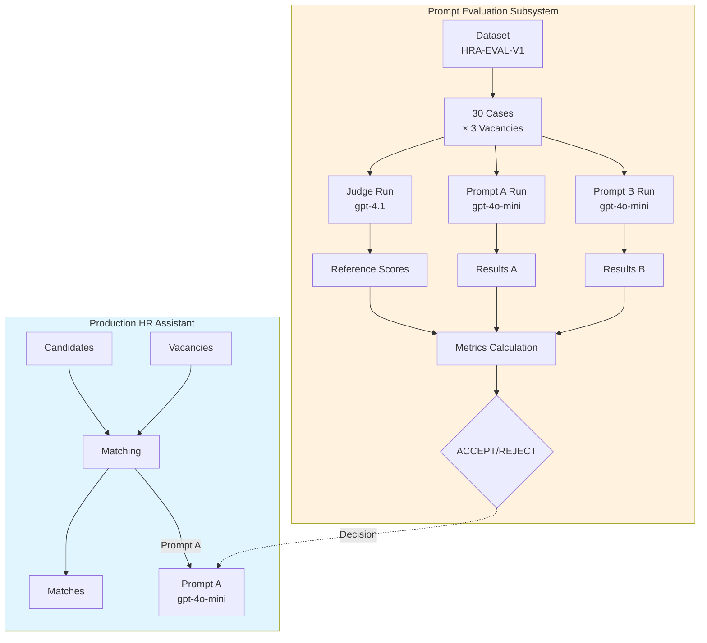

---

## Модель данных

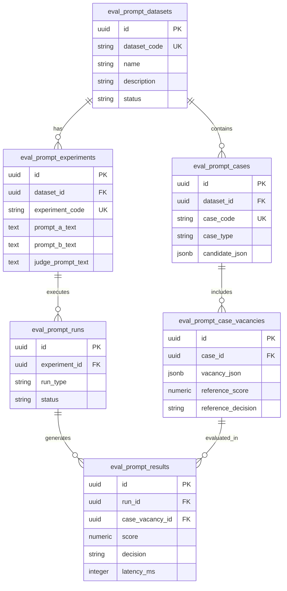

---

## Жизненный цикл эксперимента

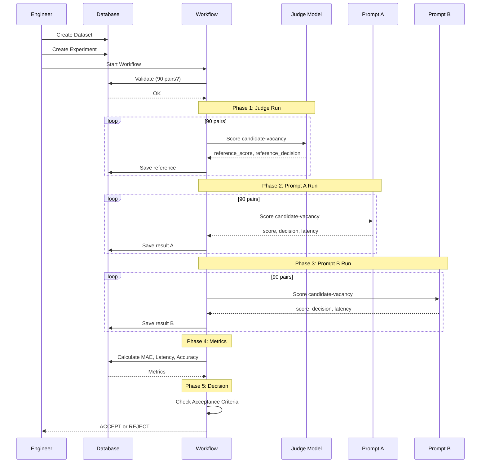

---

## Workflow последовательность

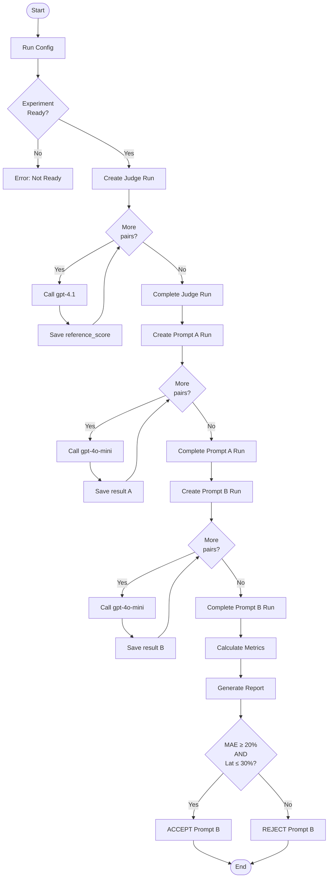

---

## Сравнение MAE по сегментам

```mermaid
xychart-beta
    title "MAE по сегментам: Prompt A vs Prompt B"
    x-axis ["obvious_match", "obvious_no_match", "borderline"]
    y-axis "MAE" 0 --> 20
    bar [9.50, 11.97, 9.43]
    bar [13.90, 15.57, 17.77]
```

**Интерпретация:**
- Prompt B показывает **худшие** результаты на всех сегментах
- Наибольшая деградация — на `borderline` кейсах (+88.3%)
- Наилучшая производительность Prompt A — на `borderline` (MAE = 9.43)

---

## Сравнение Accuracy по сегментам

```mermaid
xychart-beta
    title "Accuracy по сегментам: Prompt A vs Prompt B"
    x-axis ["obvious_match", "obvious_no_match", "borderline"]
    y-axis "Accuracy %" 85 --> 101
    bar [93.33, 100.00, 93.33]
    bar [93.33, 100.00, 90.00]
```

**Интерпретация:**
- На `obvious_match` и `obvious_no_match` Accuracy идентична
- На `borderline` Prompt B теряет **3.3 п.п.** accuracy
- Оба промпта корректно распознают очевидные кейсы

---

## Сравнение Latency по сегментам

```mermaid
xychart-beta
    title "Latency по сегментам: Prompt A vs Prompt B"
    x-axis ["obvious_match", "obvious_no_match", "borderline"]
    y-axis "Latency (ms)" 1500 --> 2600
    bar [2029, 2139, 1981]
    bar [2126, 2182, 2415]
```

**Интерпретация:**
- Prompt B медленнее на всех сегментах
- Наибольшая разница — на `borderline` кейсах (+21.9%)
- В среднем latency увеличилась на **9.3%**

---

## Критерии принятия

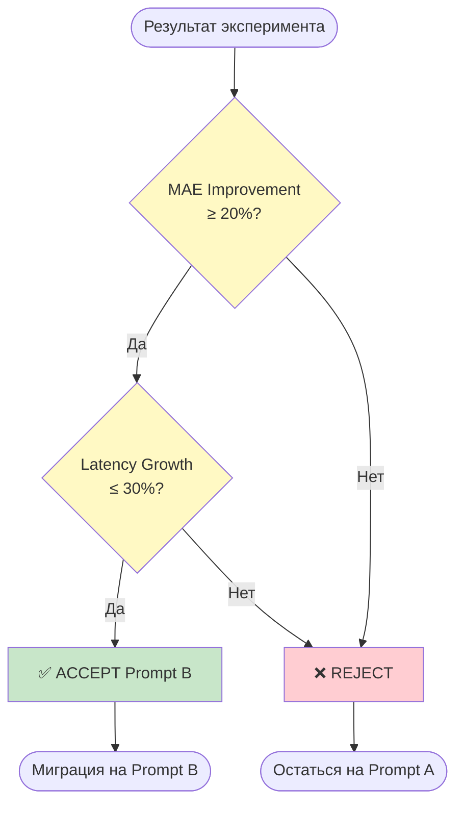

**Результат HRA-EXP-V1:**
- MAE Improvement: **-52.86%** ❌
- Latency Growth: **+9.34%** ✅
- Финальное решение: **REJECT** (один критерий не выполнен)

---

## Распределение кейсов по типам

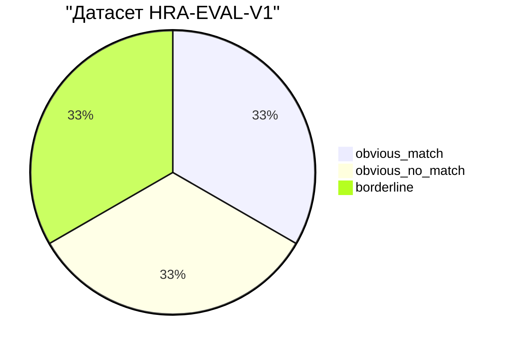

---

## Принцип изоляции подсистем

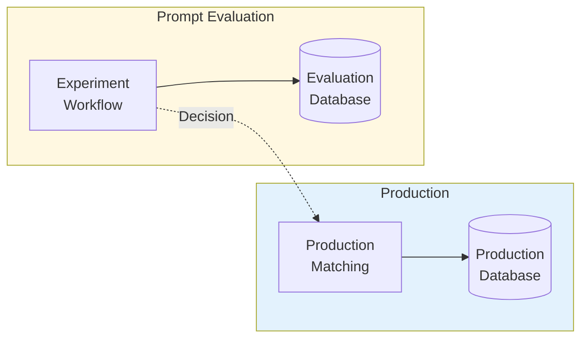

**Правило:** Данные не переходят из Evaluation в Production. Только решение инженера влияет на смену промпта.

---

## Стоимость эксперимента

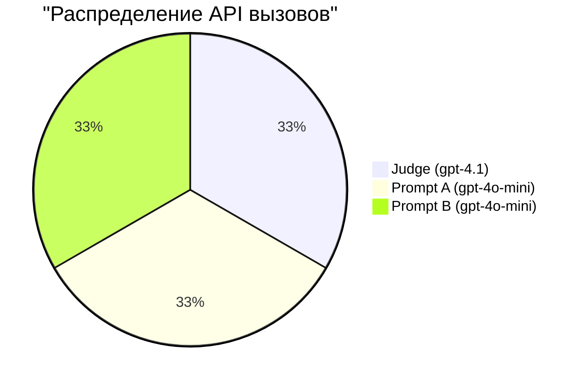

| Компонент | Модель | Вызовы | Стоимость |
|-----------|--------|--------|-----------|
| Judge | gpt-4.1 | 90 | ~$2.70 |
| Prompt A | gpt-4o-mini | 90 | ~$0.90 |
| Prompt B | gpt-4o-mini | 90 | ~$0.90 |
| **Итого** | — | **270** | **~$4.50** |

---

*Визуализации Prompt Evaluation*