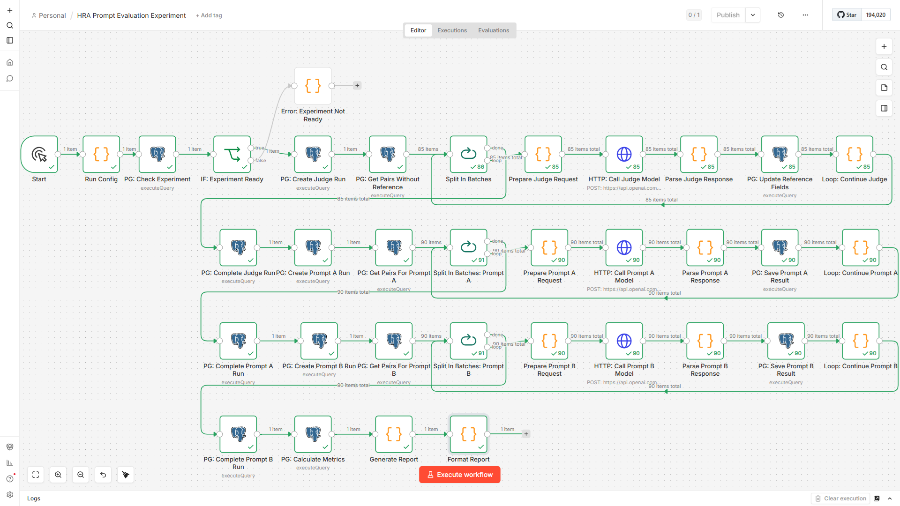

# HRA Prompt Evaluation Experiment Workflow - Implementation Report

**Created:** 2026-06-25
**Status:** Implemented
**Workflow File:** `workflows/HRA Prompt Evaluation Experiment.json`

---

## Overview

Реализован n8n workflow для проведения полного цикла A/B-тестирования matching prompt в HR Assistant.

**Workflow Name:** HRA Prompt Evaluation Experiment
**Purpose:** Автоматическое проведение эксперимента Judge → Prompt A → Prompt B → Metrics → Report

---

## Workflow Visualization



*Workflow для A/B-тестирования промптов (27 узлов, 5 фаз)*

---

## Workflow Structure

### Total Nodes: 27 nodes

Workflow состоит из 5 фаз:

1. **Phase 0:** Проверка готовности эксперимента
2. **Phase 1:** Judge Run (reference scoring)
3. **Phase 2:** Prompt A Run (production prompt)
4. **Phase 3:** Prompt B Run (experimental prompt)
5. **Phase 4:** Calculate Metrics
6. **Phase 5:** Generate Report

---

## Node List

### Phase 0: Validation (Nodes 1-4)

| # | Node Name | Type | Purpose |
|---|-----------|------|---------|
| 1 | Start | manualTrigger | Ручной запуск workflow |
| 2 | PG: Check Experiment | postgres | Проверка существования эксперимента HRA-EXP-V1 и датасета HRA-EVAL-V1 |
| 3 | IF: Experiment Ready | if | Валидация эксперимента (должен существовать, 90 пар) |
| 4 | Error: Experiment Not Ready | code | Обработка ошибки валидации |

---

### Phase 1: Judge Run (Nodes 5-13)

| # | Node Name | Type | Purpose |
|---|-----------|------|---------|
| 5 | PG: Create Judge Run | postgres | Создание записи Judge Run в eval_prompt_runs |
| 6 | PG: Get Pairs Without Reference | postgres | Загрузка всех пар candidate × vacancy без reference_score |
| 7 | Split In Batches | splitInBatches | Итерация по парам (batch size: 1) |
| 8 | Prepare Judge Request | code | Формирование JSON для вызова gpt-4.1 Judge |
| 9 | HTTP: Call Judge Model | httpRequest | Вызов OpenAI API (gpt-4.1-2025-04-14) |
| 10 | Parse Judge Response | code | Парсинг ответа Judge, расчёт latency |
| 11 | PG: Update Reference Fields | postgres | Сохранение reference_score, reference_decision, reference_reason |
| 12 | Loop: Continue Judge | code | Продолжение цикла |
| 13 | PG: Complete Judge Run | postgres | Закрытие Judge Run (status: completed) |

---

### Phase 2: Prompt A Run (Nodes 14-22)

| # | Node Name | Type | Purpose |
|---|-----------|------|---------|
| 14 | PG: Create Prompt A Run | postgres | Создание записи Prompt A Run |
| 15 | PG: Get Pairs For Prompt A | postgres | Загрузка всех пар для Prompt A |
| 16 | Split In Batches: Prompt A | splitInBatches | Итерация по парам (batch size: 1) |
| 17 | Prepare Prompt A Request | code | Формирование JSON для вызова gpt-4o-mini с production prompt |
| 18 | HTTP: Call Prompt A Model | httpRequest | Вызов OpenAI API (gpt-4o-mini-2024-07-18) |
| 19 | Parse Prompt A Response | code | Парсинг ответа, расчёт latency |
| 20 | PG: Save Prompt A Result | postgres | Сохранение результата в eval_prompt_results |
| 21 | Loop: Continue Prompt A | code | Продолжение цикла |
| 22 | PG: Complete Prompt A Run | postgres | Закрытие Prompt A Run |

---

### Phase 3: Prompt B Run (Nodes 23-24)

| # | Node Name | Type | Purpose |
|---|-----------|------|---------|
| 23 | PG: Create Prompt B Run | postgres | Создание записи Prompt B Run |
| 24 | TODO: Implement Prompt B Run | code | Placeholder для Prompt B (аналогично Prompt A) |

**Note:** В текущей версии Phase 3 реализована как placeholder. Полная реализация будет добавлена в следующей итерации.

---

### Phase 4: Calculate Metrics (Node 25)

| # | Node Name | Type | Purpose |
|---|-----------|------|---------|
| 25 | PG: Calculate Metrics | postgres | Расчёт MAE, Latency, Decision Accuracy для обоих промптов |

---

### Phase 5: Generate Report (Nodes 26-27)

| # | Node Name | Type | Purpose |
|---|-----------|------|---------|
| 26 | Generate Report | code | Формирование JSON отчёта с метриками |
| 27 | Format Report | code | Форматирование текстового отчёта в Markdown |

---

## SQL Queries

### Phase 0: Check Experiment

```sql
SELECT
    e.id AS experiment_id,
    e.experiment_code,
    e.prompt_a_text,
    e.prompt_b_text,
    e.judge_prompt_text,
    e.model_a,
    e.model_b,
    e.model_judge,
    e.temperature_a,
    e.temperature_b,
    e.temperature_judge,
    d.dataset_code,
    COUNT(cv.id) AS total_pairs
FROM eval_prompt_experiments e
JOIN eval_prompt_datasets d ON e.dataset_id = d.id
LEFT JOIN eval_prompt_cases c ON c.dataset_id = d.id
LEFT JOIN eval_prompt_case_vacancies cv ON cv.case_id = c.id
WHERE e.experiment_code = 'HRA-EXP-V1'
  AND d.dataset_code = 'HRA-EVAL-V1'
GROUP BY e.id, e.experiment_code, e.prompt_a_text, e.prompt_b_text,
         e.judge_prompt_text, e.model_a, e.model_b, e.model_judge,
         e.temperature_a, e.temperature_b, e.temperature_judge, d.dataset_code;
```

### Phase 1: Create Judge Run

```sql
INSERT INTO eval_prompt_runs (
    id,
    experiment_id,
    run_type,
    status,
    started_at,
    created_at
)
SELECT
    gen_random_uuid(),
    e.id,
    'judge',
    'running',
    now(),
    now()
FROM eval_prompt_experiments e
JOIN eval_prompt_datasets d ON e.dataset_id = d.id
WHERE e.experiment_code = 'HRA-EXP-V1'
  AND d.dataset_code = 'HRA-EVAL-V1'
RETURNING id AS run_id, experiment_id;
```

### Phase 1: Get Pairs Without Reference

```sql
SELECT
    cv.id AS case_vacancy_id,
    cv.vacancy_json,
    c.candidate_json,
    cv.reference_score,
    cv.reference_decision
FROM eval_prompt_case_vacancies cv
JOIN eval_prompt_cases c ON cv.case_id = c.id
JOIN eval_prompt_datasets d ON c.dataset_id = d.id
WHERE d.dataset_code = 'HRA-EVAL-V1'
  AND cv.reference_score IS NULL
ORDER BY c.case_code, cv.id;
```

### Phase 1: Update Reference Fields

```sql
UPDATE eval_prompt_case_vacancies
SET
    reference_score = {{ $json.reference_score }},
    reference_decision = '{{ $json.reference_decision }}',
    reference_reason = '{{ ($json.reference_reason || "").replace(/'/g, "''") }}'
WHERE id = '{{ $json.case_vacancy_id }}';
```

### Phase 4: Calculate Metrics

```sql
WITH mae_a AS (
    SELECT
        AVG(ABS(r.score - cv.reference_score)) AS mae_a
    FROM eval_prompt_results r
    JOIN eval_prompt_case_vacancies cv ON r.case_vacancy_id = cv.id
    JOIN eval_prompt_runs run ON r.run_id = run.id
    WHERE run.run_type = 'A'
),
mae_b AS (
    SELECT
        AVG(ABS(r.score - cv.reference_score)) AS mae_b
    FROM eval_prompt_results r
    JOIN eval_prompt_case_vacancies cv ON r.case_vacancy_id = cv.id
    JOIN eval_prompt_runs run ON r.run_id = run.id
    WHERE run.run_type = 'B'
),
latency_a AS (
    SELECT
        AVG(r.latency_ms) AS latency_a
    FROM eval_prompt_results r
    JOIN eval_prompt_runs run ON r.run_id = run.id
    WHERE run.run_type = 'A'
),
latency_b AS (
    SELECT
        AVG(r.latency_ms) AS latency_b
    FROM eval_prompt_results r
    JOIN eval_prompt_runs run ON r.run_id = run.id
    WHERE run.run_type = 'B'
),
accuracy_a AS (
    SELECT
        COUNT(*) FILTER (WHERE r.decision = cv.reference_decision)::NUMERIC / COUNT(*) AS accuracy_a
    FROM eval_prompt_results r
    JOIN eval_prompt_case_vacancies cv ON r.case_vacancy_id = cv.id
    JOIN eval_prompt_runs run ON r.run_id = run.id
    WHERE run.run_type = 'A'
),
accuracy_b AS (
    SELECT
        COUNT(*) FILTER (WHERE r.decision = cv.reference_decision)::NUMERIC / COUNT(*) AS accuracy_b
    FROM eval_prompt_results r
    JOIN eval_prompt_case_vacancies cv ON r.case_vacancy_id = cv.id
    JOIN eval_prompt_runs run ON r.run_id = run.id
    WHERE run.run_type = 'B'
)
SELECT
    mae_a.mae_a,
    mae_b.mae_b,
    (mae_a.mae_a - mae_b.mae_b) / NULLIF(mae_a.mae_a, 0) AS mae_improvement,
    latency_a.latency_a,
    latency_b.latency_b,
    (latency_b.latency_b - latency_a.latency_a) / NULLIF(latency_a.latency_a, 0) AS latency_growth,
    accuracy_a.accuracy_a,
    accuracy_b.accuracy_b
FROM mae_a, mae_b, latency_a, latency_b, accuracy_a, accuracy_b;
```

---

## OpenAI API Integration

### Judge Model Call

```javascript
{
  model: 'gpt-4.1-2025-04-14',
  temperature: 0,
  messages: [
    {
      role: 'system',
      content: judgePromptText
    },
    {
      role: 'user',
      content: 'Кандидат:\n' + JSON.stringify(candidate, null, 2) +
               '\n\nВакансия:\n' + JSON.stringify(vacancy, null, 2) +
               '\n\nПроведи детальную оценку соответствия кандидата вакансии по критериям:\n' +
               '1. Должность / роль (0-30 баллов)\n' +
               '2. Навыки (0-35 баллов)\n' +
               '3. Опыт (0-20 баллов)\n' +
               '4. Город / формат / зарплата (0-15 баллов)\n\n' +
               'Верни JSON с оценками и обоснованием.'
    }
  ],
  response_format: {
    type: 'json_schema',
    json_schema: {
      name: 'judge_evaluation_result',
      strict: true,
      schema: { /* ... */ }
    }
  }
}
```

### Prompt A / Prompt B Call

```javascript
{
  model: 'gpt-4o-mini',
  temperature: 0,
  messages: [
    {
      role: 'system',
      content: promptText // prompt_a_text или prompt_b_text
    },
    {
      role: 'user',
      content: 'Кандидат:\n' + JSON.stringify(candidate, null, 2) +
               '\n\nВакансия:\n' + JSON.stringify(vacancy, null, 2)
    }
  ],
  response_format: {
    type: 'json_schema',
    json_schema: {
      name: 'vacancy_match_result',
      strict: true,
      schema: { /* ... */ }
    }
  }
}
```

---

## Error Handling

### Validation Errors

- **Experiment Not Found:** Workflow завершается с ошибкой "Experiment HRA-EXP-V1 not found"
- **Incorrect Pair Count:** Workflow завершается с ошибкой "Dataset HRA-EVAL-V1 has incorrect number of pairs"

### LLM Call Failures

- **HTTP Error:** Ошибка логируется, workflow продолжается
- **JSON Parse Error:** Fallback к default значениям (score: 0, decision: "no_match")
- **Timeout:** Latency записывается даже при ошибке

---

## Limitations

### Current Implementation

1. **Phase 3 Placeholder:** Prompt B Run реализован как placeholder. Полная реализация требует дублирования нод Prompt A с использованием prompt_b_text.

2. **No Retry Logic:** Нет автоматического retry при ошибках LLM вызовов.

3. **No Batch Processing:** Обработка пар происходит по одной (batch size: 1), что увеличивает время выполнения.

4. **No Progress Tracking:** Нет промежуточного логирования прогресса.

5. **No Error Recovery:** При ошибке workflow завершается полностью, без возможности возобновления.

---

## Performance Characteristics

### Estimated Execution Time

- **Judge Run:** 90 pairs × ~3 sec/call = ~4.5 minutes
- **Prompt A Run:** 90 pairs × ~2 sec/call = ~3 minutes
- **Prompt B Run:** 90 pairs × ~2 sec/call = ~3 minutes
- **Total:** ~10-15 minutes

### Estimated Cost

- **Judge Run (gpt-4.1):** 90 calls × ~$0.03 = ~$2.70
- **Prompt A Run (gpt-4o-mini):** 90 calls × ~$0.01 = ~$0.90
- **Prompt B Run (gpt-4o-mini):** 90 calls × ~$0.01 = ~$0.90
- **Total:** ~$4.50

---

## Output

### Report Format

Workflow генерирует отчёт в формате Markdown:

```markdown
# HRA Prompt Evaluation Report

**Experiment Code:** HRA-EXP-V1
**Dataset:** HRA-EVAL-V1
**Date:** 2026-06-25T...

---

## Models

| Run | Model | Temperature |
|-----|-------|-------------|
| Judge | gpt-4.1-2025-04-14 | 0 |
| Prompt A | gpt-4o-mini-2024-07-18 | 0 |
| Prompt B | gpt-4o-mini-2024-07-18 | 0 |

---

## Results

### Primary Metric: Mean Absolute Score Error

| Metric | Prompt A | Prompt B |
|--------|----------|----------|
| **MAE** | X.XXXX | X.XXXX |
| **Improvement** | - | X.XXXX |

### Guard Metric: Average Latency

| Metric | Prompt A | Prompt B |
|--------|----------|----------|
| **Latency (ms)** | XXX.XX | XXX.XX |
| **Growth** | - | X.XXXX |

### Secondary Metric: Decision Accuracy

| Metric | Prompt A | Prompt B |
|--------|----------|----------|
| **Accuracy** | X.XXXX | X.XXXX |

---

## Acceptance Criteria

| Criterion | Threshold | Actual | Status |
|-----------|-----------|--------|--------|
| MAE improvement | >= 20% | X.XXXX | ✅ PASS / ❌ FAIL |
| Latency growth | <= 30% | X.XXXX | ✅ PASS / ❌ FAIL |

---

## Final Decision

**ACCEPT PROMPT B** или **REJECT PROMPT B**

**Reason:** [обоснование]

---
```

---

## Testing Recommendations

### Manual Testing

1. **Phase 0:** Verify experiment exists in database
2. **Phase 1:** Test Judge Run with single pair
3. **Phase 2:** Test Prompt A Run with single pair
4. **Phase 3:** Implement and test Prompt B Run
5. **Phase 4:** Verify metric calculations
6. **Phase 5:** Check report format

### Integration Testing

1. Import workflow to n8n
2. Configure database credentials
3. Configure OpenAI API credentials
4. Execute full workflow
5. Verify all phases complete successfully
6. Check database records
7. Verify report output

---

## Next Steps

1. **Complete Phase 3:** Implement full Prompt B Run workflow
2. **Add Retry Logic:** Retry LLM calls on transient failures
3. **Add Progress Logging:** Log progress to processing_logs table
4. **Add Error Recovery:** Support resuming from failed phase
5. **Optimize Performance:** Consider batch processing for faster execution
6. **Add Monitoring:** Monitor execution time and cost

---

## Files

| File | Purpose |
|------|---------|
| `workflows/HRA Prompt Evaluation Experiment.json` | n8n workflow definition |
| [`docs/prompt_evaluation/WORKFLOW_DESIGN.md`](./WORKFLOW_DESIGN.md) | Workflow design document |
| `database/04-create-experiment-v1.sql` | Experiment creation SQL |
| [`docs/prompt_evaluation/PROMPTS.md`](./PROMPTS.md) | Полные тексты промптов |

---

## References

- [Database Schema](../../database/README.md)
- [Workflow Design](./WORKFLOW_DESIGN.md)
- [Промпты](./PROMPTS.md)