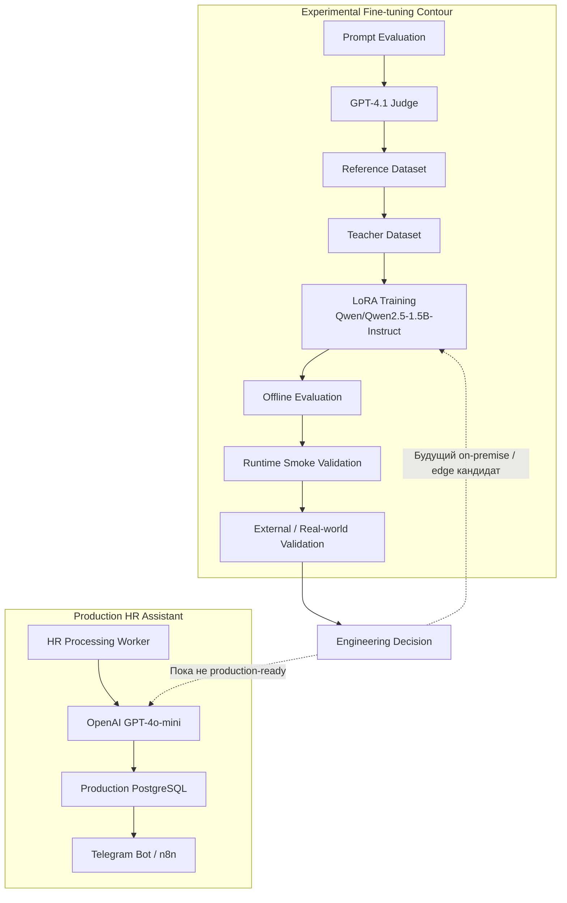
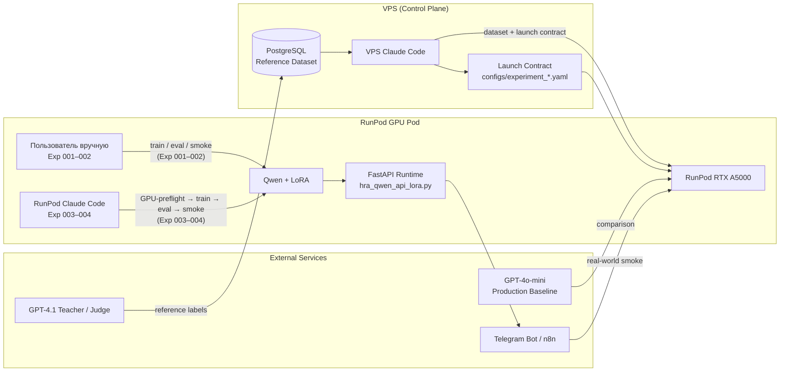
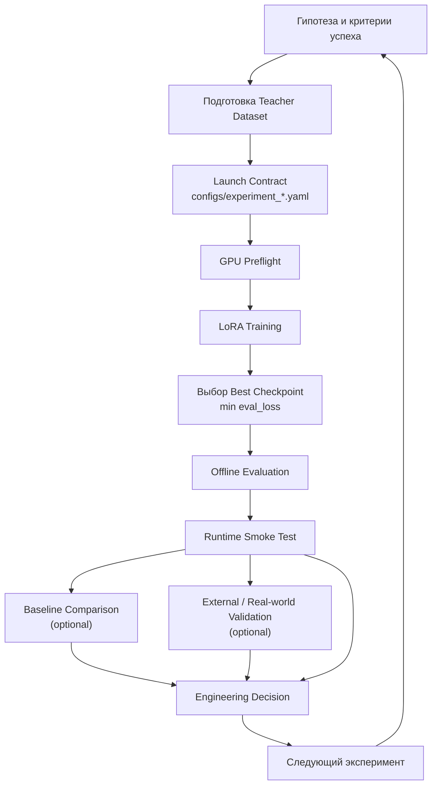
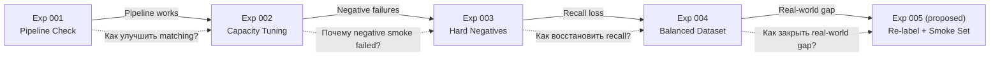
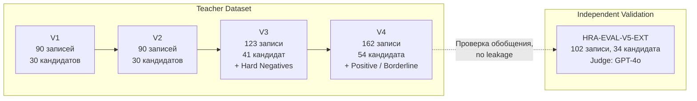

# Архитектура экспериментального fine-tuning-контура

Этот документ показывает высокоуровневую архитектуру серии экспериментов по fine-tuning в HR Assistant и причинно-следственную связь между Experiment 001 и Experiment 004. Конкретные параметры, метрики и протоколы запусков находятся в [`TECHNICAL_FOUNDATION.md`](TECHNICAL_FOUNDATION.md) и отчётах `Experiment_00N_Report.md`.

---

## 1. Общая архитектура контура

**Пояснение.** Уровень 1 (`Prompt Evaluation`) формирует размеченный `Reference Dataset`. Подсистема fine-tuning превращает его в `Teacher Dataset`, обучает на нём LoRA-адаптер поверх Qwen и проводит три уровня валидации: offline, runtime smoke, external / real-world. Результатом контура является **инженерное решение** (engineering decision): перейти к следующему эксперименту, изменить гипотезу или рекомендовать модель для production. По состоянию на Experiment 004 production-контур остаётся за GPT-4o-mini; LoRA позиционируется как рабочий on-premise / edge-кандидат.

---

## 2. Инфраструктура исполнения

**Пояснение.** VPS Claude Code готовит датасет, SQL-разметку и launch contract. В Experiments 001–002 на RunPod команды запускал пользователь вручную; в Experiments 003–004 GPU-этапы выполнял Claude Code, развёрнутый непосредственно на RunPod. RunPod хостит обучение, offline/runtime evaluation и FastAPI-сервер с LoRA-адаптером. GPT-4.1 выступает Teacher / Judge, GPT-4o-mini — production baseline для сравнения, Telegram / n8n — контур real-world smoke test.

---

## 3. Жизненный цикл одного эксперимента

**Пояснение.** Каждый эксперимент начинается с гипотезы и закрепляется launch contract. После GPU-preflight запускается обучение, выбирается best checkpoint по минимальному `eval_loss`, затем выполняются обязательные offline и runtime проверки. `Baseline Comparison` и `External / Real-world Validation` выполняются только тогда, когда гипотеза требует сравнения с production baseline или проверки обобщения на независимой выборке. Все ветки сходятся в **Engineering Decision**, которая задаёт вопрос следующему циклу (подробнее — в [`TECHNICAL_FOUNDATION.md`](TECHNICAL_FOUNDATION.md), раздел 3).

---

## 4. Эволюция Experiments 001–004

| Эксперимент | Что изменялось | Что оставалось неизменным | Ключевой результат | Вопрос к следующему циклу |
|-------------|----------------|---------------------------|--------------------|---------------------------|
| **Exp 001** | Первый LoRA-контур: `r=8`, 4 target modules, `HRA-EXP-V1`, 90 записей | — | Пайплайн работает: обучение стабильно, `valid_json_rate=1.0`, JSON-контракт выполняется; качество matching не проверялось | Какие параметры LoRA улучшат качество? |
| **Exp 002** | Ёмкость адаптера: `r=16`, 7 target modules, пересмотренный split `HRA-EXP-V2` | Базовая модель, runtime-контур, Judge GPT-4.1 | Offline-метрики выросли: `decision_accuracy` 0.444 → 0.778, `MAE_score` 29.78 → 21.89; positive smoke passed, **negative smoke failed** | Почему модель пропускает сложные negative кейсы? |
| **Exp 003** | Состав teacher dataset: добавлены 11 hard-negative/edge-case кандидатов (`HRA-EXP-V3`, 123 записи), формализованы HN1–HN8 / EC1/EC3/EC4 | Модель, LoRA, обучение, runtime | Runtime negative smoke **7/7 passed**, 0 unexpected matches; offline `decision_accuracy` упала до 0.667 — появился over-correction | Как восстановить recall на genuine match, не потеряв hard negatives? |
| **Exp 004** | Пересбалансирование dataset: добавлены 13 positive/borderline кандидатов (`HRA-EXP-V4`, 162 записи), расширен test set до 15 записей, введено сравнение с GPT-4o-mini и external validation | Модель, LoRA, обучение, runtime, все hard-negative записи Exp 003 | Offline `decision_accuracy=0.800`, runtime smoke 7/7 passed, external validation 0.931 vs GPT-4o-mini 0.941; Telegram smoke 35 % vs 43 % у GPT-4o-mini | Как устранить hard-negative failures в real-world условиях? |

**Пояснение.** Все четыре эксперимента используют одну и ту же базовую модель, runtime-контракт и Teacher Judge. Рост качества достигнут не тюнингом адаптера, а последовательным dataset engineering: Exp 002 — ёмкость, Exp 003 — hard negatives, Exp 004 — positive/borderline баланс. Exp 004 показал, что LoRA обобщается на внешних данных, но real-world hard-negative/edge сценарии всё ещё отстают от GPT-4o-mini.

---

## 5. Эволюция Teacher Dataset

**Пояснение.** Teacher dataset развивался от V1 к V4: V2 пересмотрел split, V3 добавил hard-negative и edge-case примеры, V4 добавил positive/borderline кандидатов для восстановления recall. `HRA-EVAL-V5-EXT` — **независимая выборка**, а не следующая версия teacher dataset: она не пересекается с train/validation/test по `case_code`, reference labels генерирует GPT-4o вместо GPT-4.1 и служит для cross-check обобщения модели. Подробнее — в [`reports/teacher_dataset_report.md`](reports/teacher_dataset_report.md) и [`reports/external_validation_report.md`](reports/external_validation_report.md).

---

## Связанные документы

| Документ | Назначение |
|----------|-----------|
| [`README.md`](README.md) | Точка входа в подсистему fine-tuning и сводка по экспериментам |
| [`TECHNICAL_FOUNDATION.md`](TECHNICAL_FOUNDATION.md) | Базовая модель, LoRA-конфигурация, инфраструктура, метрики, общий пайплайн |
| [`Experiment_001_Report.md`](Experiment_001_Report.md) | Технический baseline и проверка пайплайна |
| [`Experiment_002_Report.md`](Experiment_002_Report.md) | Параметрическая оптимизация и runtime negative failure |
| [`Experiment_003_Report.md`](Experiment_003_Report.md) | Hard negatives, over-correction и каталог ошибок |
| [`Experiment_004_Report.md`](Experiment_004_Report.md) | Сбалансированный dataset, GPT-4o-mini comparison, external validation, Telegram smoke |
