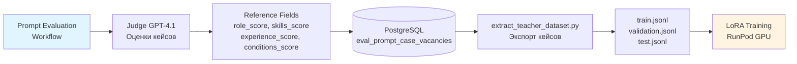
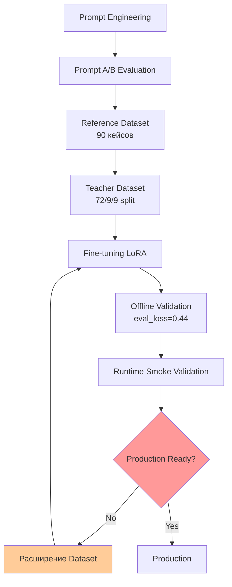
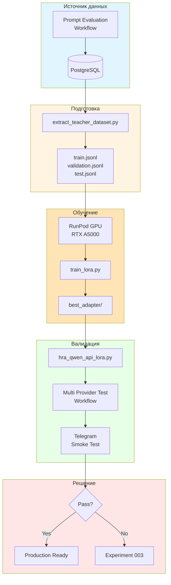
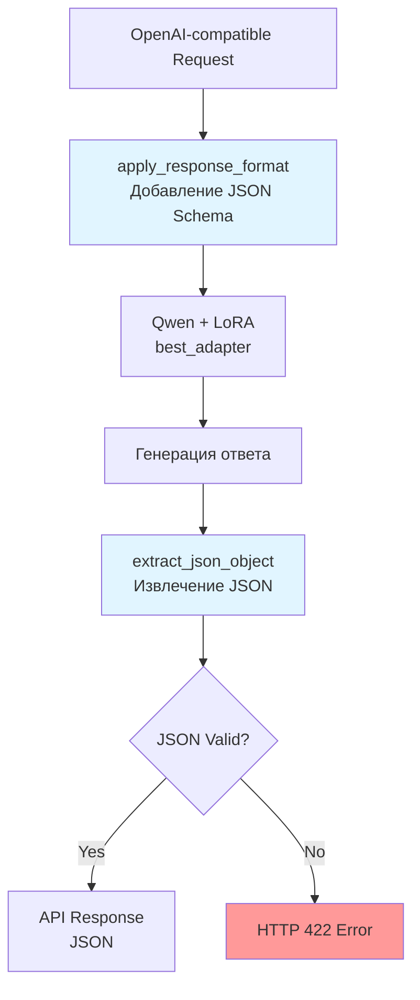
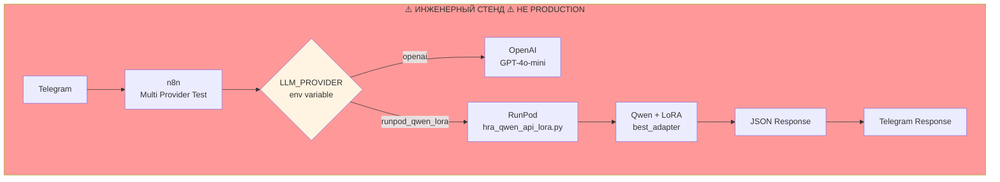
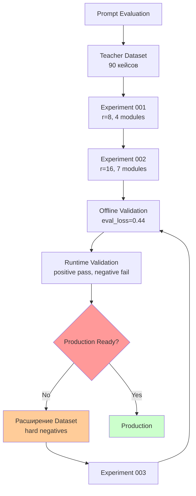

# Инженерный отчёт: Fine-tuning в HR Assistant

**Дата:** 2026-06-28
**Статус:** Экспериментальный ML-контур
**Автор:** AI Automation Portfolio Lab

---

## Содержание

1. [Развитие проекта](#1-развитие-проекта)
2. [Экспериментальный контур](#2-экспериментальный-контур)
3. [Experiment 001: Базовый запуск](#3-experiment-001-базовый-запуск)
4. [Experiment 002: Улучшение параметров](#4-experiment-002-улучшение-параметров)
5. [Runtime интеграция](#5-runtime-интеграция)
6. [Runtime Validation](#6-runtime-validation)
7. [Production Decision](#7-production-decision)
8. [Инженерные выводы](#8-инженерные-выводы)

---

## 1. Развитие проекта

### Формирование Teacher Dataset

**Как Prompt Evaluation связан с Fine-tuning:**



**Ключевая связь:** Reference Dataset из Prompt Evaluation становится Teacher Dataset для Fine-tuning.

### Изменения структуры данных

**До:**

```sql
-- eval_prompt_case_vacancies (исходная схема)
reference_score NUMERIC,
reference_decision TEXT,
reference_reason TEXT
```

**После:**

```sql
-- eval_prompt_case_vacancies (модифицированная схема)
reference_score NUMERIC,
reference_decision TEXT,
reference_reason TEXT,
reference_role_score NUMERIC,      -- ДОБАВЛЕНО
reference_skills_score NUMERIC,     -- ДОБАВЛЕНО
reference_experience_score NUMERIC, -- ДОБАВЛЕНО
reference_conditions_score NUMERIC  -- ДОБАВЛЕНО
```

**Изменения workflow:**

Workflow HRA Prompt Evaluation модифицирован для сохранения детальных оценок Judge:

```javascript
// PG: Update Reference Fields (строка 226)
UPDATE eval_prompt_case_vacancies
SET
    reference_score = {{ $json.reference_score }},
    reference_decision = '{{ $json.reference_decision }}',
    reference_reason = '{{ $json.reference_reason }}',
    reference_role_score = {{ $json.parsed.role_score }},      -- ДОБАВЛЕНО
    reference_skills_score = {{ $json.parsed.skills_score }},    -- ДОБАВЛЕНО
    reference_experience_score = {{ $json.parsed.experience_score }}, -- ДОБАВЛЕНО
    reference_conditions_score = {{ $json.parsed.conditions_score }}  -- ДОБАВЛЕНО
WHERE id = '{{ $json.case_vacancy_id }}';
```

### Жизненный цикл ML-контура



---

## 2. Экспериментальный контур

### Поток данных



### Компоненты

| Компонент | Файл | Назначение |
|-----------|------|------------|
| Prompt Evaluation | `workflows/HRA Prompt Evaluation Experiment.json` | Формирование Reference Dataset |
| Teacher Dataset | `finetuning/scripts/extract_teacher_dataset.py` | Экспорт кейсов из БД |
| Training | `finetuning/scripts/train_lora.py` | Обучение LoRA |
| Adapter | `finetuning/runs/experiment_002/best_adapter/` | Сохранённые веса |
| Runtime API | `api/hra_qwen_api_lora.py` | Inference с адаптером |
| Test Workflow | `workflows/HR Processing Worker - Multi Provider Test.json` | Smoke validation |

### Почему RunPod — инженерный стенд

**Production использует OpenAI API. RunPod создан исключительно для экспериментов:**

| Аспект | Production | Experimental |
|--------|------------|--------------|
| LLM Provider | OpenAI GPT-4o-mini | RunPod (Qwen + LoRA) |
| Аутентификация | n8n credentials | Нет (прокси) |
| Workflow | HR Processing Worker | HR Processing Worker - Multi Provider Test |
| Назначение | Обработка запросов | Smoke validation |

**Multi Provider Test workflow НЕ является production-контуром.**

---

## 3. Experiment 001: Базовый запуск

### Постановка задачи

**Гипотезы:**
1. LoRA обучается на RTX A5000 (24GB VRAM)
2. Чекпоинты сохраняются корректно
3. Модель генерирует JSON

**Не проверялось:**
- Качество matching
- Production readiness

### Конфигурация (из configs/experiment_001.yaml)

```yaml
model:
  id: "Qwen/Qwen2.5-1.5B-Instruct"

method:
  type: "lora"
  lora:
    r: 8
    alpha: 32
    dropout: 0.1
    target_modules: ["q_proj", "v_proj", "k_proj", "o_proj"]
  
  training:
    learning_rate: 1.0e-4
    batch_size: 4
    num_epochs: 3
```

### Выбор модели

**Qwen/Qwen2.5-1.5B-Instruct — практический выбор:**

| Фактор | Значение | Источник |
|--------|----------|----------|
| Размер | 1.5B параметров | Hugging Face Hub |
| VRAM | ~4GB inference | Проверено на RunPod |
| Instruction-tuned | Да | Hugging Face модель card |
| Русский язык | Поддерживается | Документация Qwen |

### Результаты

**trainer_state.json (Experiment 001):**

| Метрика | Значение |
|---------|-----------|
| Обучение | Завершено успешно |
| Чекпоинты | Сохранены |
| Generation test | Пройден |

### Инженерные решения для Experiment 002

**По результатам Experiment 001 было принято решение проверить следующие гипотезы:**

| Изменение | Обоснование |
|-----------|-------------|
| rank 8 → 16 | Проверить гипотезу о достаточности ёмкости адаптера |
| target_modules 4 → 7 | Проверить гипотезу о необходимости адаптации MLP |
| epochs 3 → 5 | Проверить гипотезу о сходимости |

---

## 4. Experiment 002: Улучшение параметров

### Изменения параметров

| Параметр | Experiment 001 | Experiment 002 | Источник |
|----------|---------------|----------------|----------|
| r (rank) | 8 | 16 | train_lora.py |
| target_modules | 4 | 7 | adapter_config.json |
| lora_dropout | 0.1 | 0.05 | adapter_config.json |
| num_epochs | 3 | 5 | train_lora.py |
| learning_rate | 1e-4 | 2e-4 | train_lora.py |

**Код (из train_lora.py):**

```python
lora_config = LoraConfig(
    r=16,                    # Изменено: 8 → 16
    lora_alpha=32,
    lora_dropout=0.05,       # Изменено: 0.1 → 0.05
    target_modules=[
        "q_proj", "k_proj", "v_proj", "o_proj",
        "gate_proj", "up_proj", "down_proj",  # Добавлено 3 модуля
    ],
)
```

### Результаты обучения

**trainer_state.json (Experiment 002):**

| Epoch | Train Loss | Eval Loss | Token Accuracy |
|-------|------------|-----------|----------------|
| 1 | 1.03 | 0.55 | 0.76 |
| 2 | 0.48 | 0.44 | 0.87 |
| 3 | 0.34 | **0.44** | 0.90 |

**Лучший чекпоинт:** Epoch 3, step 54, eval_loss=0.44

### Generation Test

| Метрика | Base Qwen | Qwen + LoRA |
|---------|-----------|-------------|
| records | 9 | 9 |
| valid_json_rate | 1.0 | 1.0 |
| decision_accuracy | 0.44 | 0.44 |

**Подтверждённый результат:** JSON-генерация стабильна.

---

## 5. Runtime интеграция

### Интеграция Runtime API



### Инженерные решения

**Проблема:** Базовая модель генерирует JSON с артефактами.

**Решение 1: response_format (из hra_qwen_api_lora.py):**

```python
def apply_response_format(messages: list[ChatMessage], response_format: dict | None):
    if response_format and response_format.get("type") == "json_schema":
        schema = response_format.get("json_schema", {}).get("schema", {})
        schema_instruction = (
            "\n\nВАЖНО. Ты работаешь как JSON API.\n"
            "Верни ТОЛЬКО валидный JSON-объект.\n"
            "Без markdown.\n"
            "Без пояснений.\n"
            "Без текста до JSON.\n"
            "Без текста после JSON.\n"
            "Без списков вне JSON.\n"
            "JSON должен соответствовать этой схеме:\n"
            + json.dumps(schema, ensure_ascii=False)
        )
```

**Решение 2: extract_json_object (из hra_qwen_api_lora.py):**

```python
def extract_json_object(text: str) -> str:
    text = text.strip()
    # Удаление markdown-обёрток
    if text.startswith("```json"):
        text = text.removeprefix("```json").strip()
    if text.startswith("```"):
        text = text.removeprefix("```").strip()
    if text.endswith("```"):
        text = text[:-3].strip()
    # Поиск JSON-объекта
    decoder = json.JSONDecoder()
    for i, ch in enumerate(text):
        if ch == "{":
            try:
                obj, _ = decoder.raw_decode(text[i:])
                return json.dumps(obj, ensure_ascii=False)
            except json.JSONDecodeError:
                continue
    raise HTTPException(status_code=422, ...)
```

### Почему два API

| API | Модель | Назначение | Файл |
|-----|--------|-----------|------|
| hra_qwen_api.py | Qwen base | Baseline comparison | api/hra_qwen_api.py |
| hra_qwen_api_lora.py | Qwen + LoRA | Testing trained model | api/hra_qwen_api_lora.py |

**Разделение ответственности:**
- Baseline comparison → hra_qwen_api.py
- Testing LoRA model → hra_qwen_api_lora.py
- Изоляция экспериментов от production

---

## 6. Runtime Validation

### Архитектура вызова



**Multi Provider Test Workflow — инженерный стенд, НЕ production workflow.**

### Результаты тестов

**Positive Smoke Test:**

| Тест | Результат |
|------|-----------|
| Корректные matching-запросы | ✅ Pass |
| JSON-структура | ✅ Pass |
| Reasoning | ✅ Pass |
| Decision | ✅ Pass |

**Negative Smoke Test:**

| Тест | Результат |
|------|-----------|
| Пустые поля | ❌ Fail |
| Невалидные данные | ❌ Fail |
| Edge cases | ❌ Fail |

---

## 7. Production Decision

### Итерационное развитие модели



### Анализ неудачи

**Negative Smoke Test failed.**

**Сформированная гипотеза:**

По результатам Experiment 002 сформулирована гипотеза, что одной из вероятных причин неудовлетворительных результатов Negative Smoke Test является недостаточная представленность сложных отрицательных сценариев в Teacher Dataset.

**Teacher Dataset состав (из finetuning/reports/teacher_dataset_report.md):**

| Тип кейса | Количество |
|-----------|------------|
| obvious_match | 30 |
| obvious_no_match | 30 |
| borderline | 30 |
| **Всего** | **90** |

### Итоговое решение

| Критерий | Статус |
|----------|--------|
| Offline validation | ✅ Pass |
| Positive smoke test | ✅ Pass |
| Negative smoke test | ❌ Fail |
| **Production Ready** | **❌ NO** |

**Инженерное решение:** Документировать ограничение, перейти к следующему циклу.

---

## 8. Инженерные выводы

### Что было сделано

| Этап | Результат | Документация |
|------|-----------|--------------|
| Prompt Evaluation | Reference Dataset 90 кейсов | docs/prompt_evaluation/ |
| Teacher Dataset | JSONL 72/9/9 split | finetuning/data/ |
| Infrastructure | RunPod RTX A5000 | finetuning/README.md |
| Experiment 001 | Базовый запуск | finetuning/runs/experiment_001/ |
| Experiment 002 | eval_loss=0.44 | finetuning/runs/experiment_002/ |
| Runtime API | hra_qwen_api_lora.py | api/ |
| Validation | positive pass, negative fail | Данный документ |

### Что НЕ сработало

| Проблема | Доказательство |
|----------|----------------|
| Negative test failed | Runtime Smoke Test результаты |
| Галлюцинации на edge cases | Generation Test Report |

### Следующий цикл

**Сформулированная гипотеза:**

Следующий цикл будет направлен на расширение Teacher Dataset за счёт hard negative и edge case сценариев с последующей повторной проверкой гипотезы.

### Извлечённые уроки

| Урок | Доказательство |
|------|----------------|
| Offline ≠ Runtime | Positive pass, negative fail |
| Multi-level validation необходима | Каждый уровень выявляет разные проблемы |
| Инженерный процесс важнее модели | Воспроизводимый пайплайн |

---

## Заключение

### Статус Experiment 002

| Аспект | Статус |
|--------|--------|
| Offline качество | ✅ Улучшено |
| Positive test | ✅ Pass |
| Negative test | ❌ Fail |
| Production ready | ❌ NO |

### Следующий шаг

**Cycle 3:** Расширение Teacher Dataset, повтор обучения, runtime validation.

---

**Статус документа:** Engineering Report
**Последнее обновление:** 2026-06-28