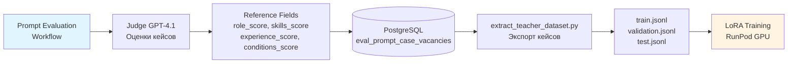
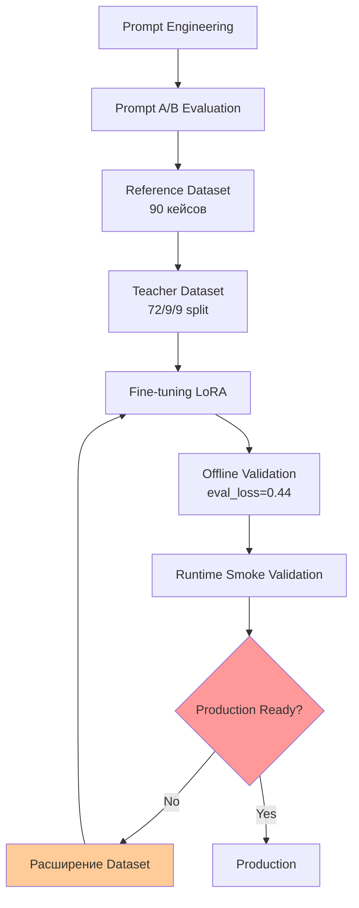
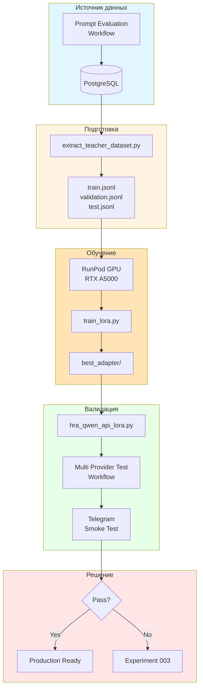
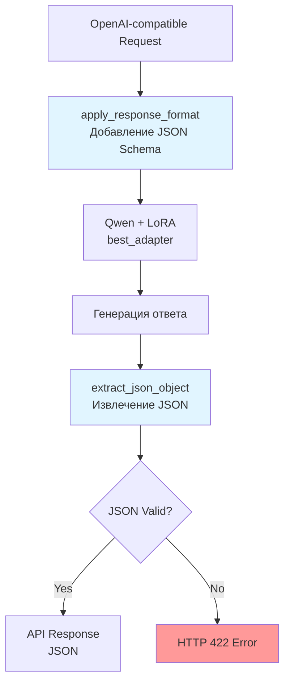
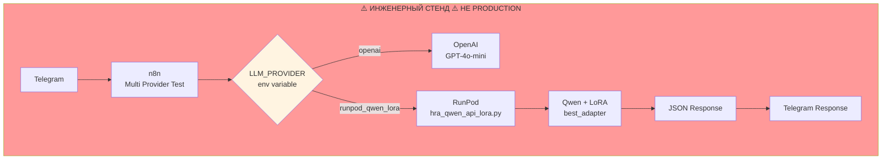
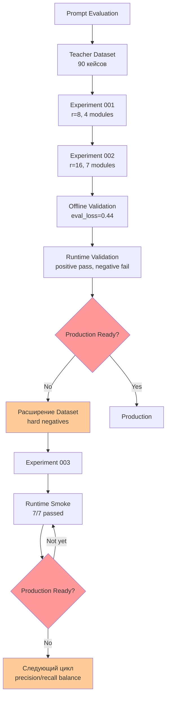

# Инженерный отчёт: Fine-tuning в HR Assistant

**Дата:** 2026-07-22
**Статус:** Экспериментальный ML-контур — Experiment 003 завершён (partially confirmed), не production-ready
**Автор:** AI Automation Portfolio Lab

---

## Содержание

1. [Развитие проекта](#1-развитие-проекта)
2. [Экспериментальный контур](#2-экспериментальный-контур)
3. [Experiment 001: Базовый запуск](#3-experiment-001-базовый-запуск)
4. [Experiment 002: Улучшение параметров](#4-experiment-002-улучшение-параметров)
5. [Runtime интеграция](#5-runtime-интеграция)
6. [Runtime Validation](#6-runtime-validation)
7. [Experiment 003: Hard Negative Teacher Dataset](#7-experiment-003-hard-negative-teacher-dataset)
8. [Production Decision](#8-production-decision)
9. [Инженерные выводы](#9-инженерные-выводы)

---

## 1. Развитие проекта

### Формирование Teacher Dataset

**Как Prompt Evaluation связан с Fine-tuning:**


```mermaid
graph LR
    PE[Prompt Evaluation<br/>Workflow] --> JUDGE[Judge GPT-4.1<br/>Оценки кейсов]
    JUDGE --> RF[Reference Fields<br/>role_score, skills_score<br/>experience_score, conditions_score]
    RF --> DB[(PostgreSQL<br/>eval_prompt_case_vacancies)]
    DB --> EXT[extract_teacher_dataset.py<br/>Экспорт кейсов]
    EXT --> TD[train.jsonl<br/>validation.jsonl<br/>test.jsonl]
    TD --> LORA[LoRA Training<br/>RunPod GPU]
    
    style PE fill:#e1f5ff
    style LORA fill:#fff4e1
```

**Ключевая связь:** Reference Dataset из Prompt Evaluation становится Teacher Dataset для Fine-tuning.

### Изменения структуры данных

**До:**

```sql
-- eval_prompt_case_vacancies (исходная схема)
reference_score NUMERIC,
reference_decision TEXT,
reference_reason TEXT
```

**После:**

```sql
-- eval_prompt_case_vacancies (модифицированная схема)
reference_score NUMERIC,
reference_decision TEXT,
reference_reason TEXT,
reference_role_score NUMERIC,      -- ДОБАВЛЕНО
reference_skills_score NUMERIC,     -- ДОБАВЛЕНО
reference_experience_score NUMERIC, -- ДОБАВЛЕНО
reference_conditions_score NUMERIC  -- ДОБАВЛЕНО
```

**Изменения workflow:**

Workflow HRA Prompt Evaluation модифицирован для сохранения детальных оценок Judge:

```javascript
// PG: Update Reference Fields (строка 226)
UPDATE eval_prompt_case_vacancies
SET
    reference_score = {{ $json.reference_score }},
    reference_decision = '{{ $json.reference_decision }}',
    reference_reason = '{{ $json.reference_reason }}',
    reference_role_score = {{ $json.parsed.role_score }},      -- ДОБАВЛЕНО
    reference_skills_score = {{ $json.parsed.skills_score }},    -- ДОБАВЛЕНО
    reference_experience_score = {{ $json.parsed.experience_score }}, -- ДОБАВЛЕНО
    reference_conditions_score = {{ $json.parsed.conditions_score }}  -- ДОБАВЛЕНО
WHERE id = '{{ $json.case_vacancy_id }}';
```

### Жизненный цикл ML-контура


```mermaid
graph TD
    PE[Prompt Engineering] --> AB[Prompt A/B Evaluation]
    AB --> RD[Reference Dataset<br/>90 кейсов]
    RD --> TD[Teacher Dataset<br/>72/9/9 split]
    TD --> FT[Fine-tuning LoRA]
    FT --> OV[Offline Validation<br/>eval_loss=0.44]
    OV --> RS[Runtime Smoke Validation]
    RS --> PR{Production Ready?}
    PR -->|No| TD2[Расширение Dataset]
    TD2 --> FT
    PR -->|Yes| PROD[Production]
    
    style PR fill:#ff9999
    style TD2 fill:#ffcc99
```

---

## 2. Экспериментальный контур

### Поток данных


```mermaid
graph TB
    subgraph Source["Источник данных"]
        PE[Prompt Evaluation<br/>Workflow] --> DB[(PostgreSQL)]
    end
    
    subgraph Preparation["Подготовка"]
        DB --> EXT[extract_teacher_dataset.py]
        EXT --> SPLIT[train.jsonl<br/>validation.jsonl<br/>test.jsonl]
    end
    
    subgraph Training["Обучение"]
        SPLIT --> RUNPOD[RunPod GPU<br/>RTX A5000]
        RUNPOD --> TRAIN[train_lora.py]
        TRAIN --> ADAPTER[best_adapter/]
    end
    
    subgraph Validation["Валидация"]
        ADAPTER --> API[hra_qwen_api_lora.py]
        API --> TEST[Multi Provider Test<br/>Workflow]
        TEST --> TG[Telegram<br/>Smoke Test]
    end
    
    subgraph Decision["Решение"]
        TG --> PASS{Pass?}
        PASS -->|Yes| READY[Production Ready]
        PASS -->|No| CYCLE3[Experiment 003]
    end
    
    style Source fill:#e1f5ff
    style Preparation fill:#fff4e1
    style Training fill:#ffe4b5
    style Validation fill:#e6ffe6
    style Decision fill:#ffe6e6
```

### Компоненты

| Компонент | Файл | Назначение |
|-----------|------|------------|
| Prompt Evaluation | `workflows/HRA Prompt Evaluation Experiment.json` | Формирование Reference Dataset |
| Teacher Dataset | `finetuning/scripts/extract_teacher_dataset.py` | Экспорт кейсов из БД |
| Training | `finetuning/scripts/train_lora.py` | Обучение LoRA |
| Adapter | `finetuning/runs/experiment_002/best_adapter/` | Сохранённые веса |
| Runtime API | `api/hra_qwen_api_lora.py` | Inference с адаптером |
| Test Workflow | `workflows/HR Processing Worker - Multi Provider Test.json` | Smoke validation |

### Почему RunPod — инженерный стенд

**Production использует OpenAI API. RunPod создан исключительно для экспериментов:**

| Аспект | Production | Experimental |
|--------|------------|--------------|
| LLM Provider | OpenAI GPT-4o-mini | RunPod (Qwen + LoRA) |
| Аутентификация | n8n credentials | Нет (прокси) |
| Workflow | HR Processing Worker | HR Processing Worker - Multi Provider Test |
| Назначение | Обработка запросов | Smoke validation |

**Multi Provider Test workflow НЕ является production-контуром.**

---

## 3. Experiment 001: Базовый запуск

### Постановка задачи

**Гипотезы:**
1. LoRA обучается на RTX A5000 (24GB VRAM)
2. Чекпоинты сохраняются корректно
3. Модель генерирует JSON

**Не проверялось:**
- Качество matching
- Production readiness

### Конфигурация (из configs/experiment_001.yaml)

```yaml
model:
  id: "Qwen/Qwen2.5-1.5B-Instruct"

method:
  type: "lora"
  lora:
    r: 8
    alpha: 32
    dropout: 0.1
    target_modules: ["q_proj", "v_proj", "k_proj", "o_proj"]
  
  training:
    learning_rate: 1.0e-4
    batch_size: 4
    num_epochs: 3
```

### Выбор модели

**Qwen/Qwen2.5-1.5B-Instruct — практический выбор:**

| Фактор | Значение | Источник |
|--------|----------|----------|
| Размер | 1.5B параметров | Hugging Face Hub |
| VRAM | ~4GB inference | Проверено на RunPod |
| Instruction-tuned | Да | Hugging Face модель card |
| Русский язык | Поддерживается | Документация Qwen |

### Результаты

**trainer_state.json (Experiment 001):**

| Метрика | Значение |
|---------|-----------|
| Обучение | Завершено успешно |
| Чекпоинты | Сохранены |
| Generation test | Пройден |

### Инженерные решения для Experiment 002

**По результатам Experiment 001 было принято решение проверить следующие гипотезы:**

| Изменение | Обоснование |
|-----------|-------------|
| rank 8 → 16 | Проверить гипотезу о достаточности ёмкости адаптера |
| target_modules 4 → 7 | Проверить гипотезу о необходимости адаптации MLP |
| epochs 3 → 5 | Проверить гипотезу о сходимости |

---

## 4. Experiment 002: Улучшение параметров

### Изменения параметров

| Параметр | Experiment 001 | Experiment 002 | Источник |
|----------|---------------|----------------|----------|
| r (rank) | 8 | 16 | train_lora.py |
| target_modules | 4 | 7 | adapter_config.json |
| lora_dropout | 0.1 | 0.05 | adapter_config.json |
| num_epochs | 3 | 5 | train_lora.py |
| learning_rate | 1e-4 | 2e-4 | train_lora.py |

**Код (из train_lora.py):**

```python
lora_config = LoraConfig(
    r=16,                    # Изменено: 8 → 16
    lora_alpha=32,
    lora_dropout=0.05,       # Изменено: 0.1 → 0.05
    target_modules=[
        "q_proj", "k_proj", "v_proj", "o_proj",
        "gate_proj", "up_proj", "down_proj",  # Добавлено 3 модуля
    ],
)
```

### Результаты обучения

**trainer_state.json (Experiment 002):**

| Epoch | Train Loss | Eval Loss | Token Accuracy |
|-------|------------|-----------|----------------|
| 1 | 1.03 | 0.55 | 0.76 |
| 2 | 0.48 | 0.44 | 0.87 |
| 3 | 0.34 | **0.44** | 0.90 |

**Лучший чекпоинт:** Epoch 3, step 54, eval_loss=0.44

### Generation Test

| Метрика | Base Qwen | Qwen + LoRA |
|---------|-----------|-------------|
| records | 9 | 9 |
| valid_json_rate | 1.0 | 1.0 |
| decision_accuracy | 0.44 | 0.44 |

**Подтверждённый результат:** JSON-генерация стабильна.

---

## 5. Runtime интеграция

### Интеграция Runtime API


```mermaid
graph TB
    REQ[OpenAI-compatible Request] --> FORMAT[apply_response_format<br/>Добавление JSON Schema]
    FORMAT --> MODEL[Qwen + LoRA<br/>best_adapter]
    MODEL --> GEN[Генерация ответа]
    GEN --> EXTRACT[extract_json_object<br/>Извлечение JSON]
    EXTRACT --> VALID{JSON Valid?}
    VALID -->|Yes| RESP[API Response<br/>JSON]
    VALID -->|No| ERR[HTTP 422 Error]
    
    style FORMAT fill:#e1f5ff
    style EXTRACT fill:#e1f5ff
    style ERR fill:#ff9999
```

### Инженерные решения

**Проблема:** Базовая модель генерирует JSON с артефактами.

**Решение 1: response_format (из hra_qwen_api_lora.py):**

```python
def apply_response_format(messages: list[ChatMessage], response_format: dict | None):
    if response_format and response_format.get("type") == "json_schema":
        schema = response_format.get("json_schema", {}).get("schema", {})
        schema_instruction = (
            "\n\nВАЖНО. Ты работаешь как JSON API.\n"
            "Верни ТОЛЬКО валидный JSON-объект.\n"
            "Без markdown.\n"
            "Без пояснений.\n"
            "Без текста до JSON.\n"
            "Без текста после JSON.\n"
            "Без списков вне JSON.\n"
            "JSON должен соответствовать этой схеме:\n"
            + json.dumps(schema, ensure_ascii=False)
        )
```

**Решение 2: extract_json_object (из hra_qwen_api_lora.py):**

```python
def extract_json_object(text: str) -> str:
    text = text.strip()
    # Удаление markdown-обёрток
    if text.startswith("```json"):
        text = text.removeprefix("```json").strip()
    if text.startswith("```"):
        text = text.removeprefix("```").strip()
    if text.endswith("```"):
        text = text[:-3].strip()
    # Поиск JSON-объекта
    decoder = json.JSONDecoder()
    for i, ch in enumerate(text):
        if ch == "{":
            try:
                obj, _ = decoder.raw_decode(text[i:])
                return json.dumps(obj, ensure_ascii=False)
            except json.JSONDecodeError:
                continue
    raise HTTPException(status_code=422, ...)
```

### Почему два API

| API | Модель | Назначение | Файл |
|-----|--------|-----------|------|
| hra_qwen_api.py | Qwen base | Baseline comparison | api/hra_qwen_api.py |
| hra_qwen_api_lora.py | Qwen + LoRA | Testing trained model | api/hra_qwen_api_lora.py |

**Разделение ответственности:**
- Baseline comparison → hra_qwen_api.py
- Testing LoRA model → hra_qwen_api_lora.py
- Изоляция экспериментов от production

---

## 6. Runtime Validation

### Архитектура вызова


```mermaid
graph TB
    subgraph NOT_PROD["⚠️ ИНЖЕНЕРНЫЙ СТЕНД ⚠️ НЕ PRODUCTION"]
        TG[Telegram] --> N8N[n8n<br/>Multi Provider Test]
        N8N --> SWITCH{LLM_PROVIDER<br/>env variable}
        SWITCH -->|openai| OPENAI[OpenAI<br/>GPT-4o-mini]
        SWITCH -->|runpod_qwen_lora| RUNPOD[RunPod<br/>hra_qwen_api_lora.py]
        RUNPOD --> QWEN[Qwen + LoRA<br/>best_adapter]
        QWEN --> JSON[JSON Response]
        JSON --> TG2[Telegram Response]
    end
    
    style NOT_PROD fill:#ff9999
    style SWITCH fill:#fff4e1
```

**Multi Provider Test Workflow — инженерный стенд, НЕ production workflow.**

### Результаты тестов

**Positive Smoke Test:**

| Тест | Результат |
|------|-----------|
| Корректные matching-запросы | ✅ Pass |
| JSON-структура | ✅ Pass |
| Reasoning | ✅ Pass |
| Decision | ✅ Pass |

**Negative Smoke Test:**

| Тест | Результат |
|------|-----------|
| Пустые поля | ❌ Fail |
| Невалидные данные | ❌ Fail |
| Edge cases | ❌ Fail |

---

## 7. Experiment 003: Hard Negative Teacher Dataset

### Постановка задачи

**Гипотеза:** провал runtime negative smoke test в Experiment 002 связан с недостатком hard negative и edge case-примеров в teacher dataset, а не с параметрами LoRA или архитектурой модели.

**Единственная изменяемая переменная:** состав teacher dataset.

**Неизменяемые параметры:** базовая модель, LoRA конфигурация, гиперпараметры обучения, runtime-контур — все совпадают с Experiment 002.

### Изменения teacher dataset

| Аспект | Experiment 002 | Experiment 003 |
|--------|----------------|----------------|
| Кандидатов | 30 | 41 |
| Записей | 90 | 123 |
| Train / Validation / Test / Holdout | 72 / 9 / 9 | 93 / 15 / 9 / 6 |
| Hard negative категории | — | HN-1–HN-8, EC-1, EC-3, EC-4 |
| Новые кандидаты | — | 11 (33 записи) |

### Результаты обучения

| Метрика | Experiment 002 | Experiment 003 |
|---------|----------------|----------------|
| Best eval_loss | 0.44 | **0.31** |
| Лучшая эпоха | 3 | 2 |
| Peak VRAM | ~8 GB | ~7.4 GB |
| Время обучения | — | 180 с |

### Offline evaluation (original test set, 9 записей)

| Модель | valid_json_rate | decision_accuracy | MAE_score |
|--------|-----------------|-------------------|-----------|
| Base Qwen (Exp 002) | 1.0 | 0.444 | 38.78 |
| LoRA Exp 002 | 1.0 | **0.778** | **21.89** |
| Base Qwen (Exp 003) | 1.0 | 0.222 | 38.33 |
| LoRA Exp 003 | 1.0 | 0.667 | 22.22 |

### Runtime smoke test

| Эксперимент | Positive | Negative | Hard Negative | Edge / Invalid | Итого |
|-------------|----------|----------|---------------|----------------|-------|
| Experiment 002 | ✅ Pass | ❌ Fail | ❌ Fail | ❌ Fail | не пройден |
| **Experiment 003** | ✅ Pass | ✅ Pass | ✅ Pass | ✅ Pass | **7/7 passed** |

### Интерпретация

- **Positive result:** hard negative примеры решили ключевую проблему Experiment 002 — модель стала корректно отклонять сложные нерелевантные профили.
- **Trade-off:** модель стала более консервативной. На original test set появились ложные отрицательные решения на genuine match-кейсах (системный аналитик), что снизило decision accuracy с 0.778 до 0.667.
- **Test loss** LoRA (8.26) выше base Qwen (7.90) на малой выборке; это не основная бизнес-метрика.

---

## 8. Production Decision

### Итерационное развитие модели


```mermaid
graph TD
    E1[Prompt Evaluation] --> E2[Teacher Dataset<br/>90 кейсов]
    E2 --> E3[Experiment 001<br/>r=8, 4 modules]
    E3 --> E4[Experiment 002<br/>r=16, 7 modules]
    E4 --> E5[Offline Validation<br/>eval_loss=0.44]
    E5 --> E6[Runtime Validation<br/>positive pass, negative fail]
    E6 --> E7{Production Ready?}
    E7 -->|No| E8[Расширение Dataset<br/>hard negatives]
    E8 --> E9[Experiment 003]
    E9 --> E10[Runtime Smoke<br/>7/7 passed]
    E10 --> E11{Production Ready?}
    E11 -->|No| E12[Следующий цикл<br/>precision/recall balance]
    E11 -->|Not yet| E10
    E7 -->|Yes| E13[Production]
    
    style E7 fill:#ff9999
    style E8 fill:#ffcc99
    style E11 fill:#ff9999
    style E12 fill:#ffcc99
```

### Анализ результатов

**Negative Smoke Test пройден в Experiment 003**, но на original test set наблюдается умеренное снижение decision accuracy и появление ложных отрицательных решений. Это указывает на **precision/recall trade-off**: модель стала слишком консервативной после добавления hard negatives.

**Teacher Dataset состав (Experiment 003):**

| Split | Записи | Состав |
|-------|--------|--------|
| train | 93 | исходный train + новые hard negatives |
| validation | 15 | исходный validation + новые hard negatives |
| test | 9 | исходный test Experiment 002 (без изменений) |
| holdout | 6 | новые hard negative / edge case кандидаты |

### Итоговое решение

| Критерий | Статус |
|----------|--------|
| Offline validation | ✅ Pass (eval_loss улучшилась) |
| Positive smoke test | ✅ Pass |
| Negative smoke test | ✅ Pass |
| Сохранение качества на original test | ⚠️ Partial (decision accuracy −11.1 pp) |
| **Production Ready** | **❌ NO** |

**Инженерное решение:** Гипотеза подтверждена частично. Hard negatives решают проблему runtime negative smoke, но требуется следующий цикл для баланса precision/recall перед production.


---

## 9. Инженерные выводы

### Что было сделано

| Этап | Результат | Документация |
|------|-----------|--------------|
| Prompt Evaluation | Reference Dataset 90 кейсов | docs/prompt_evaluation/ |
| Teacher Dataset v2 | JSONL 72/9/9 split | finetuning/data/ |
| Teacher Dataset v3 | JSONL 93/15/9/6 split + hard negatives | finetuning/reports/teacher_dataset_report_v3.md |
| Infrastructure | RunPod RTX A5000 | finetuning/README.md |
| Experiment 001 | Базовый запуск | finetuning/runs/experiment_001/ |
| Experiment 002 | eval_loss=0.44 | finetuning/runs/experiment_002/ |
| Experiment 003 | eval_loss=0.31, runtime smoke 7/7 passed | finetuning/runs/experiment_003/ |
| Runtime API | hra_qwen_api_lora.py | api/ |
| Runtime smoke test | Автоматический `runtime_smoke_test.py` | finetuning/scripts/runtime_smoke_test.py |

### Что сработало

| Успех | Доказательство |
|-------|----------------|
| Hard negatives исправили runtime negative smoke | `runtime_smoke_report.json`: 7/7 passed |
| JSON-генерация стабильна | valid_json_rate = 1.0 во всех экспериментах |
| Параметризованный launch contract работает | `configs/experiment_003.yaml`, все скрипты читают `--config` |
| WinSCP + RunPod CC workflow воспроизводим | `OPERATION_LOG.md`, `experiment_003_winscp_transfer.md` |

### Что НЕ сработало

| Проблема | Доказательство |
|----------|----------------|
| Negative test failed в Experiment 002 | Runtime Smoke Test результаты |
| Over-correction в Experiment 003 | Generation Test Report: decision accuracy 0.667 vs 0.778, ложные отрицательные на системном аналитике |
| Галлюцинации на edge cases | Generation Test Report |

### Следующий цикл

**Сформулированная цель:**

Следующий цикл должен устранить precision/recall trade-off Experiment 003. Варианты:
1. Добавить больше качественных positive/borderline примеров, чтобы модель не теряла genuine matches.
2. Скорректировать system prompt / порог decision для баланса.
3. Исследовать assistant-only loss или взвешенную loss-функцию для лучшего разделения match/no_match.

### Извлечённые уроки

| Урок | Доказательство |
|------|----------------|
| Offline ≠ Runtime | Positive pass, negative fail в Exp 002 |
| Multi-level validation необходима | Каждый уровень выявляет разные проблемы |
| Инженерный процесс важнее модели | Воспроизводимый пайплайн с launch contract |
| Dataset bias ≠ dataset size | 33 новых записи изменили поведение модели, но вызвали over-correction |

---

## Заключение

### Статус Experiment 003

| Аспект | Статус |
|--------|--------|
| Offline качество | ✅ Улучшено (eval_loss 0.44 → 0.31) |
| Positive test | ✅ Pass |
| Negative test | ✅ Pass |
| Original test quality | ⚠️ Partial (decision accuracy −11.1 pp) |
| Production ready | ❌ NO |

### Следующий шаг

**Cycle 4:** Баланс precision/recall. Варианты: добавить positive/borderline примеры, скорректировать prompt/porog, или изменить стратегию loss. Перед production требуется повторный runtime smoke и offline evaluation без degradation.

---

**Статус документа:** Engineering Report
**Последнее обновление:** 2026-07-22