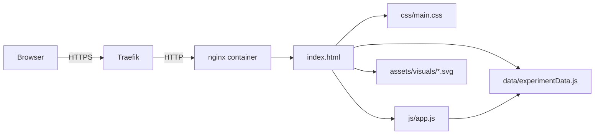
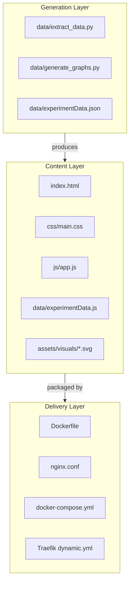
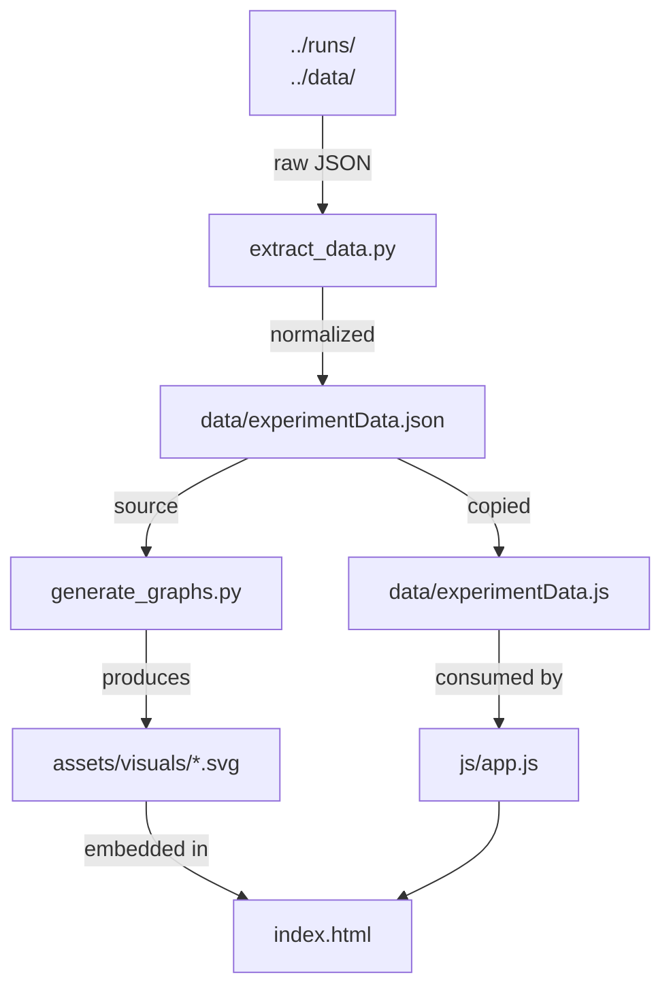

# Архитектура landing HR Assistant LoRA v3

**Кейс:** `hr-assistant`  
**Тип документа:** инженерная архитектура реализации.

Этот документ — инженерная карта устройства storytelling-лендинга в `finetuning/landing/`. Он описывает подсистемы, поток данных, зависимости между компонентами и принципы сопровождения.

Повествовательная спецификация — в [`NARRATIVE_BLUEPRINT.md`](NARRATIVE_BLUEPRINT.md).  
Инструкции по развёртыванию — в [`DEPLOYMENT_GUIDE.md`](DEPLOYMENT_GUIDE.md).  
Реестр визуальных артефактов — в [`VISUAL_ASSETS_REGISTRY.md`](VISUAL_ASSETS_REGISTRY.md).

---

## 1. Общая архитектура

Landing — статическое приложение без backend и runtime API. Все данные встраиваются в образ заранее.



### Роль компонентов

| Компонент | Роль |
|-----------|------|
| `index.html` | 21 интерфейсная сцена (23 DOM-секции), разметка и научные тексты |
| `css/main.css` | Визуальное оформление, анимации, адаптивная вёрстка |
| `js/app.js` | Навигация, keyboard shortcuts, генератор Люмины, привязка DOM-элементов к данным |
| `data/experimentData.js` | Единый источник метрик в runtime |
| `assets/visuals/*.svg` | Графики и диаграммы, сгенерированные из данных |
| `nginx` | Отдача статики, gzip, кеширование, security-заголовки |
| `Traefik` | TLS-терминация и маршрутизация (вне landing) |

---

## 2. Слои системы

Landing можно разделить на три независимых слоя.



### Content Layer

То, что отдаётся в браузер. Не содержит логики генерации данных, только их использование.

| Компонент | Что делает | Зависит от |
|-----------|------------|------------|
| `index.html` | Разметка сцен, тексты, встраивание SVG | `experimentData.js`, `app.js`, SVG |
| `css/main.css` | Стили и анимации | только самого себя |
| `js/app.js` | Интерактив и привязка данных | `experimentData.js`, DOM-разметки |
| `data/experimentData.js` | Runtime-источник метрик | `experimentData.json` |
| `assets/visuals/*.svg` | Графическое представление данных | `experimentData.json` и исходных JSON |

### Generation Layer

То, как данные попадают в Content Layer.

| Компонент | Что делает | Читает | Производит |
|-----------|------------|--------|------------|
| `data/extract_data.py` | Нормализует метрики из экспериментов | `../runs/`, `../data/` | `data/experimentData.json` |
| `data/generate_graphs.py` | Генерирует SVG-графики | `data/experimentData.json`, часть `../runs/` | `assets/visuals/*.svg` |

### Delivery Layer

То, как Content Layer доставляется пользователю.

| Компонент | Роль |
|-----------|------|
| `Dockerfile` | Сборка nginx-образа с копированием всего каталога landing |
| `nginx.conf` | Правила отдачи статики, кеширование, fallback, security-заголовки |
| `docker-compose.yml` | Подключение контейнера к сети `n8n_default` |
| `Traefik dynamic.yml` | Внешний роутер; не является частью landing, но необходим для production URL |

---

## 3. Конвейер подготовки данных

Все числа на landing прослеживаются до исходных артефактов экспериментов.



### Исходные данные

- `../runs/experiment_00*/trainer_state.json` — loss, best checkpoint, эпохи.
- `../runs/experiment_00*/generation_test_report.json` — decision accuracy, MAE, valid JSON.
- `../runs/experiment_00*/runtime_smoke_report.json` — pass/fail production smoke.
- `../data/external_validation/external_validation_report.json` — сравнение с GPT-4o-mini.
- `../data/external_validation/gpt_comparison_report.json`, `gpt_comparison_report_v2.json` — баг truncation.
- `../data/manifest_experiment_003.json`, `manifest_experiment_004.json` — состав датасета.
- `../finetuning/configs/experiment_*.yaml` — LoRA-конфигурации.

### Производные данные

- `data/experimentData.json` — нормализованный JSON, Source of Truth для метрик.
- `data/experimentData.js` — та же структура, обёрнутая в переменную для браузера.
- `assets/visuals/*.svg` — SVG-графики и диаграммы.

### Ручные артефакты

- `index.html` — научные тексты, структура сцен, привязка DOM-элементов к данным.
- `css/main.css` — визуальное оформление.
- `js/app.js` — интерактив и рендеринг Люмины.
- Концептуальные иллюстрации `lumina-*.svg` и `narrative-moment-*.svg` — используются в [`NARRATIVE_BLUEPRINT.md`](NARRATIVE_BLUEPRINT.md), не в HTML.

---

## 4. Source of Truth

| Что | Source of Truth | Почему |
|-----|-----------------|--------|
| Метрики экспериментов | `../runs/`, `../data/` | Это сырые артефакты, из которых всё выводится |
| Производные данные | `data/experimentData.json` | Единый нормализованный источник для скриптов и графиков |
| Runtime-данные в браузере | `data/experimentData.js` | Единственный источник чисел для `app.js` |
| Визуальные артефакты landing | `assets/visuals/*.svg` | Часть исходного кода, отдаётся как статика |
| Структура и тексты landing | `index.html` | Авторитетная разметка сцен и научных формулировок |
| Повествовательная спецификация | `NARRATIVE_BLUEPRINT.md` | Описывает смысл каждой сцены |
| Архитектура реализации | `LANDING_ARCHITECTURE.md` | Этот документ |
| Реестр визуальных артефактов | `VISUAL_ASSETS_REGISTRY.md` | Связывает SVG со сценами и источниками данных |
| Процесс развёртывания | `DEPLOYMENT_GUIDE.md` | Source of Truth для воспроизводимого развёртывания |

---

## 5. Архитектурные зависимости

Изменение одного компонента влияет на другие предсказуемым образом.

| Изменение | Затрагивает | Не затрагивает | Примечание |
|-----------|-------------|----------------|------------|
| Структура или тексты сцен в `index.html` | `NARRATIVE_BLUEPRINT.md` (при смысловом изменении), `VISUAL_ASSETS_REGISTRY.md` (при добавлении SVG) | `css/main.css`, `js/app.js`, если разметка не меняется | Редактируется вручную |
| Схема `data/experimentData.json` | `data/experimentData.js`, `js/app.js`, `generate_graphs.py` | `nginx.conf`, Dockerfile | Требует синхронизации всех потребителей |
| Данные в `../runs/` или `../data/` | `extract_data.py` → `experimentData.json` → `experimentData.js` и SVG | `index.html`, CSS, nginx | Перегенерация автоматическая |
| Новый SVG для сцены | `index.html`, `VISUAL_ASSETS_REGISTRY.md` | `js/app.js` | SVG встраивается как `` |
| Изменение стиля | `css/main.css` | данные, HTML-структура | Только визуальный слой |
| Изменение nginx-конфигурации | `DEPLOYMENT_GUIDE.md` | архитектура данных | Не влияет на логику landing |
| Изменение `Dockerfile` | `DEPLOYMENT_GUIDE.md` | код landing | Только способ доставки |

### Ключевые наблюдения

- **Данные и представление разделены.** `experimentData.js` — единственный runtime-источник чисел. Все DOM-элементы с метриками читают их через `app.js`.
- **SVG не зависят от JavaScript.** Каждый SVG — самодостаточный файл, встраиваемый в HTML.
- **CSS не зависит от данных.** Стили отвечают только за визуальное оформление.
- **HTML не зависит от генерации данных.** Он знает только имена SVG и ключи `experimentData.js`.

---

## 6. Архитектурные принципы

### Статический сайт без backend

Landing — набор статических файлов. В production нет runtime-компонентов, баз данных или API. Это упрощает развёртывание, масштабирование и кеширование.

### Отсутствие внешних вызовов при загрузке

Браузер не обращается к внешним API при открытии страницы. Все данные уже встроены в `experimentData.js` и SVG.

### Генерация данных заранее

Метрики и графики генерируются перед сборкой образа, а не на лету:

1. `extract_data.py` пересоздаёт `experimentData.json` и `experimentData.js`.
2. `generate_graphs.py` пересоздаёт SVG.
3. Docker-образ пересобирается и развёртывается.

### SVG как часть исходного кода

Графики хранятся в репозитории как файлы, а не загружаются с CDN. Это гарантирует воспроизводимость любой версии landing.

---

## 7. Структура каталогов

```
finetuning/landing/
├── index.html              # структура и тексты сцен
├── css/main.css            # стили
├── js/app.js               # интерактив
├── data/
│   ├── experimentData.js   # runtime-источник метрик (auto-generated)
│   ├── experimentData.json # JSON-источник метрик (auto-generated)
│   ├── extract_data.py     # извлечение из ../runs/
│   └── generate_graphs.py  # генерация SVG
├── assets/visuals/         # SVG-графики landing + иллюстрации Blueprint
├── archive/                # резервные копии версий (не отдаются)
├── Dockerfile              # nginx-образ
├── nginx.conf              # конфигурация веб-сервера
└── docker-compose.yml      # оркестрация контейнера
```

---

## 8. Принципы сопровождения

### При изменении экспериментов

1. Перегенерировать данные:
   ```bash
   cd finetuning/landing/data
   python3 extract_data.py
   python3 generate_graphs.py
   ```
2. Проверить `experimentData.js` и SVG.
3. Обновить тексты в `index.html`, если метрики изменили смысл.
4. Пересобрать и развернуть образ:
   ```bash
   cd finetuning/landing
   docker compose up -d --build
   ```

### При добавлении нового графика

1. Добавить генерацию SVG в `generate_graphs.py`.
2. Встроить SVG в сцену `index.html`.
3. Добавить запись в [`VISUAL_ASSETS_REGISTRY.md`](VISUAL_ASSETS_REGISTRY.md).
4. При необходимости обновить [`NARRATIVE_BLUEPRINT.md`](NARRATIVE_BLUEPRINT.md).

### Что изменяется автоматически

- `data/experimentData.js` и `data/experimentData.json`.
- `assets/visuals/*.svg`.
- Кеш nginx после пересборки образа.

### Что требует ручной правки

- Научные тексты и разметка сцен в `index.html`.
- `NARRATIVE_BLUEPRINT.md` при изменении повествования.
- `VISUAL_ASSETS_REGISTRY.md` при изменении артефактов.
- `LANDING_ARCHITECTURE.md` при изменении архитектуры или потока данных.
- `DEPLOYMENT_GUIDE.md` при изменении инфраструктуры или конфигурации.

---

**Статус документа:** актуально для landing v3.  
**Последнее обновление:** 2026-07-27
