# Narrative Blueprint: HR Assistant LoRA — рождение способности

**Целевой URL:** `hra-lora.alex-n8n.site`  
**Кейс:** `hr-assistant`  
**Язык:** русский  
**Формат:** narrative blueprint для demo-landing  
**Source of truth:** текущая реализация landing — `index.html`, `css/main.css`, `js/app.js`, `data/experimentData.js`, `assets/visuals/`.

---

## 0. Режиссёрская нота

Этот лендинг — документальный фильм, случайно оказавшийся внутри браузера. Каждый экран — отдельный кадр. Переключение идёт через боковое досье.

Главный герой истории — не человек, не HR-специалист, не инженер. Главный герой — **сама языковая модель**. Мы наблюдаем, как одна и та же модель проходит путь от базового Qwen2.5-1.5B-Instruct до обученного LoRA-адаптера, который умеет принимать HR-решения.

Тон повествования — спокойный, уважительный, научно-популярный. Закадровый голос не торопится, не драматизирует, не осуждает. Он наблюдает и объясняет, что происходит.

Здесь нет детективов, преступников, жертв и приговоров. Есть рост. Есть ошибки. Есть исправления. Есть новая способность, которая появляется постепенно — урок за уроком, датасет за датасетом.

### Главное правило

**Инженерные артефакты — главные герои визуального ряда. Иллюстрации только помогают их воспринимать.**

Не нужно рисовать картинки вместо графиков. Нужно сделать так, чтобы графики, матрицы, JSON-ответы и метрики читались как повествование. Иллюстрации — это свет, масштаб, ритм, связующие образы.

---

## 1. Фильм в одном предложении

> **Мы наблюдаем, как небольшая языковая модель учится принимать HR-решения: от базового состояния, где она умеет лишь красиво оформлять ответ, до LoRA-адаптера, который держит ~93% точности на независимой выборке, проходит production-smoke, переживает runtime-баг и учится работать быстрее.**

Это история не о победе. Это история о росте. Модель не становится идеальной. Она становится способной.

---

## 2. Почему этот фильм существует

Большинство рассказов о fine-tuning сосредоточены на цифрах: loss, accuracy, latency. Этот фильм сосредоточен на процессе. Мы хотим показать, что за каждой метрикой стоит маленькое открытие — и что модель, как и ученик, учится не сразу, а шаг за шагом.

После просмотра зритель должен помнить не таблицу метрик, а ощущение:

- модель, которая сначала путает формат со смыслом;
- модель, которая обучается говорить «нет», но забывает говорить «да»;
- модель, которая находит баланс;
- модель, которая выходит за пределы лаборатории и обнаруживает, что мир сложнее, чем тестовый набор.

---

## 3. Главный герой: Модель

### 3.1 Кто это

Модель — это Qwen2.5-1.5B-Instruct с небольшим LoRA-адаптером. В начале истории она умеет многое из общих языковых задач, но не умеет сопоставлять кандидата с вакансией. К концу истории она умеет это делать — не идеально, но уверенно.

### 3.2 Визуальный образ: Люмина

Модель изображается как светящийся персонаж Люмина — круглая структура с лицом, кольцами и антеннами. Это не мультяшный персонаж и не человекоподобный образ, но у него есть узнаваемые черты: глаза, рот, брови, свечение и связи. Люмина генерируется inline SVG в `js/app.js`; внешний вид меняется от сцены к сцене через девять состояний `data-lumina`.

### 3.3 Эволюция Люмины

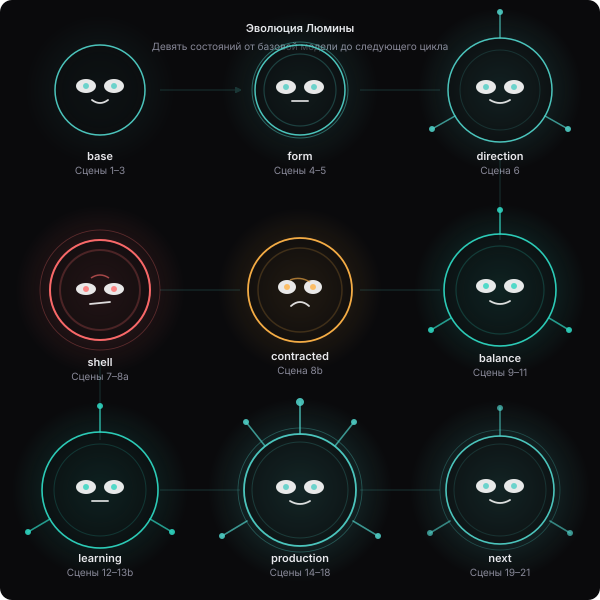

*Рис. 1. Эволюция Люмины. Девять состояний в трёх рядах: `base`, `form`, `direction` (верхний); `shell`, `contracted`, `balance` (средний); `learning`, `production`, `next` (нижний). Каждое состояние соответствует реальному визуальному образу на лендинге.*

| Состояние `data-lumina` | Сцены landing | Внешний вид | Что символизирует |
|------------------------|---------------|-------------|-------------------|
| `base` | 1, 2, 3 | Простая сфера с минимальными связями, спокойное лицо | Потенциал без специализации |
| `form` | 4, 5 | Появляются первые внутренние кольца, нейтральное выражение | Умение повторять структуру без понимания смысла |
| `direction` | 6, 7 | Первые направленные связи и антенны, взгляд целеустремлённый | Появление первой специализации |
| `shell` | 8a | Резкие грани, красное свечение, строгое лицо | Консервативность как стадия роста |
| `contracted` | 8b | Сфера сжалась, янтарное свечение, осторожное выражение | Цена отсева |
| `balance` | 9, 10, 11 | Сбалансированная форма, ровное свечение, спокойное лицо | Баланс precision и recall |
| `learning` | 12, 13a, 13b | Больше антенн, сфокусированный взгляд | Подготовка к production |
| `production` | 14, 15, 18 | Максимум антенн, уверенное лицо, яркое свечение | Готовность к реальному миру |
| `next` | 16, 17, 19, 20, 21 | Форма открыта, часть связей ещё не сформирована | Продолжение роста |

Эволюция не должна быть мультяшной трансформацией. Это медленное нарастание сложности — как рост кристалла или развитие нервной системы.

### 3.3 Поведение модели

На каждой странице модель делает одно простое действие:

- читает пример из teacher dataset;
- генерирует JSON-ответ;
- сравнивает свой ответ с эталоном;
- ошибается;
- исправляется;
- запускается в реальном API и ждёт ответа;
- работает быстрее.

Модель не улыбается, не хмурится, не разводит руками. Её «эмоции» передаются через состояние структуры: яркость, плотность связей, ритм пульсации.

---

## 4. Кинематографическая грамматика

### 4.1 Цвет и свет

- **Фон:** глубокий угольный, почти чёрный.
- **Основной холодный голубой (#4ECDC4):** модель, технологичность, спокойствие.
- **Янтарный (#FFB347):** trade-off, сомнения, зоны роста.
- **Красный (#FF6B6B):** ошибки, непрохождения, разрывы между ожиданием и реальностью.
- **Зелёный (#96CEB4):** прохождения, фиксы, готовность.
- **Белый и серый:** текст, метрики, JSON, лейблы.

Свет не заполняет всё. Он выхватывает главный объект.

### 4.2 Масштаб и ритм

Каждая страница — полноэкранный кадр. Между страницами — плавные переходы через меню слева. Не бесконечный скролл, а последовательность, которую зритель проходит в своём темпе.

- **Установочный кадр** — страница открывается, главный объект появляется.
- **Действие** — артефакт заполняется данными, модель делает шаг.
- **Вывод** — крупный план на ключевую цифру или связь.
- **Переход** — короткая текстовая плашка перед следующей страницей.

### 4.3 Композиционный центр

На каждой странице должен быть **один абсолютный центр внимания** — график, JSON-ответ, матрица, число или модель. Всё остальное — путь к этому центру.

---

## 5. Структура лендинга

Лендинг сохраняет структуру, похожую на презентацию: страницы переключаются через меню слева. Количество страниц не искусственно ограничено. Каждая страница — самостоятельный кадр, но вместе они составляют единую историю.

### Боковое досье (навигация)

Меню слева — оглавление фильма. Оно позволяет:

- идти последовательно;
- перепрыгивать к интересующей главе;
- видеть, где находишься в истории.

Каждая глава — одна страница или небольшая группа страниц.

---

## 6. Сцены

> **Соглашение о нумерации.** В интерфейсе landing используется нумерация **1–21** с промежуточными сценами **8a/8b** (третий урок и его trade-off) и **13a/13b** (latency profiling и engine optimization). В DOM-секциях `index.html` эти экраны имеют id `scene-8` / `scene-9` и `scene-14` / `scene-15` соответственно. В Blueprint применяется **интерфейсная нумерация**, чтобы документ можно было использовать параллельно с лендингом.

### Сцена 1 — Титул. «Рождение способности»

**Narrative purpose:** вступление. Знакомство с главным героем и обещание истории роста.

**Главный инженерный вопрос:** что мы будем наблюдать?

**События:**
1. Появление модели как простой светящейся сферы.
2. Четыре урока впереди: форма, ёмкость, ловушки, баланс.
3. Финальный путь: external validation, production reality, latency optimization.

**Ключевые артефакты:** inline SVG Люмины в состоянии `base`.

**Вывод:** это история не о победе, а о рождении способности.

**Переход:** «Прежде чем учиться, модель уже умеет кое-что. Посмотрим, кто участвует в этом фильме».

---

### Сцена 2 — Действующие лица

**Narrative purpose:** глоссарий персонажей для зрителя.

**Главный инженерный вопрос:** кто участвует в эксперименте и какие роли играют метрики?

**События:**
1. Представлены Qwen2.5-1.5B-Instruct, LoRA, Teacher Dataset, Decision Accuracy, MAE, Validation Loss, Hard Negatives, Positives & Borderlines, Production Smoke, vLLM, GPT-4o-mini, JSON.
2. Каждый персонаж объясняется кратко и без пафоса.

**Ключевые артефакты:** inline SVG-иконки в карточках cast-grid.

**Вывод:** чтобы понять историю, нужно понять язык, на котором она рассказывается.

**Переход:** «Теперь, когда мы знаем действующих лиц, посмотрим, что умеет базовая модель».

---

### Сцена 3 — Базовая модель. «Всё, что умеет модель из коробки»

**Narrative purpose:** отправная точка; показать, что valid JSON ≠ правильное решение.

**Главный инженерный вопрос:** что умеет базовая модель, а что — нет?

**События:**
1. Базовая Qwen2.5-1.5B-Instruct выдаёт структурированный JSON-ответ.
2. Scorecard: valid JSON 100%, decision accuracy 44%, MAE 38.8.
3. Конкретный пример: врач на вакансию специалиста по разметке данных — модель выдаёт `match`.

**Ключевые артефакты:** DOM-метрики (`experiments.001.generation_test.base.*`), inline SVG Люмины `base`, case-card.

**Вывод:** форма ответа освоена, но смысл задачи — нет. Это исходная проблема.

**Переход:** «Мы дали модели первый урок и попросили повторить teacher».

---

### Сцена 4 — Первый урок. Experiment 001

**Narrative purpose:** показать первую попытку обучения и открытие «форма без смысла».

**Главный инженерный вопрос:** сможет ли базовый LoRA на 90 примерах повторить teacher?

**События:**
1. LoRA r=16, 7 target modules, 90 записей, 5 эпох.
2. Train loss падает, eval loss достигает минимума 0.235.
3. Token accuracy растёт: модель выучила формат.
4. Generation test: valid JSON 100%, но decision accuracy 44% — как у base.
5. Best checkpoint = epoch 4 / checkpoint-72.

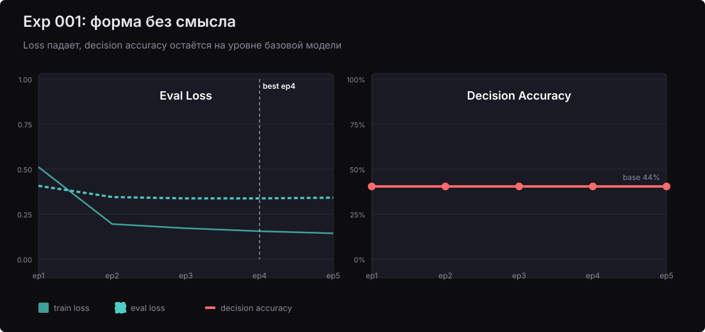

*Рис. 2. Сцена 4: кривые train/eval loss Experiment 001. Eval loss достигает минимума раньше финала, но low loss не гарантирует качество решений.*

**Ключевые артефакты:** [`G-001-loss-curves.svg`](assets/visuals/G-001-loss-curves.svg), DOM-метрики Exp 001.

**Вывод:** модель может обучиться не тому, что нужно. Лучший момент обучения — не финал.

**Переход:** «Но главное открытие было не в том, что модель ошибается, а в том, как мы это измеряли».

---

### Сцена 5 — Парадокс метрик. «Хороший loss — плохая новость»

**Narrative purpose:** центральное методологическое открытие: loss ≠ business quality.

**Главный инженерный вопрос:** почему низкий validation loss не гарантирует качество решений?

**События:**
1. Exp 001: best eval loss 0.235 — лучший, decision accuracy 44% — худший.
2. Exp 002: best eval loss 0.444 — выше, decision accuracy 78% — лучше.
3. Парадокс держится: language-modeling perplexity измеряет не то же самое, что HR-решения.

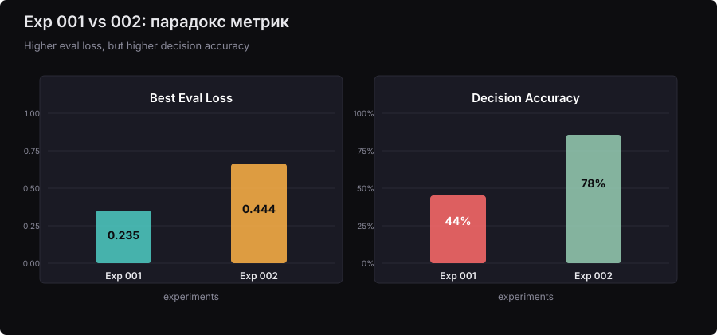

*Рис. 3. Сцена 5: парадокс best eval loss. Exp 001 имеет лучший loss, но худшую decision accuracy. Это центральное методологическое открытие кейса.*

**Ключевые артефакты:** [`G-002-best-eval-loss.svg`](assets/visuals/G-002-best-eval-loss.svg), DOM-метрики Exp 001/002.

**Вывод:** ведущими метриками становятся decision accuracy, MAE, FPR/FNR и production smoke.

**Переход:** «Если loss не подскажет, что делать дальше, попробуем другой путь».

---

### Сцена 6 — Второй урок. Experiment 002

**Narrative purpose:** показать, что модель может начать понимать, но не всё.

**Главный инженерный вопрос:** поможет ли увеличение возможностей адаптера улучшить matching?

**События:**
1. Тот же датасет 90 записей, другая динамика обучения.
2. Decision accuracy выросла 44% → 78%; MAE 38.8 → 21.9.
3. Early stopping сработал: best checkpoint = epoch 3 / checkpoint-54.

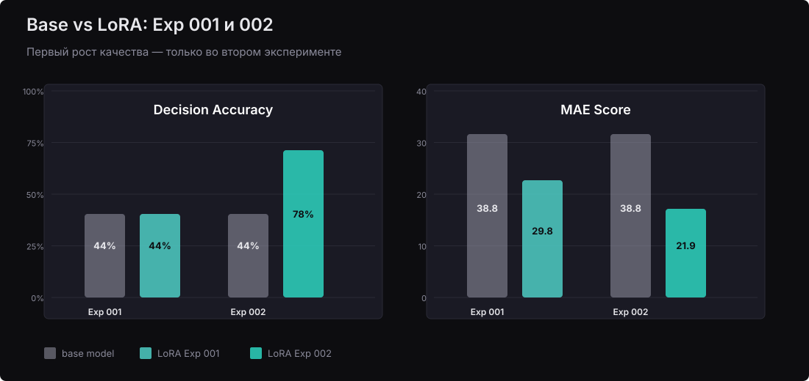

*Рис. 4. Сцена 6: сравнение Base и LoRA по decision accuracy и MAE. Exp 002 делает качественный скачок, но hard negatives всё ещё ловят модель.*

**Ключевые артефакты:** [`G-021-base-vs-lora-exp001-exp002.svg`](assets/visuals/G-021-base-vs-lora-exp001-exp002.svg), DOM-метрики Exp 002.

**Вывод:** модель стала лучше улавливать matching-логику, но проблема hard negatives осталась.

**Переход:** «Рост quality был заметен. Но реальный мир оказался сложнее тестового набора».

---

### Сцена 7 — Ловушка. Experiment 002 и runtime smoke

**Narrative purpose:** первый контакт с production: offline-метрики не покрывают production-риски.

**Главный инженерный вопрос:** что происходит, когда модель встречает реальный мир?

**События:**
1. Positive smoke Exp 002: pass.
2. Negative smoke Exp 002: fail — hard negatives, edge cases, invalid input.
3. Конкретный false positive: врач на вакансию специалиста по разметке данных, score 27 → 72, no_match → match.

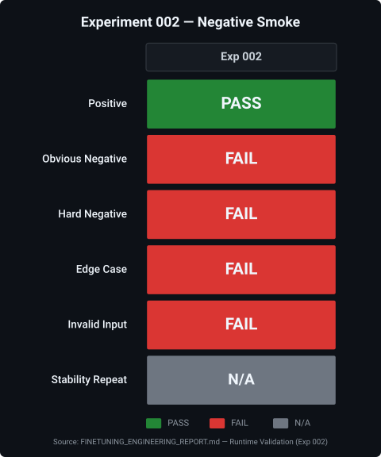

*Рис. 5. Сцена 7: матрица smoke Exp 002. Positive — pass, negative и edge cases — fail. Это первый контакт модели с production-рисками, которые offline-метрики не покрывают.*

**Ключевые артефакты:** [`G-022-exp002-smoke-fail.svg`](assets/visuals/G-022-exp002-smoke-fail.svg), case-card.

**Вывод:** production smoke — необходимый gate. Модель может хорошо выглядеть на small held-out test, но провалиться на adversarial входах.

**Переход:** «Если модель не знает ловушек, покажем ей ловушки».

---

### Сцена 8a — Третий урок. Experiment 003 — hard negatives

**Narrative purpose:** модель учится говорить «нет»; dataset engineering в действии.

**Главный инженерный вопрос:** исправят ли hard negatives false positives?

**События:**
1. Датасет расширен 90 → 123 записи (+33 hard negatives / edge cases).
2. LoRA-конфигурация не изменилась — контролируемые переменные.
3. Runtime smoke: 7/7 passed.
4. Decision accuracy: 67%.
5. Best checkpoint = epoch 2 / checkpoint-48.

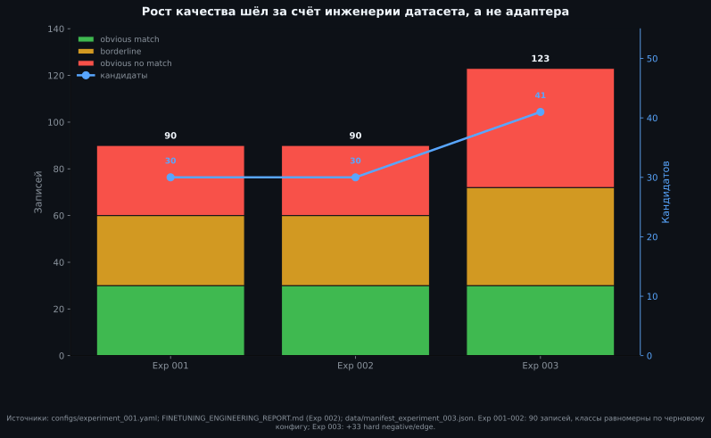

*Рис. 6. Сцена 8a: эволюция датасета от Exp 001/002 к Exp 003. Добавление 33 hard negatives меняет состав и смещает фокус модели.*

**Ключевые артефакты:** [`G-023-dataset-evolution-exp001-003.svg`](assets/visuals/G-023-dataset-evolution-exp001-003.svg), DOM-метрики Exp 003.

**Вывод:** hard negatives — эффективный способ обучить модель дискриминировать сложные негативы. Но победа имеет цену.

**Переход:** «Победа над ложными срабатываниями имеет цену».

---

### Сцена 8b — Торговля. Цена отсева

**Narrative purpose:** precision/recall trade-off — цена победы над false positives.

**Главный инженерный вопрос:** почему борьба с false positives снижает recall?

**События:**
1. Exp 003: hard negatives убили false positives.
2. Decision accuracy упала 78% → 67%.
3. Модель стала консервативной: лучше отсеивать, но рискует потерять подходящих.

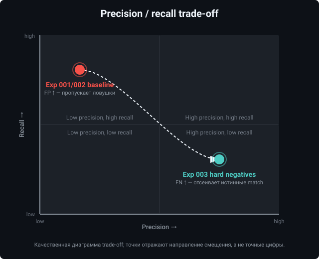

*Рис. 7. Сцена 8b: precision/recall trade-off. Добавление hard negatives убивает false positives, но снижает recall — победа имеет цену.*

**Ключевые артефакты:** [`G-024-precision-recall-tradeoff-scene8b.svg`](assets/visuals/G-024-precision-recall-tradeoff-scene8b.svg), DOM-метрики Exp 003.

**Вывод:** улучшение в одном измерении качества может ухудшить другое. Следующий шаг — восстановить balance.

**Переход:** «Чтобы вернуть баланс, нужно было показать модели, что «да» тоже бывает разным».

---

### Сцена 9 — Четвёртый урок. Experiment 004 — баланс

**Narrative purpose:** восстановление равновесия через positives и borderlines.

**Главный инженерный вопрос:** можно ли восстановить recall, сохранив hard negatives?

**События:**
1. Датасет расширен 123 → 162 записи (+39 positives / borderlines).
2. Все 33 hard-negative записи Exp 003 сохранены.
3. Decision accuracy = 80%, MAE = 15.1 — лучшее в серии.
4. Runtime smoke: 7/7 passed.

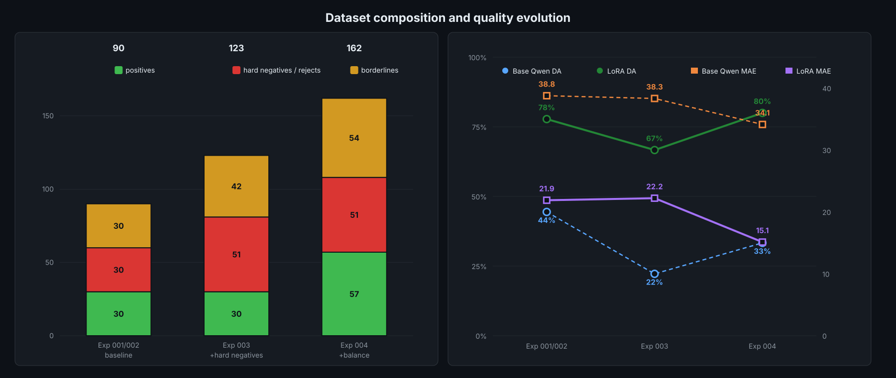

*Рис. 8. Сцена 9: баланс датасета и метрик. Добавление positives и borderlines возвращает recall, сохраняя умение отсеивать ловушки.*

**Ключевые артефакты:** [`G-025-balance-dataset-and-metrics.svg`](assets/visuals/G-025-balance-dataset-and-metrics.svg), DOM-метрики Exp 004.

**Вывод:** правильный состав teacher dataset важнее архитектурных изменений.

**Переход:** «Лабораторные тесты прошли. Теперь — данные, которых модель никогда не видела».

---

### Сцена 10 — Внешняя проверка. «Модель в незнакомом лесу»

**Narrative purpose:** генерализация и сравнение с эталоном.

**Главный инженерный вопрос:** обобщается ли модель и насколько она близка к GPT-4o-mini?

**События:**
1. External validation на 102 записях.
2. LoRA decision accuracy = 93.1%; GPT-4o-mini = 94.1%.
3. LoRA MAE = 19.5; GPT MAE = 6.9.
4. Модель обобщается, но уступает эталону по калибровке score.

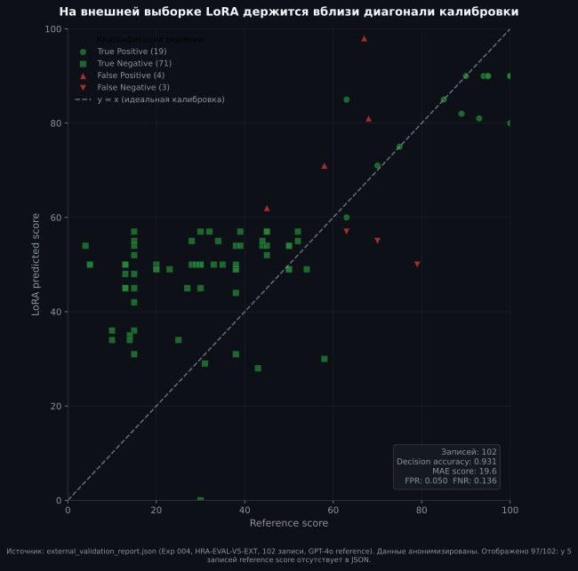

*Рис. 9. Сцена 10: external validation scatter на 102 записях. LoRA score расположен рядом с reference score — модель обобщается на незнакомых данных.*

**Ключевые артефакты:** [`G-008-external-validation-scatter.svg`](assets/visuals/G-008-external-validation-scatter.svg), DOM-метрики external validation.

**Вывод:** сравнение с эталоном превращает 93.1% из маркетинговой цифры в честную оценку.

**Переход:** «Но внешняя выборка — ещё не production. Мы запустили модель в runtime API и посмотрели, повторится ли успех».

---

### Сцена 11 — Smoke repeatability. «Первые продакшн-шаги»

**Narrative purpose:** production smoke как стабильный, повторяемый gate.

**Главный инженерный вопрос:** проходит ли модель production-smoke стабильно на разных этапах?

**События:**
1. Exp 003: runtime smoke 7/7 passed.
2. Exp 004: runtime smoke 7/7 passed.
3. Latency optimization rerun: smoke 7/7 passed.

**Ключевые артефакты:** [`G-026-smoke-repeatability-matrix.svg`](assets/visuals/G-026-smoke-repeatability-matrix.svg), DOM-метрики smoke.

**Вывод:** production smoke — не однократная удача, а стабильный gate.

**Переход:** «Smoke прошёл. Но production нашёл слабое место, которого не было в offline-тестах».

---

### Сцена 12 — Разрыв и фикс. «Когда ответ не влезает»

**Narrative purpose:** реальный инженерный баг и его влияние на интерпретацию результатов.

**Главный инженерный вопрос:** как production runtime меняет оценку качества модели?

**События:**
1. GPT comparison v1: `max_tokens=300`.
2. Два кейса вернули HTTP 422 из-за truncation.
3. Fix: `max_tokens=512` + graceful JSON extraction envelope.
4. GPT comparison v2: valid JSON 0.867 → 1.000, decision accuracy 0.800 → 0.933.

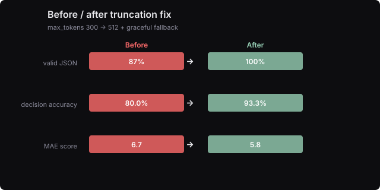

*Рис. 10. Сцена 12: влияние truncation bug на метрики GPT comparison. После увеличения max_tokens valid JSON и decision accuracy возвращаются к реальным значениям.*

**Ключевые артефакты:** [`G-015-before-after-truncation.svg`](assets/visuals/G-015-before-after-truncation.svg), DOM-метрики truncation fix.

**Вывод:** production bug может исказить оценку качества модели. Важно отделять метрики модели от метрик интеграции.

**Переход:** «API стабилен. Теперь — скорость».

---

### Сцена 13a — Поиск узкого места

**Narrative purpose:** latency profiling: где именно теряется время.

**Главный инженерный вопрос:** почему модель медленная и где bottleneck?

**События:**
1. После Exp 004: latency p50 = 11.7 с.
2. Latency profile: generate занимает >99% времени ответа.

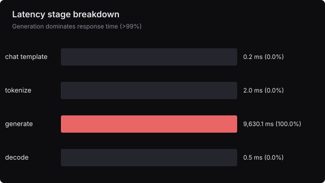

*Рис. 11. Сцена 13a: latency stage breakdown. Почти всё время ответа уходит на генерацию токенов — bottleneck найден.*

**Ключевые артефакты:** [`G-012-latency-stage-breakdown.svg`](assets/visuals/G-012-latency-stage-breakdown.svg), DOM-метрики latency.

**Вывод:** bottleneck найден: почти всё время уходит на генерацию токенов.

**Переход:** «Если узкое место — генерация, попробуем другой inference-движок».

---

### Сцена 13b — Latency. Модель учится быстрее

**Narrative purpose:** оптимизация inference engine и достижение production-viable скорости.

**Главный инженерный вопрос:** как сделать модель production-viable по скорости?

**События:**
1. Engine benchmark: transformers_fp16 avg ~9.1 с; transformers_4bit avg ~15.5 с и хуже quality.
2. vllm_fp16: avg ~2.2 с, качество сохранилось.
3. Warm persistent process + vLLM: external validation 102 записи, avg ~1.6 с.

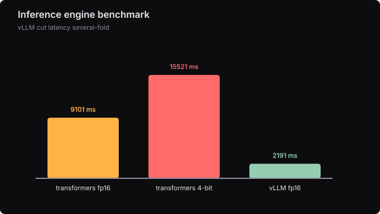

*Рис. 12. Сцена 13b: benchmark inference-движков. vLLM + warm persistent process даёт ускорение с ~11 с до ~1.6 с без потери quality.*

**Ключевые артефакты:** [`G-011-engine-benchmark.svg`](assets/visuals/G-011-engine-benchmark.svg), DOM-метрики engine benchmark.

**Вывод:** vLLM + warm process даёт ускорение без потери quality. Модель становится production-viable по скорости.

**Переход:** «Качество и скорость на месте. Подведём честный диагноз».

---

### Сцена 14 — Qwen-LoRA vs GPT-4o-mini. «Сильнее ожиданий»

**Narrative purpose:** эмоциональная кульминация: локальная модель рядом с облачным эталоном.

**Главный инженерный вопрос:** насколько близко локальная модель к облачной?

**События:**
1. 102 пары кандидат-вакансия, которых модель не видела.
2. Qwen-LoRA accuracy = 93.1%, GPT-4o-mini accuracy = 92.2%.
3. Qwen-LoRA MAE = 19.5, GPT MAE = 6.9.
4. Модель приблизилась к облачному эталону по решениям, но отстаёт по калибровке score.

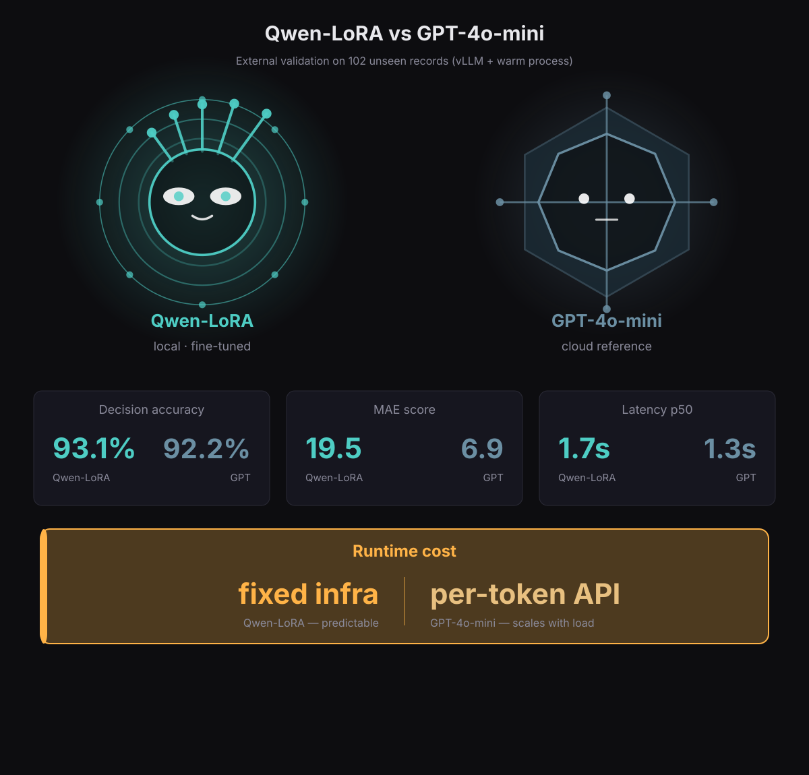

*Рис. 13. Сцена 14: Qwen-LoRA vs GPT-4o-mini на внешней выборке. Локальная модель приблизилась к облачному эталону по accuracy, но отстаёт по калибровке score.*

**Ключевые артефакты:** [`G-027-qwen-lora-vs-gpt.svg`](assets/visuals/G-027-qwen-lora-vs-gpt.svg), DOM-метрики optimized summary.

**Вывод:** маленькая локальная модель может быть конкурентоспособной по решениям и оставаться независимой.

**Переход:** «Но честная оценка важнее красивой цифры».

---

### Сцена 15 — Честный диагноз. «Что мы доказали, а что нет»

**Narrative purpose:** честная классификация достижений.

**Главный инженерный вопрос:** что доказано, что — нет, и куда двигаться?

**События:**
1. ✅ Доказано: dataset engineering.
2. ✅ Доказано: production smoke как gate.
3. ✅ Доказано: latency optimization даёт production-viable скорость.
4. ✅ Доказано: external validation ~93% — модель обобщается.
5. ⚠️ Частично: сравнение с GPT. Близко по accuracy, но уступает по MAE/FNR.
6. ❌ Не доказано: score calibration, полное parity с GPT, stratified hard-negative metrics, quantized server.

**Ключевые артефакты:** [`D-008-proven-partial-next.svg`](assets/visuals/D-008-proven-partial-next.svg), diagnosis-list.

**Вывод:** честная классификация достижений важнее маркетингового оптимизма.

**Переход:** «Честный диагноз — не конец. Он становится дорожной картой».

---

### Сцена 16 — Следующий цикл. «Модель продолжает расти»

**Narrative purpose:** открытый финал, roadmap.

**Главный инженерный вопрос:** что дальше?

**События:**
1. Roadmap: калибровка score, аугментация датасета, hard-negative метрики, квантизованный сервер.
2. Модель знает, чему научилась, и видит, чего ещё не умеет.

**Ключевые артефакты:** [`D-007-next-cycle-roadmap.svg`](assets/visuals/D-007-next-cycle-roadmap.svg), roadmap-list.

**Вывод:** ML-исследование циклично. Каждый цикл заканчивается не победой, а новым вопросом.

**Переход:** «Прежде чем закончить, вернёмся к двум урокам, которые прошли фоном».

---

### Сцена 17 — Разбор эпох. «Две кривые — одно решение»

**Narrative purpose:** показать метод выбора checkpoint на примере Exp 004.

**Главный инженерный вопрос:** как train loss и eval loss вместе помогают выбрать лучший checkpoint?

**События:**
1. Experiment 004: train loss падает, eval loss растёт после эпохи 3.
2. Best checkpoint = epoch 3 / checkpoint-87.
3. Decision accuracy = 80%, MAE = 15.1.

**Ключевые артефакты:** [`G-028-exp004-epoch-breakdown.svg`](assets/visuals/G-028-exp004-epoch-breakdown.svg), DOM-метрики Exp 004.

**Вывод:** лучший checkpoint рождается не из минимального train loss, а из баланса между запоминанием и обобщением.

**Переход:** «Это не единичный случай — во всех экспериментах лучшая эпоха оказалась не последней».

---

### Сцена 18 — Лучшая эпоха — не последняя

**Narrative purpose:** early stopping как универсальный урок всех экспериментов.

**Главный инженерный вопрос:** почему продолжение обучения не всегда улучшает результат?

**События:**
1. Exp 001: best epoch 4 из 5.
2. Exp 002: best epoch 3 из 5.
3. Exp 003: best epoch 2 из 5.
4. Exp 004: best epoch 3 из 5.
5. Во всех случаях train loss продолжал падать, но eval loss рос после best checkpoint.

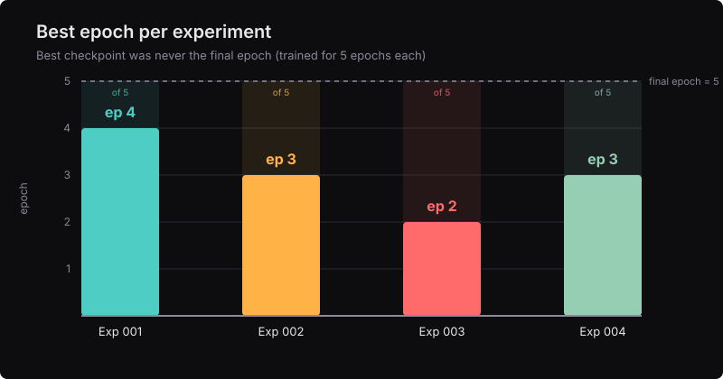

*Рис. 14. Сцена 18: best epoch во всех экспериментах. В каждом случае лучший checkpoint оказался не последним — ранний останов предотвращает переобучение.*

**Ключевые артефакты:** [`G-016-best-epoch-markers.svg`](assets/visuals/G-016-best-epoch-markers.svg), DOM-метрики best epoch.

**Вывод:** продолжение обучения улучшает запоминание train set, но не обобщение. Больше усилий не всегда означает больше мастерства.

**Переход:** «Ещё один урок, который прошёл фоном: главный рычаг качества — не модель, а данные».

---

### Сцена 19 — Данные важнее архитектуры

**Narrative purpose:** central thesis кейса — dataset engineering важнее тюнинга модели.

**Главный инженерный вопрос:** почему в этом цикле данные оказались важнее архитектуры?

**События:**
1. Все 4 `adapter_config.json` идентичны: r=16, alpha=32, dropout=0.05, 7 target modules.
2. Менялись: dataset size (90 → 90 → 123 → 162), composition, splits.
3. Два рычага: hard negatives → precision↑; positives/borderlines → recall↑.

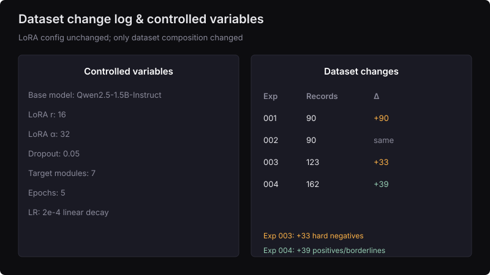

*Рис. 15. Сцена 19: dataset change log. LoRA params зафиксированы, рос только датасет — и именно это дало прирост качества.*

**Ключевые артефакты:** [`D-010-dataset-change-log.svg`](assets/visuals/D-010-dataset-change-log.svg), DOM-метрики LoRA config.

**Вывод:** в этом цикле главный рычаг качества — состав teacher dataset.

**Переход:** «Всё, что вы видели, можно проверить».

---

### Сцена 20 — Архив. «Все артефакты на одном экране»

**Narrative purpose:** evidence room для технических читателей.

**Главный инженерный вопрос:** где проверить всё, что показано в фильме?

**События:**
1. Каталог ключевых графиков: loss curves, test eval loss, per-component MAE, latency CDF, LoRA vs GPT radar, dataset composition.
2. Прямая привязка к исходным данным.

**Ключевые артефакты:** [`G-001-loss-curves.svg`](assets/visuals/G-001-loss-curves.svg), [`G-007-test-eval-loss.svg`](assets/visuals/G-007-test-eval-loss.svg), [`G-006-per-component-mae.svg`](assets/visuals/G-006-per-component-mae.svg), [`G-010-latency-cdf.svg`](assets/visuals/G-010-latency-cdf.svg), [`G-014-lora-vs-gpt-radar.svg`](assets/visuals/G-014-lora-vs-gpt-radar.svg), [`D-003-dataset-composition-transition.svg`](assets/visuals/D-003-dataset-composition-transition.svg).

**Вывод:** воспроизводимость — основа доверия. Мы не просим верить. Мы просим посмотреть.

**Переход:** «И последнее — о методе, который делает эту историю честной».

---

### Сцена 21 — О методе. «Как устроен эксперимент»

**Narrative purpose:** методологическая честность и controlled variables.

**Главный инженерный вопрос:** что менялось, что было зафиксировано, какие оговорки?

**События:**
1. Controlled variables: LoRA params зафиксированы, менялся только датасет.
2. Dataset change log: 90 → 90 → 123 → 162.
3. Central thesis: dataset engineering > model tuning.
4. Caveats: разные test sets нельзя сравнивать напрямую; 93.1% не рассказывает всё.

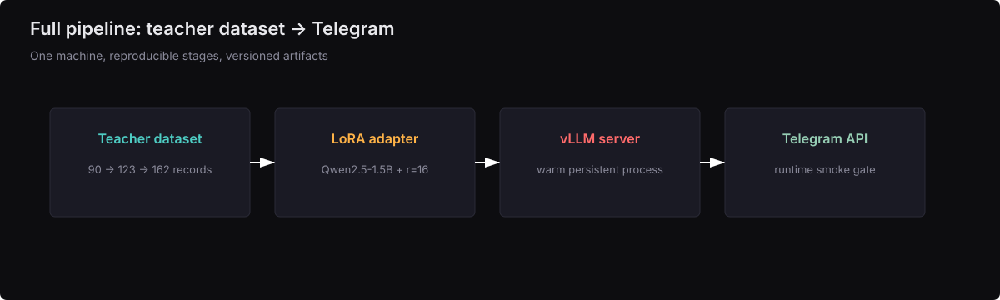

*Рис. 16. Сцена 21: full pipeline. Teacher dataset → LoRA-adapter → vLLM-server → Telegram API. Controlled variables зафиксированы, менялся только датасет.*

**Ключевые артефакты:** [`D-001-pipeline-schematic.svg`](assets/visuals/D-001-pipeline-schematic.svg), method-params DOM-элементы.

**Вывод:** честность важнее убедительности. Мы фиксировали всё: что меняли, что держали неизменным, где данных недостаточно.

---

## 7. Меню навигации

```
 1.  Рождение способности
 2.  Действующие лица
 3.  Базовая модель
 4.  Первый урок
 5.  Парадокс метрик
 6.  Второй урок
 7.  Ловушка
 8a. Третий урок — hard negatives
 8b. Торговля — цена отсева
 9.  Четвёртый урок — баланс
10.  Внешняя проверка
11.  Smoke repeatability
12.  Разрыв и фикс
13a. Поиск узкого места
13b. Latency
14.  Сильнее ожиданий
15.  Честный диагноз
16.  Следующий цикл
17.  Разбор эпох
18.  Лучшая эпоха — не последняя
19.  Данные важнее архитектуры
20.  Архив
21.  О методе
```

---

## 8. Маппинг сцен на DOM-секции

| Интерфейсная сцена | DOM-секция `index.html` | `data-lumina` |
|--------------------|------------------------|---------------|
| 1 | `scene-1` | `base` |
| 2 | `scene-2` | `base` |
| 3 | `scene-3` | `base` |
| 4 | `scene-4` | `form` |
| 5 | `scene-5` | `form` |
| 6 | `scene-6` | `direction` |
| 7 | `scene-7` | `shell` |
| 8a | `scene-8` | `learning` |
| 8b | `scene-9` | `contracted` |
| 9 | `scene-10` | `balance` |
| 10 | `scene-11` | `balance` |
| 11 | `scene-12` | `balance` |
| 12 | `scene-13` | `production` |
| 13a | `scene-14` | `production` |
| 13b | `scene-15` | `production` |
| 14 | `scene-16` | `production` |
| 15 | `scene-17` | `production` |
| 16 | `scene-18` | `next` |
| 17 | `scene-19` | `next` |
| 18 | `scene-20` | `production` |
| 19 | `scene-21` | `next` |
| 20 | `scene-22` | `next` |
| 21 | `scene-23` | `next` |

---

## 9. Артефакты по сценам

| Интерфейсная сцена | Основной SVG | Вспомогательные артефакты |
|--------------------|--------------|----------------------------|
| 1 | Inline SVG Люмины `base` | — |
| 2 | Cast-grid иконки | — |
| 3 | DOM-метрики base | case-card |
| 4 | [`G-001`](assets/visuals/G-001-loss-curves.svg) | DOM-метрики Exp 001 |
| 5 | [`G-002`](assets/visuals/G-002-best-eval-loss.svg) | DOM-метрики Exp 001/002 |
| 6 | [`G-021`](assets/visuals/G-021-base-vs-lora-exp001-exp002.svg) | DOM-метрики Exp 002 |
| 7 | [`G-022`](assets/visuals/G-022-exp002-smoke-fail.svg) | case-card |
| 8a | [`G-023`](assets/visuals/G-023-dataset-evolution-exp001-003.svg) | DOM-метрики Exp 003 |
| 8b | [`G-024`](assets/visuals/G-024-precision-recall-tradeoff-scene8b.svg) | DOM-метрики Exp 003 |
| 9 | [`G-025`](assets/visuals/G-025-balance-dataset-and-metrics.svg) | DOM-метрики Exp 004 |
| 10 | [`G-008`](assets/visuals/G-008-external-validation-scatter.svg) | DOM-метрики external validation |
| 11 | [`G-026`](assets/visuals/G-026-smoke-repeatability-matrix.svg) | DOM-метрики smoke |
| 12 | [`G-015`](assets/visuals/G-015-before-after-truncation.svg) | DOM-метрики truncation fix |
| 13a | [`G-012`](assets/visuals/G-012-latency-stage-breakdown.svg) | DOM-метрики latency |
| 13b | [`G-011`](assets/visuals/G-011-engine-benchmark.svg) | DOM-метрики engine benchmark |
| 14 | [`G-027`](assets/visuals/G-027-qwen-lora-vs-gpt.svg) | DOM-метрики optimized summary |
| 15 | [`D-008`](assets/visuals/D-008-proven-partial-next.svg) | diagnosis-list |
| 16 | [`D-007`](assets/visuals/D-007-next-cycle-roadmap.svg) | roadmap-list |
| 17 | [`G-028`](assets/visuals/G-028-exp004-epoch-breakdown.svg) | DOM-метрики Exp 004 |
| 18 | [`G-016`](assets/visuals/G-016-best-epoch-markers.svg) | DOM-метрики best epoch |
| 19 | [`D-010`](assets/visuals/D-010-dataset-change-log.svg) | DOM-метрики LoRA config |
| 20 | Archive grid | [`G-001`](assets/visuals/G-001-loss-curves.svg), [`G-007`](assets/visuals/G-007-test-eval-loss.svg), [`G-006`](assets/visuals/G-006-per-component-mae.svg), [`G-010`](assets/visuals/G-010-latency-cdf.svg), [`G-014`](assets/visuals/G-014-lora-vs-gpt-radar.svg), [`D-003`](assets/visuals/D-003-dataset-composition-transition.svg) |
| 21 | [`D-001`](assets/visuals/D-001-pipeline-schematic.svg) | method-params |

---


---

## 11. Тон и стиль текста

### Принципы закадрового голоса

1. **Без пафоса.** Не «революционный прорыв», а «модель научилась».
2. **Без антропоморфизма в эмоциях.** Модель не «рада» и не «расстроена». Она «обучилась», «стала консервативной», «нашла баланс».
3. **Без судебных метафор.** Нет «преступлений», «улик», «вердиктов», «приговоров».
4. **Сравнения с природой и обучением.** «Как ученик», «как рост кристалла», «как приспособление».
5. **Честность.** Нигде не утверждается, что LoRA победила GPT. Утверждается, что она приблизилась по одним метрикам и отстала по другим.

---

## 12. Чего не будет в лендинге

| Что убрано | Почему |
|------------|--------|
| Персонажи-люди (Doctor, HR, Researcher) | История должна быть о модели, а не о людях |
| Детективная драматургия | Противоречит спокойному документальному тону |
| Судебные метафоры | Создают ложное напряжение и отвлекают от инженерной сути |
| Центральная цифра 93.1% как кульминация | Кульминация — честный диагноз, не одна метрика |
| Ссылки на внутренние материалы | Публичная документация должна быть самодостаточной |

---

**Статус документа:** Narrative Blueprint — синхронизирован с интерфейсной нумерацией landing v3 (21 сцена, DOM-сцены 1–23).  
**Последнее обновление:** 2026-07-27
